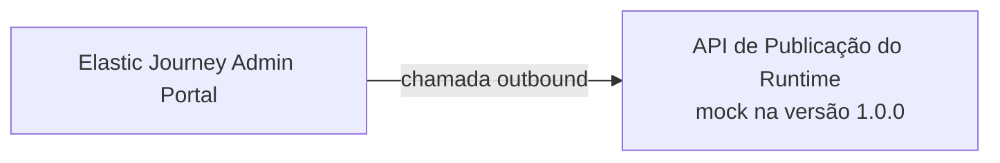
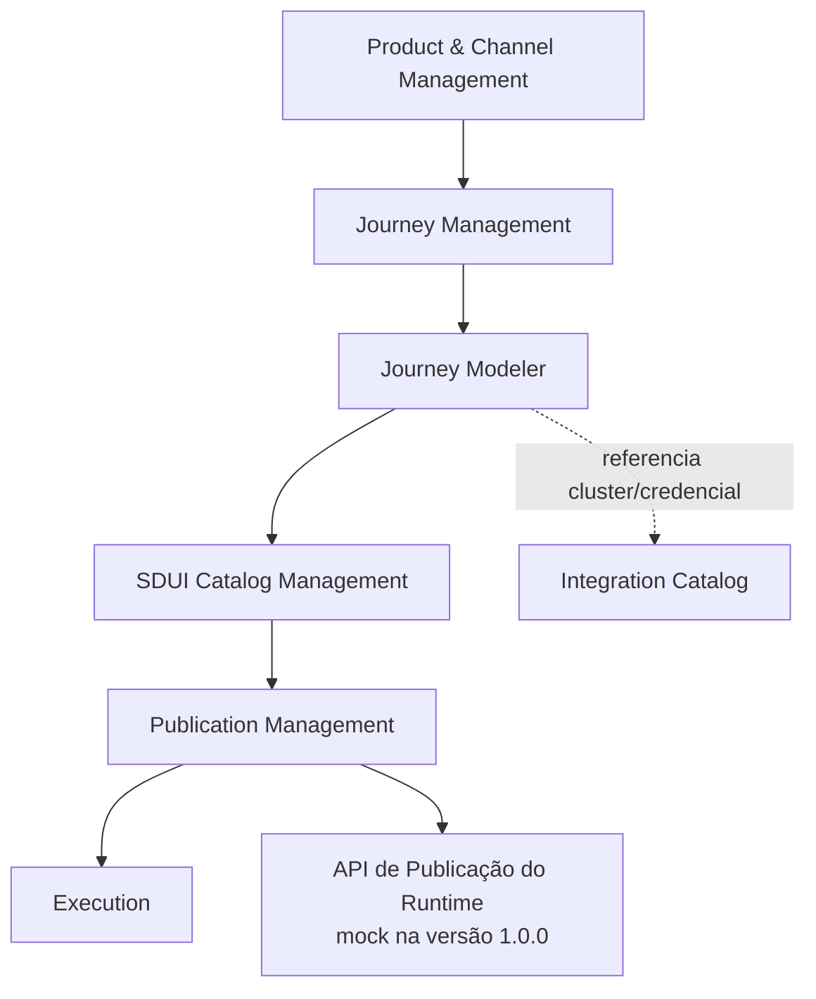
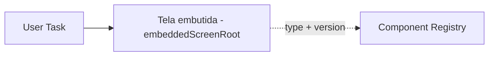
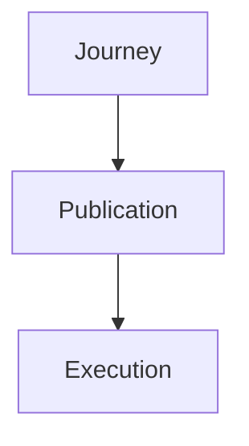
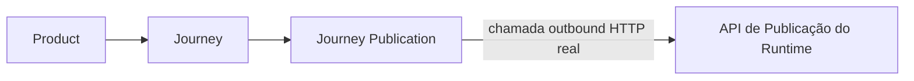
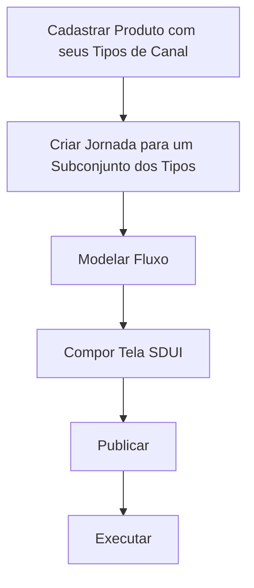
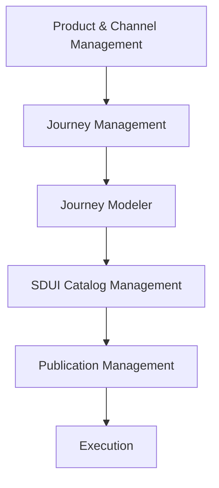
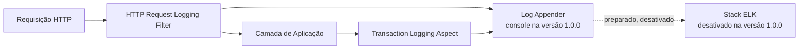
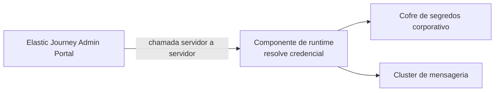

# Elastic Journey Admin Portal
## Arquitetura Lógica

### Versão
1.0.0

---

# 1. Objetivo

Este documento descreve a arquitetura lógica do Elastic Journey Admin Portal, incluindo cadastro de produtos e seus tipos de canal habilitados, autoria de jornadas multicanal, execução e publicação.

---

# 2. Visão Geral



O Admin Portal é a camada de administração e autoria. Ao publicar, envia o snapshot para uma API do runtime. O contrato definitivo dessa API ainda será definido; na versão 1.0.0, um mock simula seu recebimento. O ms-journey não conhece nem consulta o domínio do Admin Portal.

---

# 3. Escopo Arquitetural

```text
Catálogo de Produtos e Canais

Gestão de Jornadas Multicanal

Modelagem Visual de Workflows

Geração de Fluxo Assistida por IA

Catálogo Server Driven UI (SDUI)

Execução

Versionamento de Jornadas

Catálogo de Integrações

Dashboard Operacional

Autenticação e Autorização

Auditoria

Publicação de Jornadas

Publicação no Runtime por API mockada

Ajuda e Suporte

Observabilidade

```

---

# 4. Fora do Escopo

```text
Governança / Workflow de Aprovação

Rollback / Promotion Between Environments

Analytics
```

A versão 1.0.0 utilizará um provedor externo de autenticação representado por mock, com tela de login e usuário `admin`/`admin` no papel `ADMIN`. A autorização será baseada nos papéis `ADMIN`, `EDITOR` e `VIEWER`, e as operações relevantes serão auditadas sem armazenamento de dados sensíveis.

## Contrato de Erros da API

Todas as operações utilizam o schema `ApiError`. O campo `code` possui um identificador estável para tratamento pelo frontend, enquanto `message` apresenta a descrição legível. Erros associados a campos podem ser detalhados em `details`.

```text
400 — Requisição malformada ou parâmetro inválido

401 — Identidade ausente, inválida ou sessão expirada

403 — Identidade autenticada sem permissão para a operação

404 — Recurso não encontrado

409 — Conflito com o estado atual ou restrição de unicidade

422 — Requisição sintaticamente válida, mas incompatível com as regras funcionais

500 — Falha interna inesperada
```

As respostas `401` e `403` fazem parte do comportamento da versão 1.0.0 autenticada e mockada.

---

# 5. Domínios Lógicos

A versão 1.0.0 é composta por onze domínios, organizados em seis grupos funcionais.

```text
Grupo Administração
  01. Product & Channel Management
  11. Integration Catalog

Grupo Autoria
  02. Journey Management
  03. Journey Modeler
  04. SDUI Catalog Management
  05. Execution

Grupo Publicação
  06. Publication Management

Grupo Governança de Acesso
  07. Authentication & Authorization

Grupo Governança Operacional
  08. Version Management
  09. Audit Management

Grupo Observabilidade Técnica
  10. Observability
```

---

# 6. Resumo dos Domínios

| Domínio | Grupo | Responsabilidade |
|---------|-------|------------------|
| Product & Channel Management | Administração | Gestão de produtos e dos tipos de canal que cada um habilita |
| Integration Catalog | Administração | Catálogo de clusters de mensageria corporativos e referências de credencial usados pelos conectores das jornadas |
| Journey Management | Autoria | Ciclo de vida das jornadas, cada uma associada a um subconjunto dos tipos de canal do seu produto |
| Journey Modeler | Autoria | Construção visual dos fluxos |
| SDUI Catalog Management | Autoria | Manutenção do catálogo de componentes SDUI (Component Registry) e da estrutura da árvore de nós que compõe a tela de uma User Task |
| Execution | Autoria | Execução das jornadas |
| Publication Management | Publicação | Manutenção do snapshot da versão publicada e chamada outbound para a API do runtime |
| Authentication & Authorization | Governança de Acesso | Autenticação mockada por provedor externo e autorização por papéis |
| Version Management | Governança Operacional | Criação, consulta e imutabilidade das versões de jornadas |
| Audit Management | Governança Operacional | Registro e consulta de eventos sem dados sensíveis |
| Observability | Observabilidade Técnica | Log técnico de requisições de API e de transações de persistência, correlacionados por requisição |

---

# 7. Arquitetura de Domínios



## Interpretação

O usuário cadastra um produto com os tipos de canal que deseja habilitar, cria uma jornada para um subconjunto desses tipos, modela o fluxo e compõe a tela de cada User Task a partir do catálogo de componentes SDUI — configurando conectores de mensageria a partir do catálogo de integrações quando aplicável —, publica seu snapshot por meio da API do runtime mockada na versão 1.0.0 e então executa a jornada contra o motor de runtime, informando qual tipo de canal está simulando.

Observability (domínio 10) é transversal a todos os domínios acima — instrumenta toda requisição de API e toda transação de persistência independentemente do domínio de negócio envolvido — e por isso não aparece como um nó no fluxo.

---

# 8. Domínio 01 — Product & Channel Management

## Objetivo

Gerenciar produtos e os tipos de canal que cada um habilita para suas jornadas. Canal é um valor de
domínio fixo, não uma entidade com cadastro próprio.

## Responsabilidades

```text
Cadastrar, editar, consultar e desativar produtos

Declarar, na criação/edição de um produto, um conjunto não vazio de tipos de canal habilitados

Pesquisar e filtrar produtos
```

A desativação de um produto deve ser bloqueada com `409` enquanto existir qualquer jornada
descendente com publicação `PUBLISHED`. O usuário deve despublicar essas jornadas antes de repetir
a operação.

## Entidades

```text
Product
```

## Tipos de Canal

```text
WEB, MOBILE, WHATSAPP
```

## Cardinalidade

```text
Product 1 → N Channel Type (coleção de valores — product_channel_type, não uma tabela relacional)
```

> **Nota de revisão (2026-09-06):** domínio reescrito — `Channel` deixou de ser uma entidade
> cadastrável (CRUD com nome/descrição/status por produto, incluindo os tipos `URA`/`CONTACT_CENTER`/
> `OTHER`) e virou um valor de domínio fixo com só 3 tipos, declarado diretamente pelo produto.

---

---

# 10. Domínio 02 — Journey Management

## Objetivo

Gerenciar o ciclo de vida das jornadas, cada uma associada a um produto e a um subconjunto dos
tipos de canal desse produto.

## Responsabilidades

```text
Criar, editar e consultar jornadas

Listar modelos predefinidos e usá-los como ponto de partida opcional na criação

Remover fisicamente somente jornadas nunca publicadas

Desativar jornadas que possuam ou tenham possuído publicação, preservando o registro publicado

Associar cada jornada a um subconjunto não vazio dos tipos de canal habilitados pelo seu produto

Identificar a jornada por código único

Pesquisar e ordenar jornadas por produto e tipo de canal
```

Uma jornada com publicação `PUBLISHED` deve ser despublicada antes de sua desativação. A existência de um registro `UNPUBLISHED` não impede a desativação.

## Entidade Principal

```text
Journey
```

## Cardinalidade

```text
Product 1 → N Journey

Journey 1 → N Channel Type (coleção de valores — journey_channel_type, subconjunto do produto)
```

Jornadas com tipos de canal diferentes são independentes e podem possuir quantidades distintas de
telas e etapas; uma mesma jornada pode atender mais de um tipo de canal ao mesmo tempo, com o mesmo
fluxo e as mesmas telas — o tipo de canal que inicia cada execução fica disponível como variável de
processo reservada (`channel`) para caminhos de Gateway e visibilidade condicional diferentes por
canal (Domínio 03/04).

> **Nota de revisão (2026-09-06):** domínio reescrito — jornada deixou de pertencer a exatamente um
> `Channel` (entidade removida) e passou a declarar diretamente um subconjunto dos tipos de canal
> do seu produto.

Os modelos de jornada são definições de sistema versionadas no backend, não registros editáveis no banco. O frontend consulta somente seus metadados e envia o `templateId` opcional no mesmo `POST` que cria a jornada. O backend instancia novos identificadores para o fluxo, os nós e as conexões e persiste Jornada, Flow e versão inicial `DRAFT` na mesma transação. Sem `templateId`, preserva-se a criação em branco.

---

# 11. Domínio 03 — Journey Modeler

## Objetivo

Permitir a construção visual do fluxo de uma jornada.

## Elementos Suportados

```text
Eventos: Start, Message Start Event, End

Atividades: User Task, Service Task, Receive Task

Conectores habilitados: REST, Kafka

Conectores catalogados e desabilitados: GraphQL, SOAP, Database, Webhook
```

## Capacidades

```text
Drag and Drop, Zoom, Pan, Undo, Redo
```

Uma jornada criada em branco inicia com o canvas vazio; quando criada a partir de um modelo, inicia com uma cópia independente do esqueleto escolhido. O editor pode configurar o elemento inicial como `START` ou `MESSAGE_START_EVENT`, preservando exatamente um elemento inicial, ao menos um `END` e um caminho contínuo entre eles antes da publicação. Um `GATEWAY` (US-03.11) ramifica o fluxo em dois caminhos condicionais que podem terminar em `END`s distintos, sem precisar reconvergir antes do fim. Service Tasks executam integrações externas e Receive Tasks aguardam mensagens em instâncias já iniciadas. O runtime traduz esses elementos para BPMN e executa os conectores habilitados.

## Conectores de Integração

O framework de conectores é extensível. Na versão 1.0.0, `REST`, `KAFKA`, `EVENT_HUBS` e `SERVICE_BUS` são habilitados. Os demais conectores permanecem registrados no catálogo como desabilitados e não podem ser usados em fluxos publicados. Um conector de mensageria (`KAFKA`/`EVENT_HUBS`/`SERVICE_BUS`) referencia um cluster e, opcionalmente, uma credencial do Domínio 11 — Integration Catalog, em vez de texto livre.

O Admin Portal declara, no editor e no snapshot publicado, a estrutura de variáveis do fluxo: o mapeamento de saída de cada integração (`nome ← JSONPath`) e as referências `{{nome}}` usadas nos campos de entrada dos passos seguintes (REQ-03.09.010 a 014). Essa declaração é estática, validada em tempo de design. A **resolução** dessas variáveis durante a execução de uma instância de jornada — substituir `{{nome}}` pelo valor real e popular o contexto a partir da resposta — é responsabilidade do runtime, fora do domínio administrativo, na mesma fronteira já descrita para a transformação executável do fluxo.

```text
SERVICE_TASK       → bpmn:serviceTask
RECEIVE_TASK       → bpmn:receiveTask
MESSAGE_START_EVENT → bpmn:startEvent + messageEventDefinition
```

## Geração de Fluxo Assistida por IA

O editor permite gerar automaticamente um rascunho de fluxo a partir de um prompt em linguagem natural, usando a credencial de IA cadastrada no Domínio 11 — Integration Catalog. O pedido é enviado ao modelo junto com o fluxo já desenhado no canvas (nós, conexões e a tela embutida de cada User Task) como contexto: um pedido aditivo ou pontual não deve remover ou recriar o que não tem relação com ele — o id, a posição e a tela de um nó não afetado são preservados; redesenhar tudo do zero só ocorre quando pedido explicitamente. Um fluxo gerado que viole a validação estrutural do próprio domínio é corrigido e reenviado ao modelo de IA (retry/reparo) dentro de um número limitado de tentativas antes de ser apresentado; uma vez apresentado, o fluxo é um rascunho comum, sujeito às mesmas regras de validação e à mesma revisão manual de qualquer edição direta — a geração por IA não é um caminho de publicação separado.

## Entidades

```text
Flow

Flow Node

Flow Connection
```

---

# 12. Domínio 04 — SDUI Catalog Management

> **Reformulação (2026-09-05):** substitui por completo o antigo domínio "Forms Management"
> (catálogo de Formulários reutilizáveis e modelo de campo plano — ver `ej-admin-requisitos.md`
> FT-04).

## Objetivo

Manter o catálogo corporativo de componentes SDUI (Component Registry) e a estrutura da árvore de nós (`Sdui Node`) que compõe a tela embutida de uma User Task — a árvore em si é editada diretamente no nó, no editor de fluxo (Domínio 03), consultando este domínio para saber o que é permitido usar.

## Responsabilidades

```text
Manter o catálogo de componentes disponíveis (Component Registry): listar, criar, editar e remover (soft-delete)

Prover, desde a primeira instalação, o catálogo inicial com os componentes do contrato corporativo de referência

Validar, na publicação, que toda árvore de tela referencia apenas componentes existentes e não indisponíveis no catálogo

Calcular, na publicação, a interseção de alvos de renderização suportados por todos os componentes usados numa tela, e a versão mínima de renderizador exigida por alvo

Impedir estrutura inválida: id duplicado, filhos num componente que não aceita filhos, vínculo de dados fora dos namespaces reconhecidos, evento associado a ação fora do conjunto fechado do sistema
```

## Entidades

```text
Component Definition

Sdui Node
```

`Component Definition` é uma tabela própria, identificada pela combinação `type`+`version`. `Sdui Node` não é uma entidade com tabela própria: é a estrutura recursiva persistida dentro de `Flow Node.embeddedScreenRoot` (Domínio 03) — cada nó referencia um `Component Definition` por valor (`type`+`version`), nunca por chave estrangeira relacional.

## Estrutura de uma User Task



A tela de uma User Task é uma árvore de `Sdui Node` desenhada diretamente no nó (`embeddedScreenRoot`). O Component Registry nunca é copiado para dentro da tela — só descreve o que é permitido usar; a validação estrutural na publicação rejeita qualquer `type`+`version` que não exista nele ou que esteja marcado como indisponível.

## Imutabilidade na publicação

Ao publicar uma jornada, a árvore `embeddedScreenRoot` de cada User Task é copiada integralmente para o snapshot da publicação, tornando-se imutável a alterações futuras na tela do nó — o mesmo princípio de congelamento aplicado à versão da jornada (Domínio 06 — Publication Management). Diferente do modelo anterior, não existe etapa de compilação/projeção separada: a mesma árvore editada no editor de fluxo é a árvore publicada. Editar um componente do catálogo depois de publicado não afeta jornadas já publicadas — a validação só se aplica no momento de uma nova publicação.

---

# 13. Domínio 05 — Execution

## Objetivo

Permitir a verificação do caminho e das telas de uma jornada publicada, executando-a de fato contra o motor de runtime real.

## Persistência

A execução roda inteiramente contra o motor de runtime e é acompanhada em tempo real pelo frontend — não existe um agregado Execution Run/Step/Result persistido pelo Admin Portal. O único registro que sobrevive no banco do Admin Portal é um Audit Event genérico (`EXECUTION_START`) marcando que uma execução foi iniciada (Domínio 09 — Audit Management).

## Fluxo de Publicação e Execução



---

# 14. Domínio 06 — Publication Management

## Objetivo

Manter uma única publicação por jornada e enviar seu snapshot para a API de publicação do runtime.

## Responsabilidades

```text
Publicar jornada

Despublicar jornada por uma chamada outbound para a API do runtime

Consultar publicações

Filtrar publicações por produto e tipo de canal

Substituir o snapshot anterior quando a jornada for publicada novamente

Enviar o snapshot por uma chamada outbound para a API do runtime
```

## Entidade Principal

```text
Journey Publication
```

## Fluxo de Publicação e Distribuição



Cada jornada possui no máximo uma `Journey Publication` ativa, associada a uma `Journey Version`. Uma nova publicação aponta para uma nova versão imutável e preserva as versões anteriores. O Admin Portal realiza uma chamada de saída real (HTTP) para a API de publicação do runtime; o retorno de sucesso confirma a publicação e altera o estado da versão para `PUBLISHED`. A despublicação chama a mesma API para remover/desfazer a publicação; após o sucesso, a publicação passa para `UNPUBLISHED`. Uma falha em qualquer uma das duas chamadas propaga o erro e preserva os estados atuais.

## Número da versão implantada no runtime

O número da versão publicada (`Journey Version.versionNumber`) é gravado como a tag de versão do processo implantado no runtime, distinta do contador de implantação que o próprio runtime mantém internamente para aquela definição. Os dois números não são garantidos coincidir: o contador interno do runtime avança a cada implantação (mesmo sem mudança de conteúdo), enquanto `versionNumber` só avança a cada nova versão publicada pelo Admin Portal. A tela de inspeção da publicação (Domínio 02, REQ-02.10.001) e o Executor (Domínio 05) exibem `versionNumber`, não o contador interno do runtime.

---

# 15. Fluxo Completo de Trabalho do Usuário



Os códigos de produto e jornada pertencem ao domínio administrativo e são incluídos no snapshot, mas não formam um contrato de consulta pelo runtime; o tipo de canal que inicia cada execução é informado como parâmetro (Domínio 05), não é um código administrativo próprio.

---

# 16. Fronteira com o Runtime

O Admin Portal conhece apenas a API de publicação fornecida pela camada de runtime. O ms-journey não conhece o Admin Portal e não acessa suas APIs ou seu modelo de dados. A transformação da jornada publicada para o formato executável (motor de execução do fluxo) permanece fora do domínio administrativo.

Exceção pontual: o pacote de publicação de cada tela (envelope canônico com jornada, tela, revisão, alvos de renderização compatíveis e versão mínima de renderizador por alvo) é montado pelo próprio Admin Portal no momento da publicação (Domínio 04 — SDUI Catalog Management) a partir da árvore `Sdui Node` que ele já possui e enviado ao repositório de especificação corporativo — não uma transformação executada pelo motor de runtime.

Mesmo princípio se aplica ao teste de conexão do catálogo de integrações (Domínio 11): o Admin Portal nunca resolve credencial nem abre conexão com um cluster de mensageria diretamente — delega ao componente de runtime responsável por isso, que é o único a acessar o cofre de segredos corporativo e o broker de verdade.

## Capacidades Esperadas

```text
Receber o snapshot da jornada

Responder à chamada de publicação

Ser representada por um mock na versão 1.0.0
```

O contrato definitivo da API externa não faz parte da especificação OpenAPI do Admin Portal nesta versão.

---

# 17. Dependências Entre Domínios



Observability não possui dependência de fluxo com os demais domínios — atua de forma transversal, instrumentando a execução de qualquer um deles.

---

# 18. Domínio 10 — Observability

## Objetivo

Registrar em log técnico toda requisição de API e toda transação de aplicação que represente persistência em banco de dados, correlacionando-as por requisição para apoiar diagnóstico e troubleshooting em produção.

## Distinção em relação ao Audit Management (domínio 09)

Audit Management (domínio 09) é uma trilha de negócio, persistida em banco (`Audit Event`), com finalidade de compliance/rastreabilidade e consulta pelo usuário `ADMIN`. Observability é log técnico de execução (não persistido em banco), com finalidade de diagnóstico operacional, consumido via console/arquivo local e, futuramente, por uma stack de observabilidade centralizada. Os dois mecanismos compartilham o conceito de identificador de correlação (`X-Correlation-Id`), mas são trilhas independentes.

## Responsabilidades

```text
Registrar entrada e saída de toda requisição de API (método, path, status, duração)

Registrar início, sucesso e falha de toda transação de persistência da camada de aplicação

Correlacionar, por requisição, os logs de API e os logs de transação por ela disparados

Devolver o identificador de correlação ao cliente na resposta

Manter a integração com uma stack ELK como ponto de extensão preparado, porém desativado na versão 1.0.0
```

## Componentes

```text
HTTP Request Logging Filter — loga entrada/saída de toda requisição de API e propaga o identificador de correlação

Transaction Logging Aspect — loga início/sucesso/falha de toda transação de persistência da camada de aplicação

Log Appender — destino dos logs; console na versão 1.0.0, com ponto de extensão preparado para um appender ELK/Logstash desativado
```

## Fluxo de Observação de uma Requisição



Não há entidade de domínio persistida por este domínio — os logs técnicos não são armazenados em banco de dados, ao contrário do Audit Event.

---

# 19. Domínio 11 — Integration Catalog

## Objetivo

Centralizar o cadastro de clusters/brokers de mensageria corporativos e das referências de credencial usadas para acessá-los, servindo de base para os conectores de mensageria configurados no Journey Modeler (Domínio 03) — sem que o Admin Portal armazene segredo algum. Também centraliza a credencial de API do provedor de IA usada pela geração de fluxo assistida (Domínio 03), como única exceção deliberada a esse princípio.

## Responsabilidades

```text
Cadastrar, editar, consultar e desativar clusters de mensageria corporativos

Cadastrar, editar, consultar e desativar referências de credencial (referência ao Azure Key Vault, nunca o segredo)

Bloquear a desativação de um cluster ou credencial referenciado por um conector de jornada publicada

Restringir a administração do catálogo ao papel ADMIN; demais papéis apenas selecionam entradas já cadastradas

Delegar o teste de conexão ao componente de runtime que resolve a credencial e abre a conexão de verdade

Cadastrar, atualizar e remover a credencial de API de um provedor de IA (Gemini), nunca a expondo de volta pela API
```

## Entidades

```text
Messaging Cluster

Credential Reference

AI Provider Credential
```

## Cardinalidade

```text
Messaging Cluster 1 → 0..N Credential Reference
```

A empresa opera múltiplos clusters corporativos por tipo — o catálogo não assume um único cluster fixo por conector.

## Fluxo do Teste de Conexão



O Admin Portal nunca acessa o cofre de segredos nem o broker diretamente (mesmo princípio da fronteira com o runtime, Seção 16). O teste valida só conectividade/credencial — nunca publica ou consome uma mensagem real.

---

# 20. Artefatos Arquiteturais

| Artefato | Descrição |
|----------|-----------|
| Product | Produto ou serviço digital que declara os tipos de canal habilitados para suas jornadas |
| Channel Type | Valor de domínio fixo (`WEB`/`MOBILE`/`WHATSAPP`) — não é uma entidade cadastrável |
| Journey | Workflow associado a um produto e a um subconjunto dos tipos de canal desse produto |
| Flow | Estrutura visual da jornada |
| Flow Node | Elemento do fluxo: Start, End ou User Task |
| Flow Connection | Conexão entre nós do fluxo |
| Flow Annotation | Nota livre no canvas, sem efeito no fluxo executável |
| User Task Configuration | Árvore de tela SDUI (`embeddedScreenRoot`) ou mensagem de etapa embutida numa User Task |
| Component Definition | Componente do catálogo corporativo SDUI (Component Registry), identificado por `type`+`version` |
| Sdui Node | Nó da árvore que compõe a tela de uma User Task, referenciando um Component Definition |
| Journey Publication | Snapshot de uma versão imutável enviado para a API de publicação do runtime |
| Messaging Cluster | Cluster/broker de mensageria corporativo cadastrado no catálogo de integrações |
| Credential Reference | Referência a um secret do Azure Key Vault, usada por um conector de mensageria |
| AI Provider Credential | Credencial de API de um provedor de IA (Gemini), usada pela geração de fluxo assistida |

---

# 21. Resumo Arquitetural

O Elastic Journey Admin Portal versão 1.0.0 é composto por onze domínios lógicos. A arquitetura parte do cadastro de produtos (cada um declarando seus tipos de canal habilitados) e do catálogo de integrações (clusters de mensageria, referências de credencial e credencial de IA), mantém jornadas associadas a um subconjunto desses tipos de canal, permite modelar fluxos manualmente ou gerar um rascunho assistido por IA, compõe a tela de cada User Task a partir do catálogo corporativo de componentes SDUI (Component Registry), autentica usuários por um provedor externo mockado, versiona jornadas, registra auditoria e publica uma versão imutável por meio de uma chamada mockada para a futura API do runtime. Observability instrumenta, de forma transversal, todos os domínios de negócio com log técnico de API e de transações de persistência.
