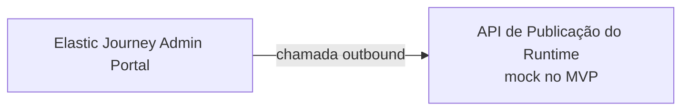
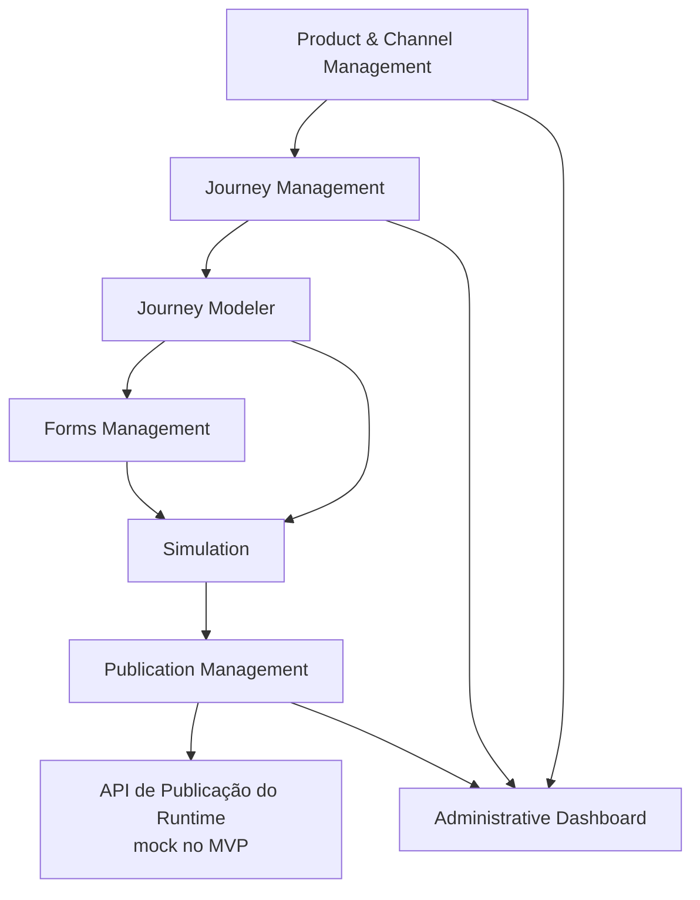
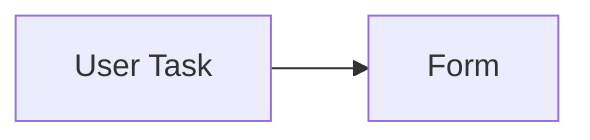
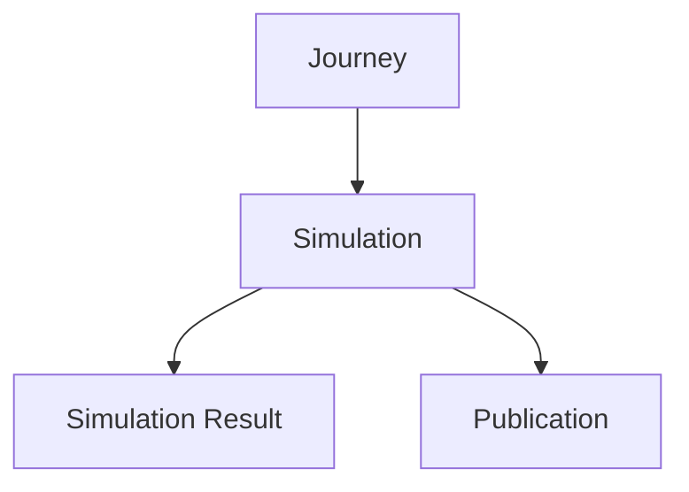
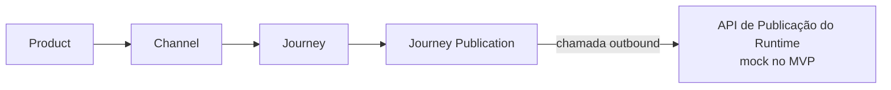
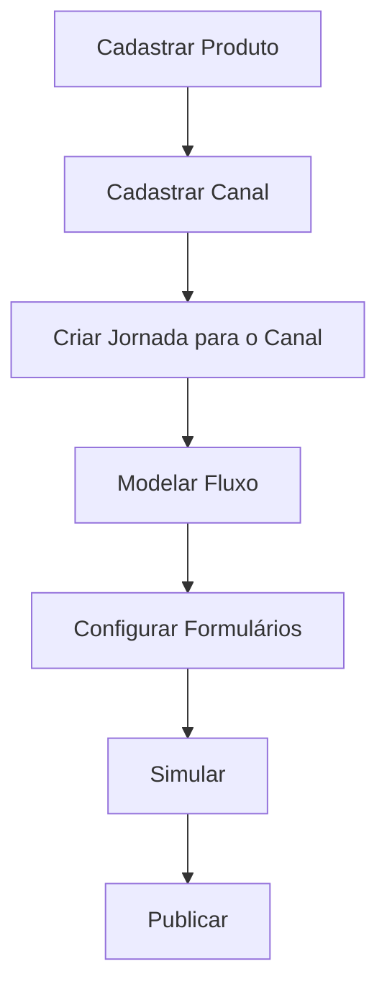
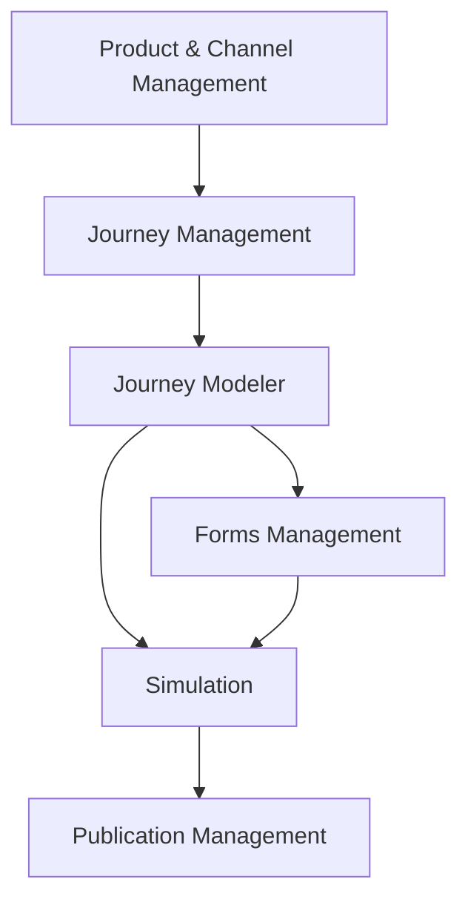

# Elastic Journey Admin Portal
## Arquitetura Lógica

### Versão
1.0 (MVP)

---

# 1. Objetivo

Este documento descreve a arquitetura lógica do Elastic Journey Admin Portal, incluindo cadastro de produtos e canais, autoria de jornadas específicas por canal, simulação, publicação e dashboard administrativo.

---

# 2. Visão Geral



O Admin Portal é a camada de administração e autoria. Ao publicar, envia o snapshot para uma API do runtime. O contrato definitivo dessa API ainda será definido; no MVP, um mock simula seu recebimento. O ms-journey não conhece nem consulta o domínio do Admin Portal.

---

# 3. Escopo Arquitetural

```text
Catálogo de Produtos e Canais

Gestão de Jornadas por Canal

Modelagem Visual de Fluxos

Gestão de Formulários

Simulação

Publicação de Jornadas

Publicação no Runtime por API mockada

Dashboard Administrativo
```

---

# 4. Fora do Escopo

```text
Governança / Workflow de Aprovação

Versionamento / Rollback / Promotion Between Environments

Autenticação / RBAC / Auditoria

Analytics / IA Assistida
```

O MVP será executado em ambiente controlado. O Admin Portal não implementará autenticação nem autorização, e todas as operações administrativas estarão disponíveis sem identificação de usuário.

## Contrato de Erros da API

Todas as operações utilizam o schema `ApiError`. O campo `code` possui um identificador estável para tratamento pelo frontend, enquanto `message` apresenta a descrição legível. Erros associados a campos podem ser detalhados em `details`.

```text
400 — Requisição malformada ou parâmetro inválido

401 — Identidade ausente ou não autenticada, reservado para uso futuro

403 — Identidade sem permissão para a operação, reservado para uso futuro

404 — Recurso não encontrado

409 — Conflito com o estado atual ou restrição de unicidade

422 — Requisição sintaticamente válida, mas incompatível com as regras funcionais

500 — Falha interna inesperada
```

Como o MVP utiliza acesso anônimo, `401` e `403` fazem parte do contrato para compatibilidade futura, mas não serão retornados nesta versão.

---

# 5. Domínios Lógicos

O MVP é composto por sete domínios, organizados em três grupos funcionais.

```text
Grupo Administração
  01. Product & Channel Management
  02. Administrative Dashboard

Grupo Autoria
  03. Journey Management
  04. Journey Modeler
  05. Forms Management
  06. Simulation

Grupo Publicação
  07. Publication Management
```

---

# 6. Resumo dos Domínios

| Domínio | Grupo | Responsabilidade |
|---------|-------|------------------|
| Product & Channel Management | Administração | Gestão de produtos e seus canais |
| Administrative Dashboard | Administração | Visão consolidada dos ativos |
| Journey Management | Autoria | Ciclo de vida das jornadas específicas por canal |
| Journey Modeler | Autoria | Construção visual dos fluxos |
| Forms Management | Autoria | Gestão de formulários SDUI |
| Simulation | Autoria | Simulação das jornadas |
| Publication Management | Publicação | Manutenção do snapshot atual e chamada outbound para a API do runtime |

---

# 7. Arquitetura de Domínios



## Interpretação

O usuário cadastra um produto e seus canais, cria uma jornada para um canal específico, modela o fluxo e os formulários, simula a jornada e então publica seu snapshot por meio da API do runtime mockada no MVP.

---

# 8. Domínio 01 — Product & Channel Management

## Objetivo

Gerenciar produtos e seus canais de atendimento.

## Responsabilidades

```text
Cadastrar, editar, consultar e desativar produtos

Cadastrar, editar, consultar e desativar canais

Associar cada canal a exatamente um produto

Pesquisar e filtrar produtos e canais
```

A desativação de um produto ou canal deve ser bloqueada com `409` enquanto existir qualquer jornada descendente com publicação `PUBLISHED`. O usuário deve despublicar essas jornadas antes de repetir a operação.

## Entidades

```text
Product

Channel
```

## Tipos de Canal

```text
WEB, MOBILE, WHATSAPP, URA, CONTACT_CENTER, OTHER
```

## Cardinalidade

```text
Product 1 → 0..N Channel
```

---

# 9. Domínio 02 — Administrative Dashboard

## Objetivo

Fornecer uma visão consolidada dos ativos administrados.

## Indicadores

```text
Quantidade de produtos

Quantidade de canais

Quantidade de jornadas

Quantidade de formulários

Quantidade de jornadas publicadas

Jornadas recentemente alteradas, ordenadas por updatedAt decrescente
```

---

# 10. Domínio 03 — Journey Management

## Objetivo

Gerenciar o ciclo de vida das jornadas específicas por canal.

## Responsabilidades

```text
Criar, editar e consultar jornadas

Remover fisicamente somente jornadas nunca publicadas

Desativar jornadas que possuam ou tenham possuído publicação, preservando o registro publicado

Associar cada jornada a exatamente um canal

Identificar a jornada por código único dentro do canal

Pesquisar e ordenar jornadas por produto e canal
```

Uma jornada com publicação `PUBLISHED` deve ser despublicada antes de sua desativação. A existência de um registro `UNPUBLISHED` não impede a desativação.

## Entidade Principal

```text
Journey
```

## Cardinalidade

```text
Channel 1 → 0..N Journey

Journey 1 → 1 Channel
```

Jornadas de canais diferentes são independentes e podem possuir quantidades distintas de telas e etapas.

---

# 11. Domínio 04 — Journey Modeler

## Objetivo

Permitir a construção visual do fluxo de uma jornada.

## Elementos Suportados

```text
Eventos: Start, End

Atividades: User Task
```

## Capacidades

```text
Drag and Drop, Zoom, Pan, Undo, Redo, Autosave
```

Uma nova jornada inicia com `START → END`. O editor insere e remove elementos preservando exatamente um `START`, exatamente um `END` e um caminho contínuo entre eles. O backend repete essas restrições na gravação e responde com `422` quando a estrutura recebida for incompatível.

## Entidades

```text
Flow

Flow Node

Flow Connection
```

---

# 12. Domínio 05 — Forms Management

## Objetivo

Gerenciar formulários utilizados pelas User Tasks.

## Componentes MVP

```text
Text, Input, Select, MultiSelect, Upload, Content
```

## Entidades

```text
Form

Form Component
```

## Estrutura de uma User Task



Uma User Task pode possuir um formulário associado. No MVP, essa associação é opcional.

---

# 13. Domínio 06 — Simulation

## Objetivo

Permitir a verificação simulada do caminho e das telas da jornada antes da publicação.

## Entidades

```text
Simulation Execution

Simulation Step

Simulation Result
```

Antes de persistir cada `Simulation Step`, o backend deve percorrer `Flow Node → Flow → Journey` e confirmar que o nó pertence à mesma jornada da `Simulation Execution`. Passos de outra jornada não devem ser persistidos.

## Fluxo de Simulação e Publicação



---

# 14. Domínio 07 — Publication Management

## Objetivo

Manter uma única publicação por jornada e enviar seu snapshot para a API de publicação do runtime.

## Responsabilidades

```text
Publicar jornada

Despublicar jornada por uma chamada outbound para a API do runtime

Consultar publicações

Filtrar publicações por produto e canal

Substituir o snapshot anterior quando a jornada for publicada novamente

Enviar o snapshot por uma chamada outbound para a API do runtime
```

## Entidade Principal

```text
Journey Publication
```

## Fluxo de Publicação e Distribuição



Cada jornada possui no máximo uma `Journey Publication`. Uma nova publicação substitui integralmente o snapshot anterior. No MVP, o retorno de sucesso do mock confirma a publicação e altera o estado da jornada para `PUBLISHED`. A despublicação também chama o mock; após o sucesso, a jornada e a publicação passam para `UNPUBLISHED`. Uma falha preserva os estados atuais.

---

# 15. Fluxo Completo de Trabalho do Usuário



Cada jornada é isolada por canal. Os códigos de produto, canal e jornada pertencem ao domínio administrativo e são incluídos no snapshot, mas não formam um contrato de consulta pelo runtime.

---

# 16. Fronteira com o Runtime

O Admin Portal conhece apenas a API de publicação fornecida pela camada de runtime. O ms-journey não conhece o Admin Portal e não acessa suas APIs ou seu modelo de dados. A transformação da jornada publicada para o formato executável permanece fora do domínio administrativo.

## Capacidades Esperadas

```text
Receber o snapshot da jornada

Responder à chamada de publicação

Ser representada por um mock no MVP
```

O contrato definitivo da API externa não faz parte da especificação OpenAPI do Admin Portal nesta versão.

---

# 17. Dependências Entre Domínios



---

# 18. Artefatos Arquiteturais

| Artefato | Descrição |
|----------|-----------|
| Product | Produto ou serviço digital |
| Channel | Aplicação ou interface de atendimento de um produto |
| Journey | Jornada específica de um canal |
| Flow | Estrutura visual da jornada |
| Flow Node | Elemento do fluxo: Start, End ou User Task |
| Flow Connection | Conexão entre nós do fluxo |
| User Task Configuration | Associação entre uma User Task e seu formulário |
| Form | Formulário utilizado por User Tasks |
| Form Component | Componente visual de um formulário |
| Simulation Execution | Execução simulada da jornada |
| Simulation Step | Etapa registrada durante a simulação |
| Simulation Result | Resultado consolidado da simulação |
| Journey Publication | Snapshot atual enviado para a API de publicação do runtime |

---

# 19. Resumo Arquitetural

O Elastic Journey Admin Portal MVP é composto por sete domínios lógicos. A arquitetura parte do cadastro de produtos e canais, mantém jornadas independentes por canal e publica um único snapshot atual por jornada por meio de uma chamada mockada para a futura API do runtime.
