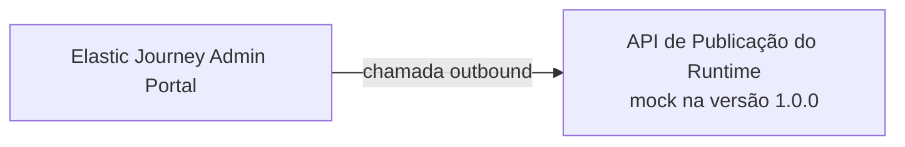
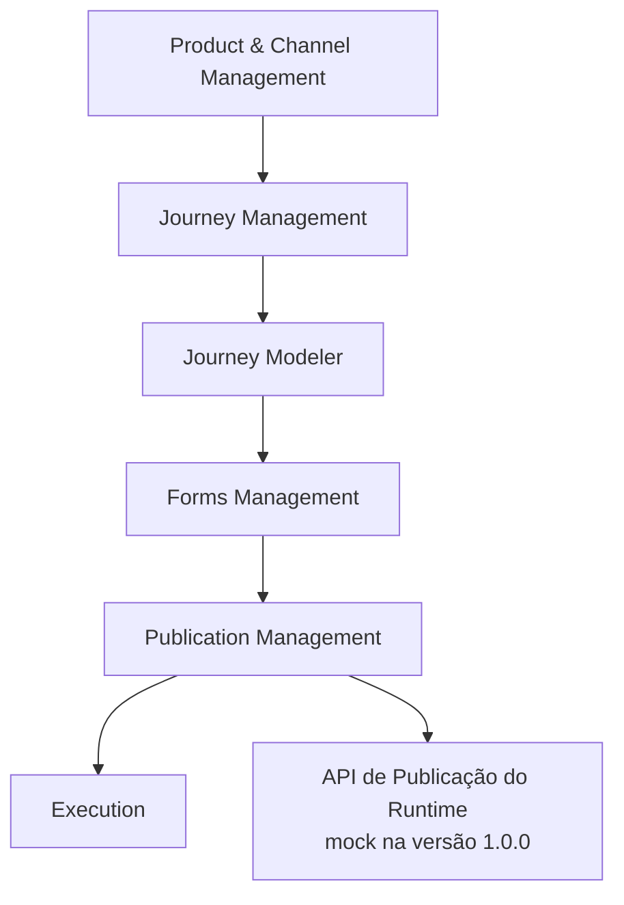
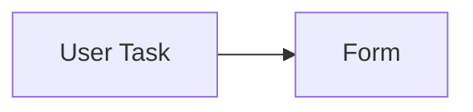
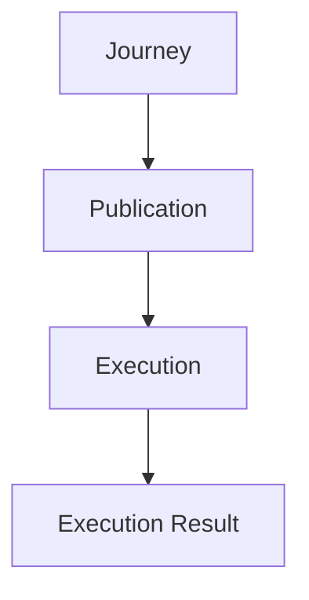
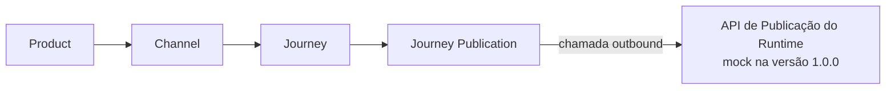
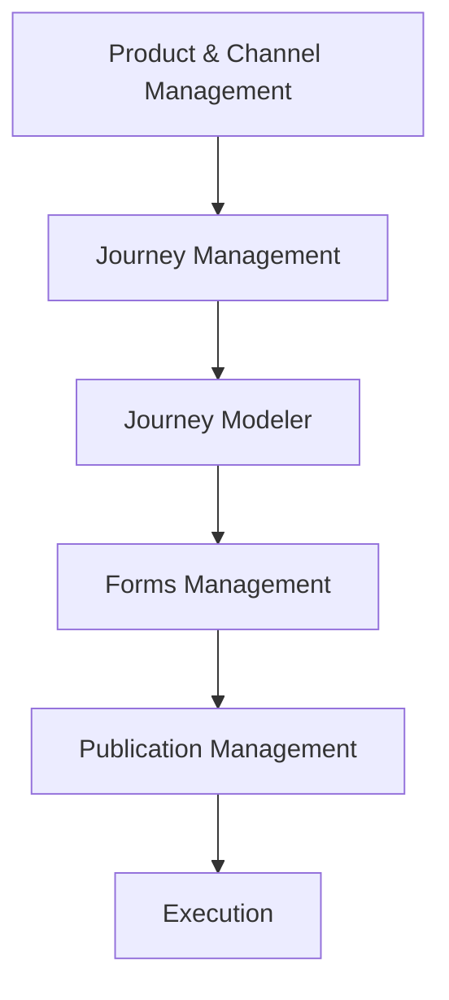
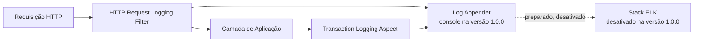

# Elastic Journey Admin Portal
## Arquitetura Lógica

### Versão
1.0.0

---

# 1. Objetivo

Este documento descreve a arquitetura lógica do Elastic Journey Admin Portal, incluindo cadastro de produtos e canais, autoria de jornadas específicas por canal, execução e publicação.

---

# 2. Visão Geral



O Admin Portal é a camada de administração e autoria. Ao publicar, envia o snapshot para uma API do runtime. O contrato definitivo dessa API ainda será definido; na versão 1.0.0, um mock simula seu recebimento. O ms-journey não conhece nem consulta o domínio do Admin Portal.

---

# 3. Escopo Arquitetural

```text
Catálogo de Produtos e Canais

Gestão de Jornadas por Canal

Modelagem Visual de Fluxos

Gestão de Formulários

Execução

Versionamento de Jornadas

Autenticação e Autorização

Auditoria

Publicação de Jornadas

Publicação no Runtime por API mockada

Ajuda e Suporte

Observabilidade

```

---

# 4. Fora do Escopo

```text
Governança / Workflow de Aprovação

Rollback / Promotion Between Environments

Analytics / IA Assistida
```

A versão 1.0.0 utilizará um provedor externo de autenticação representado por mock, com tela de login e usuário `admin`/`admin` no papel `ADMIN`. A autorização será baseada nos papéis `ADMIN`, `EDITOR` e `VIEWER`, e as operações relevantes serão auditadas sem armazenamento de dados sensíveis.

## Contrato de Erros da API

Todas as operações utilizam o schema `ApiError`. O campo `code` possui um identificador estável para tratamento pelo frontend, enquanto `message` apresenta a descrição legível. Erros associados a campos podem ser detalhados em `details`.

```text
400 — Requisição malformada ou parâmetro inválido

401 — Identidade ausente, inválida ou sessão expirada

403 — Identidade autenticada sem permissão para a operação

404 — Recurso não encontrado

409 — Conflito com o estado atual ou restrição de unicidade

422 — Requisição sintaticamente válida, mas incompatível com as regras funcionais

500 — Falha interna inesperada
```

As respostas `401` e `403` fazem parte do comportamento da versão 1.0.0 autenticada e mockada.

---

# 5. Domínios Lógicos

A versão 1.0.0 é composta por dez domínios, organizados em seis grupos funcionais.

```text
Grupo Administração
  01. Product & Channel Management

Grupo Autoria
  02. Journey Management
  03. Journey Modeler
  04. Forms Management
  05. Execution

Grupo Publicação
  06. Publication Management

Grupo Governança de Acesso
  07. Authentication & Authorization

Grupo Governança Operacional
  08. Version Management
  09. Audit Management

Grupo Observabilidade Técnica
  10. Observability
```

---

# 6. Resumo dos Domínios

| Domínio | Grupo | Responsabilidade |
|---------|-------|------------------|
| Product & Channel Management | Administração | Gestão de produtos e seus canais |
| Journey Management | Autoria | Ciclo de vida das jornadas específicas por canal |
| Journey Modeler | Autoria | Construção visual dos fluxos |
| Forms Management | Autoria | Gestão de formulários SDUI |
| Execution | Autoria | Execução das jornadas |
| Publication Management | Publicação | Manutenção do snapshot da versão publicada e chamada outbound para a API do runtime |
| Authentication & Authorization | Governança de Acesso | Autenticação mockada por provedor externo e autorização por papéis |
| Version Management | Governança Operacional | Criação, consulta e imutabilidade das versões de jornadas |
| Audit Management | Governança Operacional | Registro e consulta de eventos sem dados sensíveis |
| Observability | Observabilidade Técnica | Log técnico de requisições de API e de transações de persistência, correlacionados por requisição |

---

# 7. Arquitetura de Domínios



## Interpretação

O usuário cadastra um produto e seus canais, cria uma jornada para um canal específico, modela o fluxo e os formulários, publica seu snapshot por meio da API do runtime mockada na versão 1.0.0 e então executa a jornada contra o motor de runtime.

Observability (domínio 10) é transversal a todos os domínios acima — instrumenta toda requisição de API e toda transação de persistência independentemente do domínio de negócio envolvido — e por isso não aparece como um nó no fluxo.

---

# 8. Domínio 01 — Product & Channel Management

## Objetivo

Gerenciar produtos e seus canais de atendimento.

## Responsabilidades

```text
Cadastrar, editar, consultar e desativar produtos

Cadastrar, editar, consultar e desativar canais

Associar cada canal a exatamente um produto

Pesquisar e filtrar produtos e canais
```

A desativação de um produto ou canal deve ser bloqueada com `409` enquanto existir qualquer jornada descendente com publicação `PUBLISHED`. O usuário deve despublicar essas jornadas antes de repetir a operação.

## Entidades

```text
Product

Channel
```

## Tipos de Canal

```text
WEB, MOBILE, WHATSAPP, URA, CONTACT_CENTER, OTHER
```

## Cardinalidade

```text
Product 1 → 0..N Channel
```

---

---

# 10. Domínio 02 — Journey Management

## Objetivo

Gerenciar o ciclo de vida das jornadas específicas por canal.

## Responsabilidades

```text
Criar, editar e consultar jornadas

Remover fisicamente somente jornadas nunca publicadas

Desativar jornadas que possuam ou tenham possuído publicação, preservando o registro publicado

Associar cada jornada a exatamente um canal

Identificar a jornada por código único dentro do canal

Pesquisar e ordenar jornadas por produto e canal
```

Uma jornada com publicação `PUBLISHED` deve ser despublicada antes de sua desativação. A existência de um registro `UNPUBLISHED` não impede a desativação.

## Entidade Principal

```text
Journey
```

## Cardinalidade

```text
Channel 1 → 0..N Journey

Journey 1 → 1 Channel
```

Jornadas de canais diferentes são independentes e podem possuir quantidades distintas de telas e etapas.

---

# 11. Domínio 03 — Journey Modeler

## Objetivo

Permitir a construção visual do fluxo de uma jornada.

## Elementos Suportados

```text
Eventos: Start, Message Start Event, End

Atividades: User Task, Service Task, Receive Task

Conectores habilitados: REST, Kafka

Conectores catalogados e desabilitados: GraphQL, SOAP, Database, Webhook
```

## Capacidades

```text
Drag and Drop, Zoom, Pan, Undo, Redo
```

Uma nova jornada inicia com `START → END`. O editor pode configurar o elemento inicial como `START` ou `MESSAGE_START_EVENT`, preservando exatamente um elemento inicial, ao menos um `END` e um caminho contínuo entre eles. Um `GATEWAY` (US-03.11) ramifica o fluxo em dois caminhos condicionais que podem terminar em `END`s distintos, sem precisar reconvergir antes do fim. Service Tasks executam integrações externas e Receive Tasks aguardam mensagens em instâncias já iniciadas. O runtime traduz esses elementos para BPMN e executa os conectores habilitados.

## Conectores de Integração

O framework de conectores é extensível. Na versão 1.0.0, `REST` e `KAFKA` são habilitados. Os demais conectores permanecem registrados no catálogo como desabilitados e não podem ser usados em fluxos publicados.

O Admin Portal declara, no editor e no snapshot publicado, a estrutura de variáveis do fluxo: o mapeamento de saída de cada integração (`nome ← JSONPath`) e as referências `{{nome}}` usadas nos campos de entrada dos passos seguintes (REQ-03.09.010 a 014). Essa declaração é estática, validada em tempo de design. A **resolução** dessas variáveis durante a execução de uma instância de jornada — substituir `{{nome}}` pelo valor real e popular o contexto a partir da resposta — é responsabilidade do runtime, fora do domínio administrativo, na mesma fronteira já descrita para a transformação executável do fluxo.

```text
SERVICE_TASK       → bpmn:serviceTask
RECEIVE_TASK       → bpmn:receiveTask
MESSAGE_START_EVENT → bpmn:startEvent + messageEventDefinition
```

## Entidades

```text
Flow

Flow Node

Flow Connection
```

---

# 12. Domínio 04 — Forms Management

## Objetivo

Gerenciar formulários utilizados pelas User Tasks.

## Componentes da Versão 1.0.0

```text
Text, Input, SingleSelect, MultiSelect, FileUpload
```

`Text` absorve o antigo tipo de conteúdo estático (mesmo modelo de dados, diferença apenas de apresentação). `Input` possui subtipo (texto, número, e-mail, data) com validação de formato associada.

## Entidades

```text
Form

Form Field
```

Cada `Form Field` possui um `name` técnico (definido pelo usuário, único no formulário, imutável após criado) como chave de referência do campo.

## Estrutura de uma User Task



Uma User Task pode possuir um formulário associado. Na versão 1.0.0, essa associação é opcional.

## Imutabilidade na publicação e serialização SDUI

Ao publicar uma jornada, o conteúdo de cada `Form` referenciado por suas User Tasks é copiado integralmente para o snapshot da publicação, tornando-se imutável a alterações futuras no formulário original — o mesmo princípio de congelamento aplicado à versão da jornada (Domínio 06 — Journey Versioning). Editar um formulário depois de publicado não afeta jornadas já publicadas que o utilizam; a nova versão do formulário só passa a valer em publicações futuras.

O snapshot de publicação também guarda, para cada formulário, uma projeção derivada em árvore de nós no formato `[tag, props, children]` (estilo SDUI/hyperscript), gerada a partir do conteúdo congelado do `Form Field`. Essa árvore é uma saída de leitura calculada no momento da publicação; o modelo de campos continua sendo a fonte de dados editável no form builder — o front nunca edita a árvore diretamente.

---

# 13. Domínio 05 — Execution

## Objetivo

Permitir a verificação do caminho e das telas de uma jornada publicada, executando-a de fato contra o motor de runtime real.

## Entidades

```text
Execution Run

Execution Step

Execution Result
```

Antes de persistir cada `Execution Step`, o backend deve percorrer `Flow Node → Flow → Journey` e confirmar que o nó pertence à mesma jornada da `Execution Run`. Passos de outra jornada não devem ser persistidos.

## Fluxo de Publicação e Execução



---

# 14. Domínio 06 — Publication Management

## Objetivo

Manter uma única publicação por jornada e enviar seu snapshot para a API de publicação do runtime.

## Responsabilidades

```text
Publicar jornada

Despublicar jornada por uma chamada outbound para a API do runtime

Consultar publicações

Filtrar publicações por produto e canal

Substituir o snapshot anterior quando a jornada for publicada novamente

Enviar o snapshot por uma chamada outbound para a API do runtime
```

## Entidade Principal

```text
Journey Publication
```

## Fluxo de Publicação e Distribuição



Cada jornada possui no máximo uma `Journey Publication` ativa, associada a uma `Journey Version`. Uma nova publicação aponta para uma nova versão imutável e preserva as versões anteriores. Na versão 1.0.0, o retorno de sucesso do mock confirma a publicação e altera o estado da versão para `PUBLISHED`. A despublicação também chama o mock; após o sucesso, a publicação passa para `UNPUBLISHED`. Uma falha preserva os estados atuais.

---

# 15. Fluxo Completo de Trabalho do Usuário


Cada jornada é isolada por canal. Os códigos de produto, canal e jornada pertencem ao domínio administrativo e são incluídos no snapshot, mas não formam um contrato de consulta pelo runtime.

---

# 16. Fronteira com o Runtime

O Admin Portal conhece apenas a API de publicação fornecida pela camada de runtime. O ms-journey não conhece o Admin Portal e não acessa suas APIs ou seu modelo de dados. A transformação da jornada publicada para o formato executável (motor de execução do fluxo) permanece fora do domínio administrativo.

Exceção pontual: a árvore de renderização SDUI (`[tag, props, children]`) de cada formulário é gerada pelo próprio Admin Portal no momento da publicação (Domínio 04 — Forms Management), pois é uma projeção direta do modelo de campos que o Admin já possui — não uma transformação executada pelo runtime.

## Capacidades Esperadas

```text
Receber o snapshot da jornada

Responder à chamada de publicação

Ser representada por um mock na versão 1.0.0
```

O contrato definitivo da API externa não faz parte da especificação OpenAPI do Admin Portal nesta versão.

---

# 17. Dependências Entre Domínios



Observability não possui dependência de fluxo com os demais domínios — atua de forma transversal, instrumentando a execução de qualquer um deles.

---

# 18. Domínio 10 — Observability

## Objetivo

Registrar em log técnico toda requisição de API e toda transação de aplicação que represente persistência em banco de dados, correlacionando-as por requisição para apoiar diagnóstico e troubleshooting em produção.

## Distinção em relação ao Audit Management (domínio 09)

Audit Management (domínio 09) é uma trilha de negócio, persistida em banco (`Audit Event`), com finalidade de compliance/rastreabilidade e consulta pelo usuário `ADMIN`. Observability é log técnico de execução (não persistido em banco), com finalidade de diagnóstico operacional, consumido via console/arquivo local e, futuramente, por uma stack de observabilidade centralizada. Os dois mecanismos compartilham o conceito de identificador de correlação (`X-Correlation-Id`), mas são trilhas independentes.

## Responsabilidades

```text
Registrar entrada e saída de toda requisição de API (método, path, status, duração)

Registrar início, sucesso e falha de toda transação de persistência da camada de aplicação

Correlacionar, por requisição, os logs de API e os logs de transação por ela disparados

Devolver o identificador de correlação ao cliente na resposta

Manter a integração com uma stack ELK como ponto de extensão preparado, porém desativado na versão 1.0.0
```

## Componentes

```text
HTTP Request Logging Filter — loga entrada/saída de toda requisição de API e propaga o identificador de correlação

Transaction Logging Aspect — loga início/sucesso/falha de toda transação de persistência da camada de aplicação

Log Appender — destino dos logs; console na versão 1.0.0, com ponto de extensão preparado para um appender ELK/Logstash desativado
```

## Fluxo de Observação de uma Requisição



Não há entidade de domínio persistida por este domínio — os logs técnicos não são armazenados em banco de dados, ao contrário do Audit Event.

---

# 19. Artefatos Arquiteturais

| Artefato | Descrição |
|----------|-----------|
| Product | Produto ou serviço digital |
| Channel | Aplicação ou interface de atendimento de um produto |
| Journey | Jornada específica de um canal |
| Flow | Estrutura visual da jornada |
| Flow Node | Elemento do fluxo: Start, End ou User Task |
| Flow Connection | Conexão entre nós do fluxo |
| User Task Configuration | Associação entre uma User Task e seu formulário |
| Form | Formulário utilizado por User Tasks |
| Form Component | Componente visual de um formulário |
| Execution Run | Execução da jornada |
| Execution Step | Etapa registrada durante a execução |
| Execution Result | Resultado consolidado da execução |
| Journey Publication | Snapshot de uma versão imutável enviado para a API de publicação do runtime |

---

# 20. Resumo Arquitetural

O Elastic Journey Admin Portal versão 1.0.0 é composto por dez domínios lógicos. A arquitetura parte do cadastro de produtos e canais, mantém jornadas independentes por canal, autentica usuários por um provedor externo mockado, versiona jornadas, registra auditoria e publica uma versão imutável por meio de uma chamada mockada para a futura API do runtime. Observability instrumenta, de forma transversal, todos os domínios de negócio com log técnico de API e de transações de persistência.
