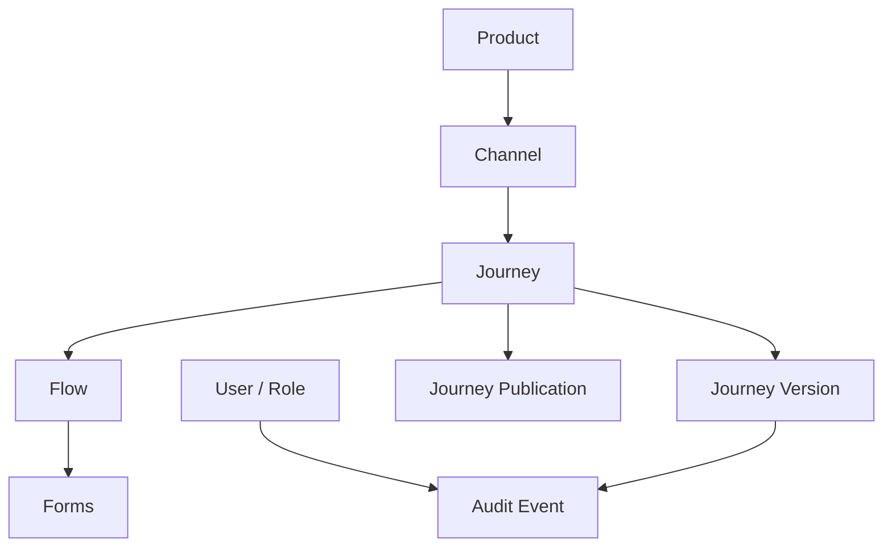
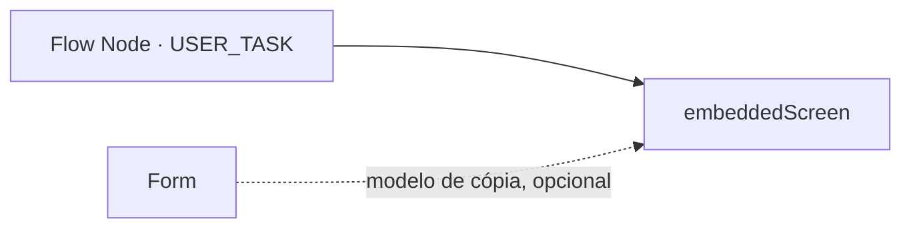
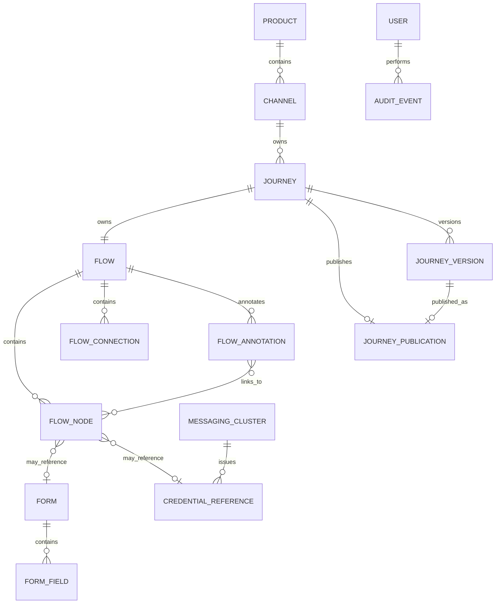

# Elastic Journey Admin Portal
## Modelo de Dados Conceitual

### Versão
1.0.0

---

# 1. Objetivo

Este documento descreve o modelo de dados conceitual do Elastic Journey Admin Portal, abrangendo produtos, canais, jornadas, fluxos, formulários e publicação.

---

# 2. Princípios de Modelagem

## 2.1 Product como Agrupador de Canais

Um Product representa um produto ou serviço digital e agrupa seus canais de atendimento.

Um Product não pode ser desativado enquanto alguma jornada de seus canais possuir publicação ativa.

## 2.2 Jornada Específica por Canal

Cada Journey pertence a exatamente um Channel. Jornadas de canais diferentes possuem definições independentes.

Um Channel não pode ser desativado enquanto alguma de suas jornadas possuir publicação ativa. Uma Journey também deve ser despublicada antes de ser desativada.

## 2.3 Identidade Administrativa

Product, Channel e Journey possuem códigos para identificação e pesquisa no Admin Portal. Esses códigos integram o snapshot publicado, mas não são utilizados pelo runtime para consultar o domínio administrativo.

## 2.4 Publicação como Snapshot

A publicação preserva a definição da versão da jornada no momento da publicação, incluindo produto, canal, fluxo e formulários. Cada jornada possui no máximo uma publicação ativa, associada a uma versão imutável.

## 2.5 Desacoplamento do Motor BPM

Nenhuma entidade possui dependência de BPMN ou de qualquer motor de execução específico.

## 2.6 Simplicidade

A versão 1.0.0 contempla versionamento de jornadas, autenticação mockada, autorização por papéis e auditoria. Rollback, governança e ownership permanecem fora da versão 1.0.0.

## 2.7 Observabilidade Não Persistida

Os logs técnicos de observabilidade (requisições de API e transações de persistência, FT-10) não constituem entidade de domínio: não são armazenados em banco de dados, ao contrário do Audit Event. Por isso não aparecem nas seções seguintes deste documento.

## 2.8 Execução Não É Uma Entidade Persistida

A execução de uma jornada publicada roda inteiramente contra o motor de runtime (fora do domínio deste portal) e é acompanhada em tempo real pelo frontend, sem passar por um agregado próprio do Admin Portal — não existe um Execution Run/Step/Result persistido. O único vestígio que sobrevive no banco do Admin Portal é um Audit Event genérico (`EXECUTION_START`) registrando que uma execução foi iniciada. Por isso não aparece como entidade nas seções seguintes deste documento.

---

# 3. Visão Conceitual



---

# 4. Entidades Principais

| Entidade | Descrição |
|----------|-----------|
| Product | Produto ou serviço digital que agrupa canais |
| Channel | Aplicação ou interface de atendimento de um produto |
| Journey | Jornada específica de um canal |
| Flow | Estrutura visual da jornada |
| Flow Node | Elemento posicionado no canvas: Start, Message Start Event, User Task, Service Task, Receive Task, Gateway ou End |
| Flow Connection | Conexão entre nós do fluxo |
| Flow Annotation | Nota livre no canvas, sem efeito no fluxo executável |
| Form | Formulário reutilizável utilizado por User Tasks |
| Form Field | Campo pertencente a um formulário |
| Journey Publication | Snapshot de uma versão imutável enviado para a API de publicação do runtime |
| Journey Version | Versão imutável de uma jornada |
| User / Role | Identidade autenticada e papel de autorização |
| Audit Event | Registro de operação realizada no sistema |
| Messaging Cluster | Cluster/broker de mensageria corporativo cadastrado no catálogo de integrações |
| Credential Reference | Referência a um secret do Azure Key Vault usada por um conector de mensageria — nunca o valor do segredo |
| AI Provider Credential | Credencial de API de um provedor de IA (Gemini), usada pela geração de fluxo assistida |

---

# 5. Product

## Descrição

Representa um produto ou serviço digital. Exemplo: Vivo+.

## Informações Principais

```text
Código, Nome, Descrição, Status
```

## Cardinalidade

```text
Product 1 → 0..N Channel
```

---

# 6. Channel

## Descrição

Representa uma aplicação ou interface de atendimento pertencente a um produto.

## Tipos Suportados

```text
WEB, MOBILE, WHATSAPP, URA, CONTACT_CENTER, OTHER
```

## Informações Principais

```text
Produto, Código, Nome, Tipo, Status, Descrição
```

## Cardinalidade

```text
Channel 1 → 0..N Journey

Channel N → 1 Product
```

---

# 7. Journey

## Descrição

Representa um workflow específico de um canal.

## Informações Principais

```text
Canal, Código, Nome, Descrição, Status
```

## Responsabilidades

Agrupar o fluxo e registrar execuções e a publicação atual.

## Cardinalidade

```text
Journey N → 1 Channel

Journey 1 → 1 Flow
```

O produto da jornada é determinado pelo produto do canal associado.

Uma Journey somente pode ser removida fisicamente quando nunca tiver possuído uma Journey Publication. Quando houver registro de publicação, a Journey pode apenas ser desativada e sua publicação deve ser preservada.

---

# 8. Flow, Flow Node, Flow Connection e Flow Annotation

## Flow

Estrutura principal da jornada; define a sequência das telas e etapas.

## Flow Node — Tipos

```text
START, END, USER_TASK, SERVICE_TASK, RECEIVE_TASK, MESSAGE_START_EVENT, GATEWAY
```

Uma `USER_TASK` sem tela desenhada (`embeddedScreen` vazio, REQ-04.01.005) pode declarar uma mensagem de texto exibida ao usuário nessa etapa (`messageText`). Toda referência `{{nome}}` (REQ-03.09.012) — na mensagem ou em qualquer prop de texto de um campo da tela desenhada (rótulo, texto de ajuda, valor padrão, opções etc.) — é resolvida contra as variáveis reais da instância no momento da execução, não na publicação.

## Flow Connection

Liga dois nós do mesmo fluxo. Cada fluxo possui exatamente um elemento inicial (`START` ou `MESSAGE_START_EVENT`) e ao menos um `END`. O elemento inicial não possui entrada e possui exatamente uma saída; cada `USER_TASK`, `SERVICE_TASK` e `RECEIVE_TASK` possui ao menos uma entrada e exatamente uma saída; um `GATEWAY` possui ao menos uma entrada e exatamente duas saídas (US-03.11); o `END` possui ao menos uma entrada e nenhuma saída. Todos os nós integram um caminho contínuo e alcançável entre o elemento inicial e algum `END` — um `GATEWAY` pode ramificar o fluxo em caminhos que terminam em `END`s distintos, sem precisar reconvergir antes do fim.

Um `END` alcançável apenas por tarefas automáticas via conector REST — sem nenhum checkpoint (`USER_TASK`, `RECEIVE_TASK` ou uma `SERVICE_TASK` Kafka) desde o elemento inicial — é uma estrutura inválida: o conector HTTP nativo do motor de runtime executa de forma síncrona, e várias execuções concluindo a instância na mesma transação que a iniciou rompem o motor. O backend rejeita esse desenho ao salvar o fluxo.

## Flow Annotation

Nota livre posicionada no canvas do editor de fluxo, usada apenas como documentação visual — nunca participa da validação estrutural do `Flow` nem é traduzida para BPMN na publicação (nunca é enviada ao `ms-transform-publication`). Pode ser vinculada a um ou mais `Flow Node` do mesmo fluxo, exibida como uma linha pontilhada no editor; o vínculo é apenas informativo, sem efeito na execução.

## Persistência e identificadores

O `Flow` (nós, conexões e anotações) é persistido como um único documento `jsonb` associado à jornada — não há necessidade de consultar nós/conexões/anotações individualmente hoje, então não são normalizados em tabelas próprias.

Na publicação, a runtime traduz este `Flow` para uma definição de processo BPMN. Elementos BPMN em XML exigem identificadores no formato `NCName` (não podem iniciar com dígito), o que um UUID puro não garante. Por isso, os identificadores que a runtime embute diretamente como `id` de elemento BPMN nascem com um prefixo fixo, nunca como UUID puro:

| Identificador | Formato | Vira, na runtime |
|---|---|---|
| `Flow.flowId` | `Process_<uuid>` | `id` do `<bpmn:process>` |
| `FlowNode.nodeId` | `Node_<uuid>` | `id` de elementos BPMN de início, tarefa, espera ou término |
| `FlowConnection.connectionId` | `Flow_<uuid>` | `id` de `<bpmn:sequenceFlow>` |

Os demais identificadores do domínio (`productId`, `channelId`, `journeyId`, `formId`, etc.) nunca aparecem no XML BPMN gerado e permanecem UUID puro — o prefixo é aplicado apenas onde a restrição do XML exige. `FlowAnnotation.id` também recebe um prefixo fixo (`Annotation_<uuid>`) por convenção de legibilidade, mas nunca por exigência do XML — uma anotação nunca é enviada ao `ms-transform-publication` nem vira elemento BPMN.

---

# 9. Integration Tasks and Connectors

`SERVICE_TASK` executes an external integration. `RECEIVE_TASK` waits for a message in an already running journey instance. `MESSAGE_START_EVENT` creates a new journey instance from an external message.

The connector framework is extensible. `REST`, `KAFKA`, `EVENT_HUBS` and `SERVICE_BUS` are enabled in version 1.0.0; additional connectors may be cataloged as disabled without being available for use in flows.

```text
SERVICE_TASK        → bpmn:serviceTask
RECEIVE_TASK        → bpmn:receiveTask
MESSAGE_START_EVENT → bpmn:startEvent + messageEventDefinition
```

Connector configuration is declarative and stored with the flow snapshot. Credential values are not stored; a messaging connector (`KAFKA`/`EVENT_HUBS`/`SERVICE_BUS`) references a `Credential Reference` from the Integration Catalog (Section 13) instead of free text. Output mapping follows a defined structure (a list of `name`/`jsonPath` rules) rather than free-form JSON; input fields (URL, headers, body/payload) may reference variables from prior steps via `{{name}}`.

# 10. User Task Configuration

Trio de atributos (`embeddedScreen`, `embeddedScreenSdui`, `messageText`) que a API expõe agrupado sob o nome `User Task Configuration` — não é uma entidade com identidade própria: pertence ao próprio `Flow Node`, dentro do mesmo documento `jsonb` do `Flow` (ver §8), e não existe fora dele (não tem id, não é criada/consultada/removida separadamente). Só é relevante para um `Flow Node` do tipo `USER_TASK`.

Na versão 1.0.0, a tela é opcional: cada `USER_TASK` pode ter uma tela desenhada diretamente no nó (`embeddedScreen`, array de `Form Field`) ou não ter nenhuma. Quando `embeddedScreen` está vazio, `messageText` guarda a mensagem de texto exibida ao usuário nessa etapa (REQ-04.01.005) — os dois nunca coexistem com sentido. `embeddedScreenSdui` só existe numa snapshot de publicação/versão: a árvore SDUI compilada de `embeddedScreen` no momento em que a jornada foi publicada (§12, Imutabilidade).



Um `Form` do catálogo (§11) pode servir de modelo de partida ao montar `embeddedScreen` — seus campos são copiados no momento da escolha —, mas nenhuma referência é persistida entre o nó e o `Form` de origem depois disso.

> **Nota de revisão (2026-08-24):** seção reescrita — a Runtime Engine só suporta um conjunto básico de tipos de campo nativos (~5-6), inviabilizando manter a `USER_TASK` associada a um `Form` por `formId`; a tela passou a ser desenhada diretamente no nó (`embeddedScreen`), com o `Form` do catálogo servindo apenas como modelo de cópia opcional.

---

# 11. Form e Form Field

## Form

Formulário reutilizável do catálogo, usado só como modelo de partida (cópia) para a tela embutida de uma User Task — nunca referenciado por id depois da cópia.

## Form Field — Tipos da Versão 1.0.0

```text
SECTION, TEXT, INPUT, SINGLE_SELECT, MULTI_SELECT, FILE_UPLOAD, RADIO, SWITCH,
SLIDER, RATING, STEPPER, AUTOCOMPLETE, TITLE, IMAGE, DIVIDER, CARD, CALLOUT
```

> Nomenclatura alinhada ao domínio implementado (`FormField`/`FormFieldType`). O tipo `STATIC_CONTENT`, que existia como tipo separado, foi colapsado em `TEXT` — os dois tinham o mesmo modelo de dados e divergiam apenas na apresentação visual. `SECTION` é estrutural — agrupa os campos seguintes até a próxima seção numa grade de colunas configurável — e não coleta valor.

O mesmo modelo de `Form Field` é usado tanto no catálogo (`Form.fields`) quanto na tela embutida de uma `USER_TASK` (`Flow Node.embeddedScreen`, §10). Cada campo possui um `name` técnico, usado como chave de referência. No catálogo, o `name` é único dentro do formulário e imutável após a criação. Na tela embutida, o `name` é editável a qualquer momento e sua unicidade é verificada na jornada inteira, não só na tela — mesmo espaço de nomes das variáveis de saída de integração (REQ-03.09.011).

- `INPUT` possui um subtipo (texto, número, e-mail, data), com validação de formato associada (faixa mínima/máxima para número; regex/máscara para texto); o valor padrão pode referenciar `{{nome}}` de uma variável do fluxo, resolvida em tempo de execução.
- `SINGLE_SELECT`/`MULTI_SELECT`/`RADIO`/`AUTOCOMPLETE` possuem opções como pares rótulo/valor (não apenas rótulo). `AUTOCOMPLETE` usa opções estáticas na v1.0.0 — fonte de dados dinâmica remota é evolução futura.
- `FILE_UPLOAD` possui configuração de extensões aceitas e tamanho máximo do arquivo.
- `SLIDER`/`STEPPER` possuem mínimo, máximo e incremento configuráveis; `RATING` possui número máximo de estrelas configurável.

Ao publicar uma jornada, a tela embutida (`embeddedScreen`) de cada User Task é copiada integralmente para o snapshot da publicação, tornando-se imutável a alterações futuras na tela do nó (mesmo princípio de congelamento do versionamento de jornada). O snapshot de publicação também guarda, para cada User Task com tela desenhada, uma representação derivada em árvore de nós no formato `[tag, props, children]` (estilo SDUI/hyperscript) — `embeddedScreenSdui` — uma projeção de leitura gerada a partir do `embeddedScreen` congelado, e não um formato de armazenamento da tela em edição. Editar um `Form` do catálogo depois de publicado não afeta jornadas já publicadas — elas nunca dependeram dele, só copiaram os campos uma vez.

## Persistência

Os `Form Field` de um formulário são persistidos como um único documento `jsonb` (`Form.fields`); os de uma tela embutida, como parte do documento `jsonb` do próprio `Flow Node` (`embeddedScreen`, §8) — nenhum dos dois é normalizado em tabela própria. Cada campo não tem um id UUID próprio: sua chave real é o `name` técnico.

> **Nota de revisão (2026-08-24):** seção reescrita — a Runtime Engine só suporta um conjunto básico de tipos de campo nativos (~5-6), inviabilizando manter a `USER_TASK` associada a um `Form` do catálogo por `formId`; a tela passou a ser desenhada diretamente no nó (`embeddedScreen`), com o `Form` do catálogo servindo apenas como modelo de cópia opcional — e o catálogo de tipos foi ampliado de 5 para 17 componentes para cobrir a necessidade real de telas ricas, resolvida inteiramente pelo Admin Portal (SDUI) em vez de depender do motor.

---

# 12. Journey Publication

## Descrição

Representa o snapshot de uma versão imutável enviado para a API de publicação do runtime, por uma chamada de saída real (HTTP). A publicação ativa referencia uma `Journey Version`.

## Conteúdo

```text
Product

Channel

Journey

Flow (com a tela já compilada — embeddedScreenSdui — de cada User Task)

VersionNumber
```

## Estados Possíveis

```text
PUBLISHED, UNPUBLISHED
```

Cada jornada possui no máximo uma publicação. Publicar novamente substitui o snapshot existente, sem criar histórico ou nova versão (o histórico vive em `Journey Version`, §14).

Ao despublicar, o Admin Portal chama a mesma API real do runtime. Somente após o retorno de sucesso, Journey e Journey Publication passam para `UNPUBLISHED`. Jornadas nunca publicadas permanecem `DRAFT`.

> **Nota de revisão (2026-08-24):** `Conteúdo` reescrito — a Runtime Engine só suporta um conjunto básico de tipos de campo nativos (~5-6), inviabilizando manter a User Task associada a um formulário do catálogo por `formId`; a tela passou a ser desenhada diretamente no nó, e o snapshot não carrega mais uma lista de formulários — só a tela já compilada de cada nó, mais o número da versão publicada.

---

# 13. Messaging Cluster e Credential Reference

## Messaging Cluster

Cluster/broker de mensageria corporativo cadastrado no catálogo de integrações, usado como base pelos conectores de mensageria do Journey Modeler (Seção 9). A empresa opera múltiplos clusters corporativos por tipo — o catálogo não assume um único cluster fixo.

```text
Nome, Tipo (KAFKA, EVENT_HUBS, SERVICE_BUS), Endereço de conexão, Status
```

## Credential Reference

Referência a um secret mantido no Azure Key Vault da empresa, associada a um `Messaging Cluster`. Nunca armazena o valor do segredo — só o nome de referência (usado como `credentialRef` na configuração do conector), a URI do Key Vault e o nome do secret dentro dele.

```text
Nome de referência, Cluster, URI do Key Vault, Nome do secret, Status
```

## Administração

A criação, edição e desativação de clusters e credenciais é restrita ao papel `ADMIN`. Demais papéis apenas selecionam entradas já cadastradas ao configurar um conector. A desativação de um cluster ou credencial é bloqueada enquanto houver credencial ativa ou conector de jornada publicada referenciando-a.

## Teste de Conexão

Valida conectividade e credencial contra o cluster — nunca publica ou consome uma mensagem real. É delegado ao componente de runtime que efetivamente resolve a credencial e abre a conexão; o Admin Portal nunca acessa o Key Vault nem o broker diretamente.

## Cardinalidade

```text
Messaging Cluster 1 → 0..N Credential Reference
```

---

# 14. AI Provider Credential

Credencial de API de um provedor de IA (Gemini), usada pela geração de fluxo assistida do Journey Modeler (Seção 9). Entidade isolada, sem relacionamento com nenhuma outra — não pertence ao mesmo agrupamento de `Messaging Cluster`/`Credential Reference`, por servir um único consumidor (a geração de fluxo), não um framework de conectores com múltiplos tipos.

```text
Provedor, Chave de API, Data de criação, Data de atualização
```

Diferente de `Credential Reference`, esta entidade armazena o valor do segredo — exceção deliberada e temporária ao princípio de nunca persistir um segredo (ver Seção 13), com pendência de criptografia registrada como TODO no código antes de produção. A API nunca retorna o valor da chave, apenas se o provedor está configurado e a data da última atualização.

---

# 15. Relacionamentos das Entidades

| Origem | Destino | Cardinalidade |
|--------|---------|---------------|
| Product | Channel | 1:N |
| Channel | Journey | 1:N |
| Journey | Flow | 1:1 |
| Flow | Flow Node | 1:N |
| Flow | Flow Connection | 1:N |
| Flow | Flow Annotation | 1:N |
| Flow Annotation | Flow Node | N:M |
| Flow Node | Form | N:0..1 |
| Form | Form Field | 1:N |
| Journey | Journey Publication | 1:0..1 |
| Journey | Journey Version | 1:N |
| Journey Version | Journey Publication | 1:0..1 |
| User | Audit Event | 1:N |
| Messaging Cluster | Credential Reference | 1:N |

---

# 16. Diagrama ER Conceitual



`AI Provider Credential` não aparece no diagrama acima por não possuir relacionamento com nenhuma outra entidade — é consultada pelo Journey Modeler (Seção 9) no momento da geração de fluxo, sem chave estrangeira ou vínculo persistido.

---

# 17. Glossário

| Conceito | Descrição |
|----------|-----------|
| Product | Produto ou serviço digital |
| Channel | Aplicação ou interface de atendimento de um produto |
| Journey | Jornada específica de um canal |
| Flow / Flow Node / Flow Connection | Estrutura visual da jornada e seus elementos |
| Flow Annotation | Nota livre no canvas, sem efeito no fluxo executável |
| User Task Configuration | Trio `embeddedScreen`/`embeddedScreenSdui`/`messageText` embutido num Flow Node `USER_TASK` — não é uma entidade própria |
| Form / Form Field | Formulário reutilizável do catálogo (modelo de cópia opcional) e os campos que o compõem |
| Journey Publication | Snapshot de uma versão imutável enviado para a API de publicação do runtime |
| Messaging Cluster | Cluster/broker de mensageria corporativo cadastrado no catálogo de integrações |
| Credential Reference | Referência a um secret do Azure Key Vault usada por um conector de mensageria |
| AI Provider Credential | Credencial de API de um provedor de IA (Gemini), usada pela geração de fluxo assistida |

> **Nota de revisão (2026-08-24):** linhas `User Task Configuration` e `Form / Form Field` reescritas — a Runtime Engine só suporta um conjunto básico de tipos de campo nativos (~5-6), inviabilizando manter a User Task associada a um formulário do catálogo por `formId`; a tela passou a ser desenhada diretamente no nó (`embeddedScreen`), com o formulário do catálogo servindo apenas como modelo de cópia opcional.

---

# 18. Resumo Conceitual

O modelo conceitual parte de Product, que agrupa Channels. Cada Channel possui Journeys independentes, e cada Journey agrega fluxo e múltiplas versões. No máximo uma versão pode estar publicada por jornada; a publicação preserva seu snapshot imutável. Usuários e papéis controlam o acesso, eventos de auditoria registram operações relevantes sem dados sensíveis, e um catálogo de clusters de mensageria e referências de credencial dá suporte aos conectores de mensageria configurados no fluxo.
