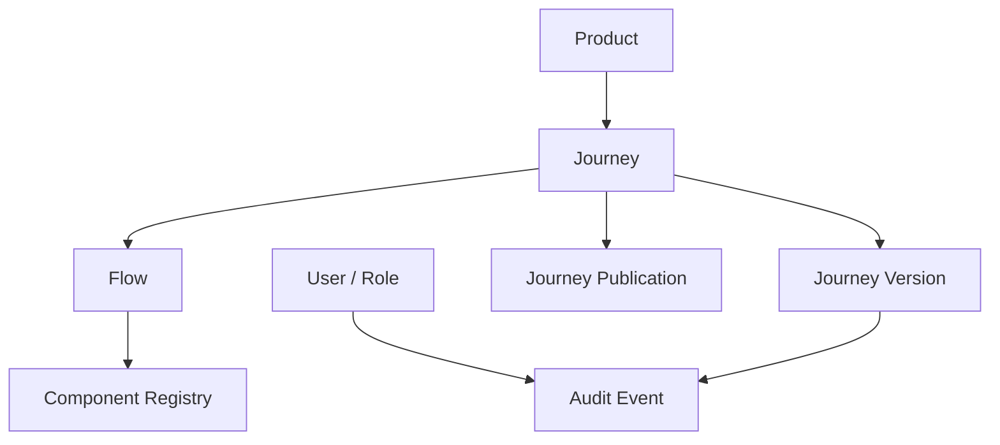
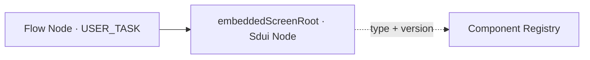
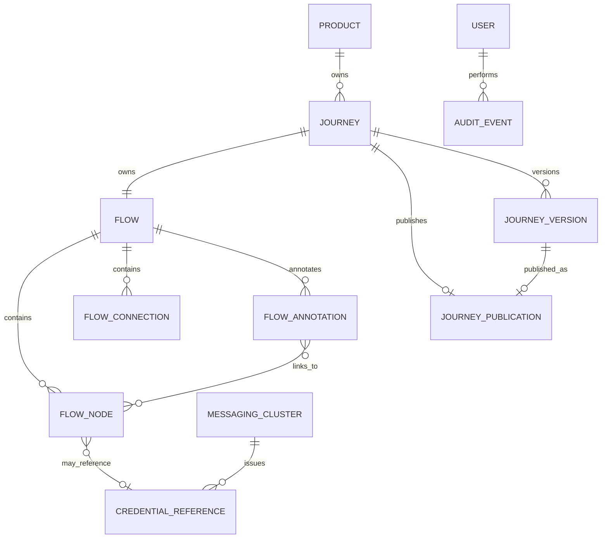

# Elastic Journey Admin Portal
## Modelo de Dados Conceitual

### Versão
1.0.0

---

# 1. Objetivo

Este documento descreve o modelo de dados conceitual do Elastic Journey Admin Portal, abrangendo produtos, canais, jornadas, fluxos, formulários e publicação.

---

# 2. Princípios de Modelagem

## 2.1 Product Declara seus Tipos de Canal

Um Product representa um produto ou serviço digital e declara diretamente um conjunto não vazio de
tipos de canal (`WEB`, `MOBILE`, `WHATSAPP`) pelos quais suas jornadas podem ficar disponíveis.
Canal não é uma entidade com cadastro próprio — é um valor de domínio fixo (Seção 6).

Um Product não pode ser desativado enquanto alguma de suas jornadas possuir publicação ativa.

## 2.2 Jornada Associada a um Subconjunto de Tipos de Canal do Produto

Cada Journey pertence diretamente a um Product e declara um subconjunto não vazio dos tipos de
canal habilitados por esse produto — nunca um tipo fora do que o produto permite. Uma jornada pode
atender mais de um tipo de canal ao mesmo tempo, com o mesmo fluxo e as mesmas telas; o tipo de
canal que inicia cada execução fica disponível como variável de processo (Seção 9) para caminhos de
Gateway e regras de visibilidade condicional diferentes por canal (Seção 11).

Uma Journey deve ser despublicada antes de ser desativada.

## 2.3 Identidade Administrativa

Product e Journey possuem códigos para identificação e pesquisa no Admin Portal. Esses códigos
integram o snapshot publicado, mas não são utilizados pelo runtime para consultar o domínio
administrativo.

> **Nota de revisão (2026-09-06):** Seções 2.1/2.2 reescritas e Channel removido da lista de
> entidades com código próprio — canal deixou de ser uma entidade cadastrável (CRUD com
> nome/descrição/status por produto) e virou um valor de domínio fixo (Seção 6); Product e Journey
> passaram a declarar `channelTypes` diretamente, como coleção de valores, não mais uma relação
> para outra tabela.

## 2.4 Publicação como Snapshot

A publicação preserva a definição da versão da jornada no momento da publicação, incluindo produto, canal, fluxo e formulários. Cada jornada possui no máximo uma publicação ativa, associada a uma versão imutável.

## 2.5 Modelos predefinidos de jornada

Um `Journey Template` é uma definição de sistema, versionada no código do backend e sem identidade persistida no banco. Ao ser escolhido na criação, produz um novo `Flow` com identificadores próprios; a partir desse momento, a cópia pertence exclusivamente à jornada e não mantém vínculo vivo com o modelo de origem.

## 2.5 Desacoplamento do Motor BPM

Nenhuma entidade possui dependência de BPMN ou de qualquer motor de execução específico.

## 2.6 Simplicidade

A versão 1.0.0 contempla versionamento de jornadas, autenticação mockada, autorização por papéis e auditoria. Rollback, governança e ownership permanecem fora da versão 1.0.0.

## 2.7 Observabilidade Não Persistida

Os logs técnicos de observabilidade (requisições de API e transações de persistência, FT-10) não constituem entidade de domínio: não são armazenados em banco de dados, ao contrário do Audit Event. Por isso não aparecem nas seções seguintes deste documento.

## 2.8 Execução Não É Uma Entidade Persistida

A execução de uma jornada publicada roda inteiramente contra o motor de runtime (fora do domínio deste portal) e é acompanhada em tempo real pelo frontend, sem passar por um agregado próprio do Admin Portal — não existe um Execution Run/Step/Result persistido. O único vestígio que sobrevive no banco do Admin Portal é um Audit Event genérico (`EXECUTION_START`) registrando que uma execução foi iniciada. Por isso não aparece como entidade nas seções seguintes deste documento.

---

# 3. Visão Conceitual



`Channel Type` (Seção 6) não aparece no diagrama acima por não ser uma entidade — é um valor de
domínio fixo declarado como atributo (coleção) tanto de `Product` quanto de `Journey`.

---

# 4. Entidades Principais

| Entidade | Descrição |
|----------|-----------|
| Product | Produto ou serviço digital que declara os tipos de canal habilitados para suas jornadas |
| Journey | Workflow associado a um produto e a um subconjunto dos tipos de canal desse produto |
| Journey Template | Esqueleto de fluxo predefinido, copiado na criação e não persistido como entidade própria |
| Flow | Estrutura visual da jornada |
| Flow Node | Elemento posicionado no canvas: Start, Message Start Event, User Task, Service Task, Receive Task, Gateway ou End |
| Flow Connection | Conexão entre nós do fluxo |
| Flow Annotation | Nota livre no canvas, sem efeito no fluxo executável |
| Component Registry | Catálogo corporativo de componentes SDUI (Component Definition) disponíveis para compor telas |
| Sdui Node | Nó da árvore de tela de uma User Task, referenciando um componente do Component Registry |
| Journey Publication | Snapshot de uma versão imutável enviado para a API de publicação do runtime |
| Journey Version | Versão imutável de uma jornada |
| User / Role | Identidade autenticada e papel de autorização |
| Audit Event | Registro de operação realizada no sistema |
| Messaging Cluster | Cluster/broker de mensageria corporativo cadastrado no catálogo de integrações |
| Credential Reference | Referência a um secret do Azure Key Vault usada por um conector de mensageria — nunca o valor do segredo |
| AI Provider Credential | Credencial de API de um provedor de IA (Gemini), usada pela geração de fluxo assistida |

---

# 5. Product

## Descrição

Representa um produto ou serviço digital. Exemplo: Vivo+.

## Informações Principais

```text
Código, Nome, Descrição, Status, Tipos de Canal habilitados (não vazio)
```

---

# 6. Channel Type

## Descrição

Valor de domínio fixo que representa o meio de atendimento digital pelo qual uma jornada pode ficar
disponível para o cliente. Não é uma entidade com identidade, cadastro ou ciclo de vida próprio —
substitui a antiga entidade `Channel` (CRUD com nome/descrição/status por produto).

## Valores Suportados

```text
WEB, MOBILE, WHATSAPP
```

## Uso

`Product` declara um conjunto não vazio de `Channel Type` que habilita para suas jornadas. `Journey`
declara um subconjunto não vazio dos `Channel Type` do seu `Product`. Ambos como coleção de valores
(sem identidade própria, sem chave estrangeira) — nunca uma referência a linha de outra tabela.

---

# 7. Journey

## Descrição

Representa um workflow associado a um produto e a um subconjunto dos tipos de canal desse produto.

## Informações Principais

```text
Produto, Tipos de Canal (não vazio, subconjunto do produto), Código, Nome, Descrição, Status
```

## Responsabilidades

Agrupar o fluxo e registrar execuções e a publicação atual.

## Cardinalidade

```text
Journey N → 1 Product

Journey 1 → 1 Flow
```

O tipo de canal que inicia cada execução é informado pelo chamador e validado contra os tipos
habilitados da jornada (Seção 9) — nunca derivado de uma entidade Channel, que não existe mais.

Uma Journey somente pode ser removida fisicamente quando nunca tiver possuído uma Journey Publication. Quando houver registro de publicação, a Journey pode apenas ser desativada e sua publicação deve ser preservada.

---

# 8. Flow, Flow Node, Flow Connection e Flow Annotation

## Flow

Estrutura principal da jornada; define a sequência das telas e etapas.

## Flow Node — Tipos

```text
START, END, USER_TASK, SERVICE_TASK, RECEIVE_TASK, MESSAGE_START_EVENT, GATEWAY
```

Uma `USER_TASK` sem tela desenhada (`embeddedScreenRoot` ausente, REQ-04.01.005) pode declarar uma mensagem de texto exibida ao usuário nessa etapa (`messageText`). Toda referência `{{nome}}`/`{{namespace.path}}` (REQ-03.09.012, seção 8 do contrato SDUI) — na mensagem ou em qualquer prop de texto de um nó da tela desenhada — é resolvida contra as variáveis reais da instância no momento da execução, não na publicação.

Um `GATEWAY` pode referenciar a variável reservada `channel` em sua condição — injetada automaticamente pelo tipo de canal informado ao iniciar a instância (Seção 7), nunca declarável pelo usuário — permitindo caminhos diferentes por tipo de canal sem nenhum mecanismo novo no motor de runtime.

## Flow Connection

Liga dois nós do mesmo fluxo. Cada fluxo possui exatamente um elemento inicial (`START` ou `MESSAGE_START_EVENT`) e ao menos um `END`. O elemento inicial não possui entrada e possui exatamente uma saída; cada `USER_TASK`, `SERVICE_TASK` e `RECEIVE_TASK` possui ao menos uma entrada e exatamente uma saída; um `GATEWAY` possui ao menos uma entrada e exatamente duas saídas (US-03.11); o `END` possui ao menos uma entrada e nenhuma saída. Todos os nós integram um caminho contínuo e alcançável entre o elemento inicial e algum `END` — um `GATEWAY` pode ramificar o fluxo em caminhos que terminam em `END`s distintos, sem precisar reconvergir antes do fim.

Um `END` alcançável apenas por tarefas automáticas via conector REST — sem nenhum checkpoint (`USER_TASK`, `RECEIVE_TASK` ou uma `SERVICE_TASK` Kafka) desde o elemento inicial — é uma estrutura inválida: o conector HTTP nativo do motor de runtime executa de forma síncrona, e várias execuções concluindo a instância na mesma transação que a iniciou rompem o motor. O backend rejeita esse desenho ao salvar o fluxo.

## Flow Annotation

Nota livre posicionada no canvas do editor de fluxo, usada apenas como documentação visual — nunca participa da validação estrutural do `Flow` nem é traduzida para BPMN na publicação (nunca é enviada ao `ms-transform-publication`). Pode ser vinculada a um ou mais `Flow Node` do mesmo fluxo, exibida como uma linha pontilhada no editor; o vínculo é apenas informativo, sem efeito na execução.

## Persistência e identificadores

O `Flow` (nós, conexões e anotações) é persistido como um único documento `jsonb` associado à jornada — não há necessidade de consultar nós/conexões/anotações individualmente hoje, então não são normalizados em tabelas próprias.

Na publicação, a runtime traduz este `Flow` para uma definição de processo BPMN. Elementos BPMN em XML exigem identificadores no formato `NCName` (não podem iniciar com dígito), o que um UUID puro não garante. Por isso, os identificadores que a runtime embute diretamente como `id` de elemento BPMN nascem com um prefixo fixo, nunca como UUID puro:

| Identificador | Formato | Vira, na runtime |
|---|---|---|
| `Flow.flowId` | `Process_<uuid>` | `id` do `<bpmn:process>` |
| `FlowNode.nodeId` | `Node_<uuid>` | `id` de elementos BPMN de início, tarefa, espera ou término |
| `FlowConnection.connectionId` | `Flow_<uuid>` | `id` de `<bpmn:sequenceFlow>` |

Os demais identificadores do domínio (`productId`, `journeyId`, `formId`, etc.) nunca aparecem no XML BPMN gerado e permanecem UUID puro — o prefixo é aplicado apenas onde a restrição do XML exige. `FlowAnnotation.id` também recebe um prefixo fixo (`Annotation_<uuid>`) por convenção de legibilidade, mas nunca por exigência do XML — uma anotação nunca é enviada ao `ms-transform-publication` nem vira elemento BPMN.

---

# 9. Integration Tasks and Connectors

`SERVICE_TASK` executes an external integration. `RECEIVE_TASK` waits for a message in an already running journey instance. `MESSAGE_START_EVENT` creates a new journey instance from an external message.

The connector framework is extensible. `REST`, `KAFKA`, `EVENT_HUBS` and `SERVICE_BUS` are enabled in version 1.0.0; additional connectors may be cataloged as disabled without being available for use in flows.

```text
SERVICE_TASK        → bpmn:serviceTask
RECEIVE_TASK        → bpmn:receiveTask
MESSAGE_START_EVENT → bpmn:startEvent + messageEventDefinition
```

Connector configuration is declarative and stored with the flow snapshot. Credential values are not stored; a messaging connector (`KAFKA`/`EVENT_HUBS`/`SERVICE_BUS`) references a `Credential Reference` from the Integration Catalog (Section 13) instead of free text. Output mapping follows a defined structure (a list of `name`/`jsonPath` rules) rather than free-form JSON; input fields (URL, headers, body/payload) may reference variables from prior steps via `{{name}}`.

# 10. User Task Configuration

Par de atributos (`embeddedScreenRoot`, `messageText`) que a API expõe agrupado sob o nome `User Task Configuration` — não é uma entidade com identidade própria: pertence ao próprio `Flow Node`, dentro do mesmo documento `jsonb` do `Flow` (ver §8), e não existe fora dele (não tem id, não é criada/consultada/removida separadamente). Só é relevante para um `Flow Node` do tipo `USER_TASK`.

Na versão 1.0.0, a tela é opcional: cada `USER_TASK` pode ter uma tela desenhada diretamente no nó (`embeddedScreenRoot`, raiz de uma árvore de `Sdui Node`, §11) ou não ter nenhuma. Quando `embeddedScreenRoot` está ausente, `messageText` guarda a mensagem de texto exibida ao usuário nessa etapa (REQ-04.01.005) — os dois nunca coexistem com sentido. Diferente do modelo anterior, não existe mais uma árvore "compilada" separada para publicação: a mesma árvore de `embeddedScreenRoot` é copiada tal como está para o snapshot de publicação/versão (§12, Imutabilidade).



Cada `Sdui Node` da árvore referencia um componente do `Component Registry` (§11) por `type`+`version` — uma referência por valor dentro do documento JSONB, nunca uma chave estrangeira relacional. Diferente do antigo `Form` do catálogo, o Component Registry não é copiado pra dentro da tela: ele só descreve o que É PERMITIDO usar; a validação de publicação (FT-04, US-04.13) rejeita qualquer `type`+`version` que não exista lá.

> **Nota de revisão (2026-09-05):** seção reescrita — `embeddedScreen` (array de `Form Field`) e `embeddedScreenSdui` (árvore compilada) substituídos por `embeddedScreenRoot` (árvore de `Sdui Node` nativa, sem projeção/compilação separada) — ver `ej-admin-requisitos.md` FT-04. Nota de 2026-08-24 mantida abaixo por histórico.
>
> **Nota de revisão (2026-08-24):** seção reescrita — a Runtime Engine só suporta um conjunto básico de tipos de campo nativos (~5-6), inviabilizando manter a `USER_TASK` associada a um `Form` por `formId`; a tela passou a ser desenhada diretamente no nó (`embeddedScreen`), com o `Form` do catálogo servindo apenas como modelo de cópia opcional.

---

# 11. Componente SDUI e Component Registry

> **Reformulação (2026-09-05):** substitui por completo a antiga seção "Form e Form Field" —
> catálogo de Formulários e modelo de campo plano removidos (ver `ej-admin-requisitos.md` FT-04).

## Component Registry

Fonte de verdade operacional do catálogo SDUI corporativo v1 (`requisitos/admin/sdui/
elastic-journey-sdui-component-catalog-v1.md`) — descreve o que o Form Builder pode compor numa
tela e o que cada alvo de renderização consegue exibir. Persistido em tabela própria
(`component_definition`, modelo físico §11), não uma lista fixa em código. Identificado pela
combinação `type` (ex.: `ui.textInput`) + `version` (ex.: `1.0`).

Cada componente declara: `status` (experimental/estável/depreciado/indisponível), `level`
(camada de complexidade) e `category` (conteúdo/layout/entrada/ação/feedback), se aceita filhos,
o schema de suas propriedades configuráveis (`Prop Descriptor`: nome, tipo de valor, obrigatoriedade,
valor padrão), os eventos que pode disparar, e sua compatibilidade por alvo de renderização
(`Target Support`: status + versão mínima de renderizador, por `react.web`/`react.mobile`/
`flutter.web`/`flutter.mobile`). Remover um componente nunca apaga o registro — marca `status =
indisponível`, preservando a referência de telas já publicadas.

Catálogo v1 traz 19 tipos `ui.*` (ex.: `ui.screen`, `ui.container`, `ui.stack`, `ui.card`,
`ui.text`, `ui.image`, `ui.textInput`, `ui.select`, `ui.checkbox`, `ui.datePicker`, `ui.button`,
`ui.alert` — lista completa no documento do contrato acima), substituindo os 17 tipos fixos
(`FormFieldType`) do modelo anterior. Vários tipos antigos sem equivalente direto no catálogo v1
(`MULTI_SELECT`, `FILE_UPLOAD`, `RADIO`, `SLIDER`, `RATING`, `STEPPER`, `AUTOCOMPLETE`, `AVATAR`,
`BADGE`, `TAG`, `TABS`, `CAROUSEL`, `TABLE`) foram deliberadamente deixados de fora — perda de
capacidade aceita explicitamente ao adotar o catálogo corporativo.

## Sdui Node — Árvore de Tela

Estrutura recursiva que representa a tela de uma User Task — substitui por completo o antigo `Form
Field` (lista plana). Cada nó tem: `id` (único dentro da tela), `type`+`version` (referenciando um
componente do Component Registry), `props` (configuração conforme o schema do componente),
`bindings` (vínculo de dados por namespace — `form`/`data`/`session`/`route`/`computed`), `events`
(evento → ação de um conjunto fechado) e `visibility` (condição de exibição — igualdade/diferença
contra um valor, ou "está em"/"não está em" uma lista, usado sobretudo para condicionar um
componente a um subconjunto dos tipos de canal da jornada via `session.channel`), além de `children`
quando o componente aceita filhos. A raiz da árvore de uma tela é sempre um único nó `ui.screen`;
a profundidade de aninhamento não é limitada.

O identificador técnico de um campo que coleta valor (antes `Form Field.name`) deixou de ser um
atributo próprio: é o sufixo do binding de leitura-e-escrita no namespace `form` (`form.<nome>`),
com unicidade continuando verificada na jornada inteira, mesmo espaço de nomes das variáveis de
saída de integração (REQ-03.09.011). Também deixou de existir "valor padrão" estático — o valor
inicial de um componente vem da resolução do seu vínculo de dados em tempo de execução.

Ao publicar uma jornada, a árvore de tela (`embeddedScreenRoot`) de cada User Task é copiada
integralmente para o snapshot da publicação, tornando-se imutável a alterações futuras na tela do
nó (mesmo princípio de congelamento do versionamento de jornada) — sem etapa de compilação ou
projeção intermediária: a árvore publicada é a mesma árvore editada. O pacote de publicação
(§12 e FT-04 US-04.14) também calcula, a partir dos componentes usados na árvore, os alvos de
renderização compatíveis e a versão mínima de renderizador exigida por alvo, e é enviado a um
repositório de especificação corporativo (Strapi via `ms-espec-registry`) — nunca ao runtime de
fluxo diretamente. Editar um componente do Registry depois de uma tela publicada não afeta telas já
publicadas — elas referenciam `type`+`version`, e uma nova versão do componente não altera o que já
foi congelado.

## Persistência

Os `Sdui Node` de uma tela são persistidos como parte do documento `jsonb` do próprio `Flow Node`
(`embeddedScreenRoot`, §8) — sem tabela própria, mesmo espírito do modelo anterior. Já o Component
Registry É uma tabela relacional própria (`component_definition`) — diferença central em relação ao
antigo catálogo de Formulários, que também era só um documento JSONB.

---

# 12. Journey Publication

## Descrição

Representa o snapshot de uma versão imutável enviado para a API de publicação do runtime, por uma chamada de saída real (HTTP). A publicação ativa referencia uma `Journey Version`.

## Conteúdo

```text
Product

Tipos de Canal da Journey (subconjunto dos tipos do Product)

Journey

Flow (com a árvore de tela — embeddedScreenRoot — de cada User Task)

VersionNumber
```

## Estados Possíveis

```text
PUBLISHED, UNPUBLISHED
```

Cada jornada possui no máximo uma publicação. Publicar novamente substitui o snapshot existente, sem criar histórico ou nova versão (o histórico vive em `Journey Version`, §14).

Ao despublicar, o Admin Portal chama a mesma API real do runtime. Somente após o retorno de sucesso, Journey e Journey Publication passam para `UNPUBLISHED`. Jornadas nunca publicadas permanecem `DRAFT`.

> **Nota de revisão (2026-08-24):** `Conteúdo` reescrito — a Runtime Engine só suporta um conjunto básico de tipos de campo nativos (~5-6), inviabilizando manter a User Task associada a um formulário do catálogo por `formId`; a tela passou a ser desenhada diretamente no nó, e o snapshot não carrega mais uma lista de formulários — só a tela já compilada de cada nó, mais o número da versão publicada.

---

# 13. Messaging Cluster e Credential Reference

## Messaging Cluster

Cluster/broker de mensageria corporativo cadastrado no catálogo de integrações, usado como base pelos conectores de mensageria do Journey Modeler (Seção 9). A empresa opera múltiplos clusters corporativos por tipo — o catálogo não assume um único cluster fixo.

```text
Nome, Tipo (KAFKA, EVENT_HUBS, SERVICE_BUS), Endereço de conexão, Status
```

## Credential Reference

Referência a um secret mantido no Azure Key Vault da empresa, associada a um `Messaging Cluster`. Nunca armazena o valor do segredo — só o nome de referência (usado como `credentialRef` na configuração do conector), a URI do Key Vault e o nome do secret dentro dele.

```text
Nome de referência, Cluster, URI do Key Vault, Nome do secret, Status
```

## Administração

A criação, edição e desativação de clusters e credenciais é restrita ao papel `ADMIN`. Demais papéis apenas selecionam entradas já cadastradas ao configurar um conector. A desativação de um cluster ou credencial é bloqueada enquanto houver credencial ativa ou conector de jornada publicada referenciando-a.

## Teste de Conexão

Valida conectividade e credencial contra o cluster — nunca publica ou consome uma mensagem real. É delegado ao componente de runtime que efetivamente resolve a credencial e abre a conexão; o Admin Portal nunca acessa o Key Vault nem o broker diretamente.

## Cardinalidade

```text
Messaging Cluster 1 → 0..N Credential Reference
```

---

# 14. AI Provider Credential

Credencial de API de um provedor de IA (Gemini), usada pela geração de fluxo assistida do Journey Modeler (Seção 9). Entidade isolada, sem relacionamento com nenhuma outra — não pertence ao mesmo agrupamento de `Messaging Cluster`/`Credential Reference`, por servir um único consumidor (a geração de fluxo), não um framework de conectores com múltiplos tipos.

```text
Provedor, Chave de API, Data de criação, Data de atualização
```

Diferente de `Credential Reference`, esta entidade armazena o valor do segredo — exceção deliberada e temporária ao princípio de nunca persistir um segredo (ver Seção 13), com pendência de criptografia registrada como TODO no código antes de produção. A API nunca retorna o valor da chave, apenas se o provedor está configurado e a data da última atualização.

---

# 15. Relacionamentos das Entidades

| Origem | Destino | Cardinalidade |
|--------|---------|---------------|
| Product | Journey | 1:N |
| Journey | Flow | 1:1 |
| Flow | Flow Node | 1:N |
| Flow | Flow Connection | 1:N |
| Flow | Flow Annotation | 1:N |
| Flow Annotation | Flow Node | N:M |
| Journey | Journey Publication | 1:0..1 |
| Journey | Journey Version | 1:N |
| Journey Version | Journey Publication | 1:0..1 |
| User | Audit Event | 1:N |
| Messaging Cluster | Credential Reference | 1:N |

`Sdui Node` (dentro de `embeddedScreenRoot` de um `Flow Node`) referencia um `Component
Definition` do Component Registry por `type`+`version` — uma referência por valor dentro do
documento JSONB, não uma cardinalidade relacional (por isso fora da tabela acima), ver §11.

---

# 16. Diagrama ER Conceitual



`AI Provider Credential` não aparece no diagrama acima por não possuir relacionamento com nenhuma outra entidade — é consultada pelo Journey Modeler (Seção 9) no momento da geração de fluxo, sem chave estrangeira ou vínculo persistido.

---

# 17. Glossário

| Conceito | Descrição |
|----------|-----------|
| Product | Produto ou serviço digital que declara os tipos de canal habilitados para suas jornadas |
| Channel Type | Valor de domínio fixo (`WEB`/`MOBILE`/`WHATSAPP`) — não é uma entidade cadastrável |
| Journey | Workflow associado a um produto e a um subconjunto dos tipos de canal desse produto |
| Flow / Flow Node / Flow Connection | Estrutura visual da jornada e seus elementos |
| Flow Annotation | Nota livre no canvas, sem efeito no fluxo executável |
| User Task Configuration | Trio `embeddedScreenRoot`/`messageText` embutido num Flow Node `USER_TASK` — não é uma entidade própria |
| Component Registry / Sdui Node | Catálogo de componentes SDUI disponíveis (tabela própria) e os nós da árvore de tela que instanciam esses componentes |
| Journey Publication | Snapshot de uma versão imutável enviado para a API de publicação do runtime |
| Messaging Cluster | Cluster/broker de mensageria corporativo cadastrado no catálogo de integrações |
| Credential Reference | Referência a um secret do Azure Key Vault usada por um conector de mensageria |
| AI Provider Credential | Credencial de API de um provedor de IA (Gemini), usada pela geração de fluxo assistida |

> **Nota de revisão (2026-09-06):** linha `Channel` (entidade) substituída por `Channel Type`
> (valor de domínio fixo) — canal deixou de ser um CRUD e passou a ser declarado diretamente como
> atributo de `Product`/`Journey`. Linha `Journey` reescrita — não pertence mais a um canal
> específico, e sim a um produto e a um subconjunto de tipos de canal desse produto.
>
> **Nota de revisão (2026-09-05):** linha `Form / Form Field` substituída por `Component Registry / Sdui Node` e `User Task Configuration` atualizada — a tela de uma User Task passou a ser uma árvore de nós SDUI (`embeddedScreenRoot`) que referenciam componentes de um catálogo mantido em tabela própria (Component Registry), publicada por um envelope canônico no repositório de especificação corporativo; não existe mais formulário do catálogo como modelo de cópia.
>
> **Nota de revisão (2026-08-24):** linhas `User Task Configuration` e `Form / Form Field` reescritas — a Runtime Engine só suporta um conjunto básico de tipos de campo nativos (~5-6), inviabilizando manter a User Task associada a um formulário do catálogo por `formId`; a tela passou a ser desenhada diretamente no nó (`embeddedScreen`), com o formulário do catálogo servindo apenas como modelo de cópia opcional.

---

# 18. Resumo Conceitual

O modelo conceitual parte de Product, que declara os tipos de canal habilitados para suas jornadas. Cada Journey pertence a um Product e a um subconjunto não vazio desses tipos de canal, e agrega fluxo e múltiplas versões. No máximo uma versão pode estar publicada por jornada; a publicação preserva seu snapshot imutável. Usuários e papéis controlam o acesso, eventos de auditoria registram operações relevantes sem dados sensíveis, e um catálogo de clusters de mensageria e referências de credencial dá suporte aos conectores de mensageria configurados no fluxo.
