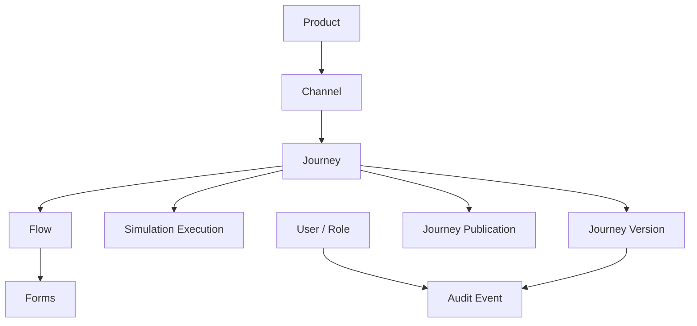
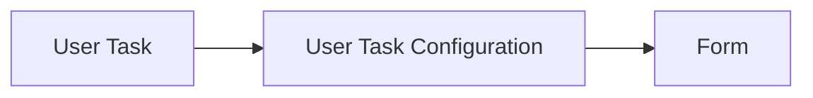
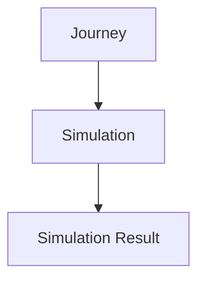
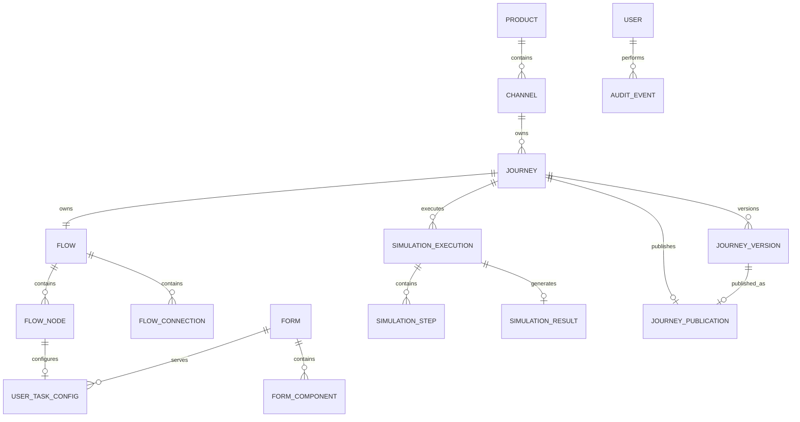

# Elastic Journey Admin Portal
## Modelo de Dados Conceitual

### Versão
1.0.0

---

# 1. Objetivo

Este documento descreve o modelo de dados conceitual do Elastic Journey Admin Portal, abrangendo produtos, canais, jornadas, fluxos, formulários, simulação e publicação.

---

# 2. Princípios de Modelagem

## 2.1 Product como Agrupador de Canais

Um Product representa um produto ou serviço digital e agrupa seus canais de atendimento.

Um Product não pode ser desativado enquanto alguma jornada de seus canais possuir publicação ativa.

## 2.2 Jornada Específica por Canal

Cada Journey pertence a exatamente um Channel. Jornadas de canais diferentes possuem definições independentes.

Um Channel não pode ser desativado enquanto alguma de suas jornadas possuir publicação ativa. Uma Journey também deve ser despublicada antes de ser desativada.

## 2.3 Identidade Administrativa

Product, Channel e Journey possuem códigos para identificação e pesquisa no Admin Portal. Esses códigos integram o snapshot publicado, mas não são utilizados pelo runtime para consultar o domínio administrativo.

## 2.4 Publicação como Snapshot

A publicação preserva a definição da versão da jornada no momento da publicação, incluindo produto, canal, fluxo e formulários. Cada jornada possui no máximo uma publicação ativa, associada a uma versão imutável.

## 2.5 Desacoplamento do Motor BPM

Nenhuma entidade possui dependência de BPMN, Camunda ou outro motor de execução.

## 2.6 Simplicidade

A versão 1.0.0 contempla versionamento de jornadas, autenticação mockada, autorização por papéis e auditoria. Rollback, governança e ownership permanecem fora da versão 1.0.0.

## 2.7 Observabilidade Não Persistida

Os logs técnicos de observabilidade (requisições de API e transações de persistência, FT-10) não constituem entidade de domínio: não são armazenados em banco de dados, ao contrário do Audit Event. Por isso não aparecem nas seções seguintes deste documento.

---

# 3. Visão Conceitual



---

# 4. Entidades Principais

| Entidade | Descrição |
|----------|-----------|
| Product | Produto ou serviço digital que agrupa canais |
| Channel | Aplicação ou interface de atendimento de um produto |
| Journey | Jornada específica de um canal |
| Flow | Estrutura visual da jornada |
| Flow Node | Elemento posicionado no canvas: Start, End ou User Task |
| Flow Connection | Conexão entre nós do fluxo |
| User Task Configuration | Associação entre uma User Task e um formulário |
| Form | Formulário reutilizável utilizado por User Tasks |
| Form Component | Elemento visual pertencente a um formulário |
| Simulation Execution | Execução simulada da jornada |
| Simulation Step | Etapa registrada durante a simulação |
| Simulation Result | Resultado consolidado da simulação |
| Journey Publication | Snapshot de uma versão imutável enviado para a API de publicação do runtime |
| Journey Version | Versão imutável de uma jornada |
| User / Role | Identidade autenticada e papel de autorização |
| Audit Event | Registro de operação realizada no sistema |

---

# 5. Product

## Descrição

Representa um produto ou serviço digital. Exemplo: Vivo+.

## Informações Principais

```text
Código, Nome, Descrição, Status
```

## Cardinalidade

```text
Product 1 → 0..N Channel
```

---

# 6. Channel

## Descrição

Representa uma aplicação ou interface de atendimento pertencente a um produto.

## Tipos Suportados

```text
WEB, MOBILE, WHATSAPP, URA, CONTACT_CENTER, OTHER
```

## Informações Principais

```text
Produto, Código, Nome, Tipo, Status, Descrição
```

## Cardinalidade

```text
Channel 1 → 0..N Journey

Channel N → 1 Product
```

---

# 7. Journey

## Descrição

Representa um workflow específico de um canal.

## Informações Principais

```text
Canal, Código, Nome, Descrição, Status
```

## Responsabilidades

Agrupar o fluxo e registrar simulações e a publicação atual.

## Cardinalidade

```text
Journey N → 1 Channel

Journey 1 → 1 Flow
```

O produto da jornada é determinado pelo produto do canal associado.

Uma Journey somente pode ser removida fisicamente quando nunca tiver possuído uma Journey Publication. Quando houver registro de publicação, a Journey pode apenas ser desativada e sua publicação deve ser preservada.

---

# 8. Flow, Flow Node e Flow Connection

## Flow

Estrutura principal da jornada; define a sequência das telas e etapas.

## Flow Node — Tipos

```text
START, END, USER_TASK, SERVICE_TASK, RECEIVE_TASK, MESSAGE_START_EVENT
```

## Flow Connection

Liga dois nós do mesmo fluxo. Cada fluxo possui exatamente um elemento inicial (`START` ou `MESSAGE_START_EVENT`) e ao menos um `END`. O elemento inicial não possui entrada e possui exatamente uma saída; cada `USER_TASK`, `SERVICE_TASK` e `RECEIVE_TASK` possui ao menos uma entrada e exatamente uma saída; um `GATEWAY` possui ao menos uma entrada e exatamente duas saídas (US-03.11); o `END` possui ao menos uma entrada e nenhuma saída. Todos os nós integram um caminho contínuo e alcançável entre o elemento inicial e algum `END` — um `GATEWAY` pode ramificar o fluxo em caminhos que terminam em `END`s distintos, sem precisar reconvergir antes do fim.

## Persistência e identificadores

O `Flow` (nós e conexões) é persistido como um único documento `jsonb` associado à jornada — não há necessidade de consultar nós/conexões individualmente hoje, então não são normalizados em tabelas próprias.

Na publicação, a runtime traduz este `Flow` para uma definição de processo BPMN (Camunda). Elementos BPMN em XML exigem identificadores no formato `NCName` (não podem iniciar com dígito), o que um UUID puro não garante. Por isso, os identificadores que a runtime embute diretamente como `id` de elemento BPMN nascem com um prefixo fixo, nunca como UUID puro:

| Identificador | Formato | Vira, na runtime |
|---|---|---|
| `Flow.flowId` | `Process_<uuid>` | `id` do `<bpmn:process>` |
| `FlowNode.nodeId` | `Node_<uuid>` | `id` de elementos BPMN de início, tarefa, espera ou término |
| `FlowConnection.connectionId` | `Flow_<uuid>` | `id` de `<bpmn:sequenceFlow>` |

Os demais identificadores do domínio (`productId`, `channelId`, `journeyId`, `formId`, etc.) nunca aparecem no XML BPMN gerado e permanecem UUID puro — o prefixo é aplicado apenas onde a restrição do XML exige.

---

# 9. Integration Tasks and Connectors

`SERVICE_TASK` executes an external integration. `RECEIVE_TASK` waits for a message in an already running journey instance. `MESSAGE_START_EVENT` creates a new journey instance from an external message.

The connector framework is extensible. `REST` and `KAFKA` are enabled in version 1.0.0; additional connectors may be cataloged as disabled without being available for use in flows.

```text
SERVICE_TASK        → bpmn:serviceTask
RECEIVE_TASK        → bpmn:receiveTask
MESSAGE_START_EVENT → bpmn:startEvent + messageEventDefinition
```

Connector configuration is declarative and stored with the flow snapshot. Credential values are not stored; only a runtime-resolved credential reference is persisted. Output mapping follows a defined structure (a list of `name`/`jsonPath` rules) rather than free-form JSON; input fields (URL, headers, body/payload) may reference variables from prior steps via `{{name}}`.

# 10. User Task Configuration

Associa um nó `USER_TASK` a um formulário. Na versão 1.0.0, a associação é opcional: cada User Task pode possuir zero ou uma configuração e, quando configurada, referencia exatamente um formulário.



---

# 11. Form e Form Field

## Form

Formulário reutilizável associado a uma ou mais User Tasks.

## Form Field — Tipos da Versão 1.0.0

```text
TEXT, INPUT, SINGLE_SELECT, MULTI_SELECT, FILE_UPLOAD
```

> Nomenclatura alinhada ao domínio implementado (`FormField`/`FormFieldType`). O tipo `STATIC_CONTENT`, que existia como tipo separado, foi colapsado em `TEXT` — os dois tinham o mesmo modelo de dados e divergiam apenas na apresentação visual.

Cada campo (`Form Field`) possui um `name` técnico, único dentro do formulário e imutável após a criação, usado como chave de referência do campo (substitui o identificador interno usado antes do refino do FT-04).

- `INPUT` possui um subtipo (texto, número, e-mail, data), com validação de formato associada (faixa mínima/máxima para número; regex/máscara para texto).
- `SINGLE_SELECT`/`MULTI_SELECT` possuem opções como pares rótulo/valor (não apenas rótulo).
- `FILE_UPLOAD` possui configuração de extensões aceitas e tamanho máximo do arquivo.

Um formulário pode ser utilizado por User Tasks de jornadas diferentes. Ao publicar uma jornada, o conteúdo de cada formulário referenciado é copiado integralmente para o snapshot da publicação, tornando-se imutável a alterações futuras no formulário original (mesmo princípio de congelamento do versionamento de jornada). O snapshot de publicação também guarda, para cada formulário, uma representação derivada em árvore de nós no formato `[tag, props, children]` (estilo SDUI/hyperscript) — uma projeção de leitura gerada a partir do Form Field congelado, e não um formato de armazenamento do form em edição.

---

# 12. Simulation Execution, Simulation Step e Simulation Result

## Simulation Execution

Execução simulada da jornada, permitindo verificar seu caminho e suas telas sem publicação.

## Simulation Step

Etapa percorrida durante a simulação, associada a um nó do fluxo.

## Simulation Result

Resultado consolidado contendo o caminho executado e o resumo da execução.



---

# 13. Journey Publication

## Descrição

Representa o snapshot de uma versão imutável enviado para a API de publicação do runtime. A chamada é mockada na versão 1.0.0 e a publicação ativa referencia uma `Journey Version`.

## Conteúdo

```text
Product

Channel

Journey

Flow

Forms
```

## Estados Possíveis

```text
PUBLISHED, UNPUBLISHED
```

Cada jornada possui no máximo uma publicação. Publicar novamente substitui o snapshot existente, sem criar histórico ou nova versão.

Ao despublicar, o Admin Portal chama a API mockada do runtime. Somente após o retorno de sucesso, Journey e Journey Publication passam para `UNPUBLISHED`. Jornadas nunca publicadas permanecem `DRAFT`.

---

# 14. Relacionamentos das Entidades

| Origem | Destino | Cardinalidade |
|--------|---------|---------------|
| Product | Channel | 1:N |
| Channel | Journey | 1:N |
| Journey | Flow | 1:1 |
| Flow | Flow Node | 1:N |
| Flow | Flow Connection | 1:N |
| Flow Node | User Task Configuration | 1:0..1 |
| Form | User Task Configuration | 1:N |
| Form | Form Component | 1:N |
| Journey | Simulation Execution | 1:N |
| Simulation Execution | Simulation Step | 1:N |
| Simulation Execution | Simulation Result | 1:0..1 |
| Journey | Journey Publication | 1:0..1 |
| Journey | Journey Version | 1:N |
| Journey Version | Journey Publication | 1:0..1 |
| User | Audit Event | 1:N |

---

# 15. Diagrama ER Conceitual



---

# 16. Glossário

| Conceito | Descrição |
|----------|-----------|
| Product | Produto ou serviço digital |
| Channel | Aplicação ou interface de atendimento de um produto |
| Journey | Jornada específica de um canal |
| Flow / Flow Node / Flow Connection | Estrutura visual da jornada e seus elementos |
| User Task Configuration | Associação entre User Task e Form |
| Form / Form Component | Formulário e seus componentes visuais |
| Simulation Execution / Step / Result | Execução simulada, etapas e resultado |
| Journey Publication | Snapshot de uma versão imutável enviado para a API de publicação do runtime |

---

# 17. Resumo Conceitual

O modelo conceitual parte de Product, que agrupa Channels. Cada Channel possui Journeys independentes, e cada Journey agrega fluxo, simulações e múltiplas versões. No máximo uma versão pode estar publicada por jornada; a publicação preserva seu snapshot imutável. Usuários e papéis controlam o acesso, e eventos de auditoria registram operações relevantes sem dados sensíveis.
