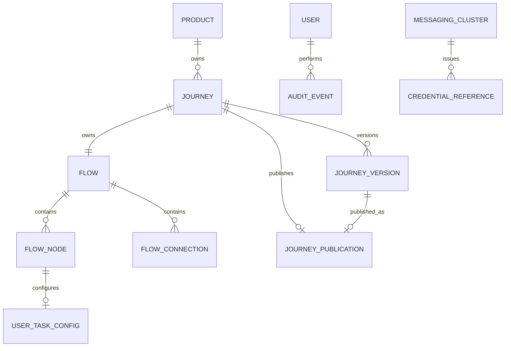

# Elastic Journey Admin Portal
## Modelo de Dados Físico

### Versão
1.0.0

---

# 1. Objetivo

Este documento descreve o modelo físico de dados do Elastic Journey Admin Portal para produtos, canais, jornadas, fluxos, formulários e publicação.

---

# 2. Premissas Técnicas

## Banco de Dados

```text
PostgreSQL
```

## Identificadores

Todas as entidades utilizam `UUID` como chave primária.

## Datas

Datas operacionais utilizam `TIMESTAMPTZ` em UTC.

## Estruturas Dinâmicas

Configurações visuais, dados de execução e snapshots publicados utilizam `JSONB`.

---

# 3. Estratégia de Persistência

`product` declara diretamente um conjunto não vazio de tipos de canal (`product_channel_type`) — canal não é uma tabela própria, é um valor de domínio fixo (`WEB`/`MOBILE`/`WHATSAPP`). Cada `journey` pertence a um `product` (`product_id`) e declara seu próprio conjunto não vazio de tipos de canal (`journey_channel_type`), sempre um subconjunto dos tipos habilitados pelo produto (validado em aplicação, não por constraint de banco).

> **Nota de revisão (2026-09-06):** parágrafo reescrito — `channel` deixou de ser uma tabela própria (CRUD com nome/descrição/status por produto) e `journey.channel_id` foi removido; ver §6/§7.

Formulários são ativos reutilizáveis associados às User Tasks por `user_task_config`. A publicação armazena o snapshot da versão imutável enviada para a API de publicação do runtime e preserva versões anteriores.

Os logs técnicos de observabilidade (FT-10) não são persistidos no PostgreSQL — trafegam por `logback` (console na versão 1.0.0, com ponto de extensão preparado e desativado para ELK) e, por isso, não possuem tabela neste modelo.

A execução de uma jornada publicada roda inteiramente contra o motor de runtime, acompanhada em tempo real pelo frontend — não existe `execution_run`/`execution_step`/`execution_result` neste schema. O único registro que sobrevive no PostgreSQL do Admin Portal é um `audit_event` genérico (`EXECUTION_START`) marcando que uma execução foi iniciada.

`messaging_cluster` e `credential_reference` (FT-14) formam o catálogo de integrações: cada credencial referencia um cluster, e um conector de mensageria de `flow_node` referencia uma credencial por `reference_name` (persistido dentro do documento `jsonb` do fluxo, não por chave estrangeira de banco — mesma limitação já descrita para `flow_node`/`flow_connection` no §9). Nunca armazenam o valor de um segredo — só a referência ao Azure Key Vault.

`ai_provider_credential` (FT-14 US-14.06) é uma tabela isolada, sem relacionamento com as demais: guarda a credencial de API de um provedor de IA (Gemini) usada pela geração de fluxo assistida (FT-03 US-03.17). Diferente de `credential_reference`, armazena o segredo em texto plano — desvio deliberado e temporário do princípio de nunca persistir segredo, documentado como TODO no código.

---

# 4. Modelo Relacional — Tabelas

```text
product
product_channel_type
journey
journey_channel_type
flow
flow_node
flow_connection
flow_annotation
component_definition
user_task_config
journey_publication
journey_version
audit_event
messaging_cluster
credential_reference
ai_provider_credential
```

---

# 5. Tabela Product

```sql
CREATE TABLE product (
    product_id UUID PRIMARY KEY,
    name VARCHAR(150) NOT NULL,
    description TEXT,
    status VARCHAR(20) NOT NULL CHECK (status IN ('ACTIVE', 'INACTIVE')),
    created_at TIMESTAMPTZ NOT NULL DEFAULT CURRENT_TIMESTAMP,
    updated_at TIMESTAMPTZ NOT NULL DEFAULT CURRENT_TIMESTAMP
);
```

---

# 6. Tabela Product Channel Type

Coleção de valores (`@ElementCollection`) — sem chave própria além do par produto+tipo, sem FK
para nenhuma tabela de canal (canal não é uma entidade).

```sql
CREATE TABLE product_channel_type (
    product_id UUID NOT NULL REFERENCES product(product_id),
    channel_type VARCHAR(20) NOT NULL CHECK (channel_type IN ('WEB', 'MOBILE', 'WHATSAPP')),
    PRIMARY KEY (product_id, channel_type)
);
```

> **Nota de revisão (2026-09-06):** substitui a antiga tabela `channel` (CRUD com
> `channel_id`/`name`/`status` por produto, criada em `V1__baseline.sql`) — canal deixou de ser uma
> entidade e virou um valor de domínio fixo declarado direto pelo produto. Migration
> `V16__product_channel_type.sql` cria esta tabela, faz backfill a partir de `channel.type` (apenas
> os tipos `WEB`/`MOBILE`/`WHATSAPP` — os demais tipos antigos não têm equivalente) e derruba
> `channel`.

---

# 7. Tabela Journey

```sql
CREATE TABLE journey (
    journey_id UUID PRIMARY KEY,
    product_id UUID NOT NULL,
    name VARCHAR(200) NOT NULL,
    description TEXT,
    status VARCHAR(20) NOT NULL CHECK (
        status IN ('DRAFT', 'PUBLISHED', 'UNPUBLISHED', 'INACTIVE')
    ),
    created_at TIMESTAMPTZ NOT NULL DEFAULT CURRENT_TIMESTAMP,
    updated_at TIMESTAMPTZ NOT NULL DEFAULT CURRENT_TIMESTAMP,
    CONSTRAINT fk_journey_product
        FOREIGN KEY (product_id) REFERENCES product(product_id)
);

CREATE TABLE journey_channel_type (
    journey_id UUID NOT NULL REFERENCES journey(journey_id),
    channel_type VARCHAR(20) NOT NULL CHECK (channel_type IN ('WEB', 'MOBILE', 'WHATSAPP')),
    PRIMARY KEY (journey_id, channel_type)
);
```

`journey_channel_type` não tem constraint de banco garantindo que seus valores sejam um subconjunto
de `product_channel_type` do mesmo produto — essa regra é validada em aplicação
(`JourneyChannelValidation`), não no schema.

> **Nota de revisão (2026-09-06):** `journey.channel_id` (FK para `channel`) removido — a jornada
> passa a referenciar o produto diretamente (`product_id`) e a declarar seu próprio conjunto de
> tipos de canal em `journey_channel_type`, em vez de herdar um único canal. Migration
> `V16__product_channel_type.sql` faz backfill a partir do antigo par `journey_channel`/`channel` e
> derruba `journey_channel`.

---

# 8. Tabela Flow

```sql
CREATE TABLE flow (
    flow_id VARCHAR(80) PRIMARY KEY,
    journey_id UUID NOT NULL UNIQUE,
    name VARCHAR(200) NOT NULL,
    nodes JSONB NOT NULL,
    connections JSONB NOT NULL,
    annotations JSONB NOT NULL DEFAULT '[]',
    created_at TIMESTAMPTZ NOT NULL DEFAULT CURRENT_TIMESTAMP,
    updated_at TIMESTAMPTZ NOT NULL DEFAULT CURRENT_TIMESTAMP,
    FOREIGN KEY (journey_id) REFERENCES journey(journey_id)
);
```

`flow_id` é gerado como `Process_<uuid>` — não é um UUID puro, então a coluna é `VARCHAR`, não `UUID` (ver dicionário de dados). `nodes`, `connections` e `annotations` são a persistência real de `FlowNode`, `FlowConnection` e `FlowAnnotation` (§9-10) — arrays JSONB, não tabelas próprias. As seções seguintes descrevem cada item desses arrays no formato de referência relacional (colunas, FK) só para documentar sua forma; nenhuma delas existe como tabela de fato.

---

# 9. Tabela FlowNode

```sql
CREATE TABLE flow_node (
    node_id UUID PRIMARY KEY,
    flow_id UUID NOT NULL,
    node_type VARCHAR(30) NOT NULL CHECK (
        node_type IN ('START', 'END', 'USER_TASK', 'SERVICE_TASK', 'RECEIVE_TASK', 'MESSAGE_START_EVENT', 'GATEWAY')
    ),
    name VARCHAR(200) NOT NULL,
    description TEXT,
    position_x INTEGER,
    position_y INTEGER,
    created_at TIMESTAMPTZ NOT NULL DEFAULT CURRENT_TIMESTAMP,
    updated_at TIMESTAMPTZ NOT NULL DEFAULT CURRENT_TIMESTAMP,
    FOREIGN KEY (flow_id) REFERENCES flow(flow_id),
    UNIQUE (flow_id, node_id)
);
```

O desenho acima é a referência relacional de cada elemento do array — a persistência real é um item do array `flow.nodes` (JSONB, ver §8), sem tabela própria: `node_id` é a chave dentro do array, não uma PK de banco, e a FK para `flow_id` é implícita (o nó só existe dentro do documento do próprio `Flow`).

As configurações de integração dos nós `SERVICE_TASK`, `RECEIVE_TASK` e `MESSAGE_START_EVENT` permanecem no documento JSONB do fluxo. A estrutura deve separar propriedades comuns (`connector_type`, `credential_ref`, `input_mapping`, `output_mapping`) das propriedades específicas de `REST` e `KAFKA`, permitindo a inclusão futura de novos conectores sem alteração da tabela `flow_node`. `output_mapping` segue formato estruturado — lista de regras `name`/`jsonPath` — em vez de objeto livre (REQ-03.09.010); campos de texto de `connectorConfig` (`url`, `headers`, `body`) podem referenciar variáveis de passos anteriores via `{{nome}}` (REQ-03.09.012).

```json
{
  "nodeType": "SERVICE_TASK",
  "connectorType": "REST",
  "connectorConfig": {
    "method": "POST",
    "url": "https://brasilapi.com.br/api/cnpj/v1/{{cnpjInformado}}",
    "headers": {},
    "query": {},
    "body": {}
  },
  "credentialRef": "runtime-secret-ref",
  "inputMapping": {},
  "outputMapping": [
    { "name": "cnpjRazaoSocial", "jsonPath": "$.razao_social" }
  ]
}
```

Outros atributos do documento `flow_node`, fora do bloco de conector acima: `startVariables` (REQ-03.12.001) — lista `{ name, type }`, só preenchida no nó `START`, declarando as variáveis que o canal digital/BFF deve fornecer ao iniciar uma instância; `messageText` (REQ-04.01.005) — texto livre, só relevante numa `USER_TASK` sem tela desenhada (`embeddedScreenRoot` ausente), podendo referenciar `{{nome}}` do mesmo jeito que `connectorConfig`; e `embeddedScreenRoot` — raiz da árvore SDUI (`SduiNode`, §12), só relevante numa `USER_TASK`. Diferente do modelo anterior, não existe mais um campo separado "compilado" para publicação: a mesma árvore de `embeddedScreenRoot` é copiada tal como está para o snapshot de publicação/versão (REQ-04.08.007) — sem etapa de compilação/projeção. Toda referência `{{nome}}` em `messageText`, e todo binding `value.path`/interpolação `{{namespace.path}}` dentro de `embeddedScreenRoot`, é resolvida pelo `ms-espec-registry` em tempo de execução (não na publicação).

> **Nota de revisão (2026-09-05):** `embeddedScreen` (array de `FormField`) e `embeddedScreenSdui` (tupla compilada) substituídos por um único `embeddedScreenRoot` (`SduiNode`, catálogo SDUI corporativo v1) — ver `ej-admin-requisitos.md` FT-04. Nota de 2026-08-24 mantida abaixo por histórico.

> **Nota de revisão (2026-08-24):** `embeddedScreen`/`embeddedScreenSdui` adicionados e `messageText` reescrito nesta revisão — a Runtime Engine só suporta um conjunto básico de tipos de campo nativos (~5-6), inviabilizando manter a User Task associada a um formulário do catálogo por `formId`; a tela passou a ser desenhada diretamente no nó.

---

# 10. Tabela FlowConnection

```sql
CREATE TABLE flow_connection (
    connection_id UUID PRIMARY KEY,
    flow_id UUID NOT NULL,
    source_node_id UUID NOT NULL,
    target_node_id UUID NOT NULL,
    created_at TIMESTAMPTZ NOT NULL DEFAULT CURRENT_TIMESTAMP,
    FOREIGN KEY (flow_id) REFERENCES flow(flow_id),
    FOREIGN KEY (flow_id, source_node_id) REFERENCES flow_node(flow_id, node_id),
    FOREIGN KEY (flow_id, target_node_id) REFERENCES flow_node(flow_id, node_id),
    UNIQUE (flow_id, source_node_id)
);
```

A restrição `UNIQUE (flow_id, source_node_id)` acima descreve o desenho relacional de referência, mas não reflete a persistência real: o `Flow` (nós e conexões, ver §8) é gravado como um único documento `jsonb`, então a cardinalidade de saída por tipo de nó — inclusive a exceção do `GATEWAY`, que tem exatamente duas (US-03.11) — é garantida pelo backend (`FlowValidator`), não por uma constraint de banco. Antes de persistir o fluxo completo, o backend deve garantir exatamente um elemento inicial (`START` ou `MESSAGE_START_EVENT`), ao menos um `END`, as cardinalidades de entrada e saída de cada tipo e a existência de um caminho contínuo entre o elemento inicial e algum `END`.

O `FlowValidator` também rejeita (422) um `END` alcançável apenas por `SERVICE_TASK`s com conector REST — sem nenhum checkpoint (`USER_TASK`, `RECEIVE_TASK` ou `SERVICE_TASK` Kafka) entre o elemento inicial e esse `END`. O conector HTTP nativo usado pelo motor de runtime para REST executa de forma síncrona, dentro da mesma transação de quem disparou a execução; várias dessas execuções concluindo a instância na mesma transação (sem nenhum ponto de parada) rompem o motor com um erro interno (`NullValueException: execution ... doesn't exist`, reproduzido em ambiente real). O `ms-espec-registry` replica essa mesma checagem antes de chamar o motor, cobrindo jornadas publicadas antes dessa regra existir.

## Tabela FlowAnnotation

```sql
CREATE TABLE flow_annotation (
    annotation_id UUID PRIMARY KEY,
    flow_id UUID NOT NULL,
    text TEXT,
    position_x INTEGER,
    position_y INTEGER,
    linked_node_ids UUID[],
    FOREIGN KEY (flow_id) REFERENCES flow(flow_id)
);
```

Mesmo caso de `flow_node`/`flow_connection`: o desenho acima é a referência relacional, mas a persistência real é mais um documento dentro do mesmo `jsonb` do `Flow` (ver §8), sem tabela própria. Uma `FlowAnnotation` nunca é lida pelo `FlowValidator` nem enviada ao `ms-transform-publication` — não participa da validação estrutural do fluxo nem da tradução para BPMN. `linked_node_ids` é só informativo (desenha uma linha pontilhada no editor); não há integridade referencial exigida contra `flow_node` — se um nó vinculado for excluído, o próprio editor remove o vínculo da anotação.

---

# 11. Tabela ComponentDefinition (Component Registry)

> **Reformulação (2026-09-05):** substitui por completo as antigas tabelas conceituais `form`/
> `form_field` (removidas junto com o catálogo de Formulários e o modelo de campo plano — ver
> `ej-admin-requisitos.md` FT-04). Diferente delas, `component_definition` é uma tabela real,
> criada pela migration `V12__component_registry.sql` e evoluída por `V13`/`V14`/`V18`–`V23`
> (ver nota de revisão abaixo).

```sql
CREATE TABLE component_definition (
    component_definition_id UUID PRIMARY KEY,
    type VARCHAR(60) NOT NULL,
    version VARCHAR(20) NOT NULL,
    status VARCHAR(20) NOT NULL CHECK (status IN ('EXPERIMENTAL', 'STABLE', 'DEPRECATED', 'REMOVED')),
    level INTEGER NOT NULL CHECK (level BETWEEN 0 AND 4),
    category VARCHAR(20) NOT NULL CHECK (category IN ('CONTENT', 'LAYOUT', 'INPUT', 'ACTION', 'FEEDBACK')),
    allows_children BOOLEAN NOT NULL DEFAULT FALSE,
    allowed_child_types JSONB NOT NULL DEFAULT '[]',
    props_schema JSONB NOT NULL DEFAULT '[]',
    events JSONB NOT NULL DEFAULT '[]',
    allowed_reserved_fields JSONB NOT NULL DEFAULT '[]',
    supported_targets JSONB NOT NULL DEFAULT '{}',
    origin VARCHAR(20) NOT NULL DEFAULT 'CUSTOM' CHECK (origin IN ('SYSTEM', 'CUSTOM')),
    created_at TIMESTAMPTZ NOT NULL DEFAULT CURRENT_TIMESTAMP,
    updated_at TIMESTAMPTZ NOT NULL DEFAULT CURRENT_TIMESTAMP,
    CONSTRAINT uq_component_definition_type_version UNIQUE (type, version)
);
```

Chave de negócio é `(type, version)` (ex.: `ui.textInput` + `1.0.0`), não `component_definition_id`
— este último é só a chave técnica. `level` foi corrigido de `SMALLINT` para `INTEGER` na `V14`
(a entidade JPA usa `int` Java, que o Hibernate mapeia por padrão para `INTEGER`, não `SMALLINT`).
`allowed_child_types`/`props_schema`/`events`/`allowed_reserved_fields`/`supported_targets` são
JSONB — ver §12 pro shape de `props_schema` (lista de `PropDescriptor`) e `supported_targets` (mapa
alvo→`TargetSupport`). `allowed_reserved_fields` (`V21`) é a lista dos campos reservados
(`$bindings`/`$events`/`$visibility`/`$active`) que aquele componente pode usar — orienta o Form
Builder, não integra a UI Spec publicada. Remover um componente (`DELETE /component-registry/{id}`)
nunca apaga a linha — marca `status = 'REMOVED'`, preservando a referência para telas já publicadas
que o utilizem; um componente de `origin = 'SYSTEM'` não pode ser removido (a aplicação bloqueia
antes de chegar ao banco).

> **Nota de revisão (2026-09-10):** `V18`/`V19` introduziram uma segunda leva de linhas em versão
> semver plena (`1.0.0`) ao lado das originais `1.0` da `V13`, depois retirando de circulação
> (`status = 'REMOVED'`) as `1.0` legadas — a versão `1.0.0` é o catálogo canônico em uso hoje.
> `V20` normalizou nomes de `kind` dentro do `props_schema` já persistido. `V21` adicionou
> `allowed_reserved_fields`. `V22` adicionou `origin`, marcando como `SYSTEM` os 19 componentes
> `ui.*` do contrato corporativo de referência (`status` promovido para `STABLE`) — qualquer
> componente criado depois via `POST /component-registry` nasce `origin = 'CUSTOM'`, o único que
> pode ser removido. `V23` corrigiu o `props_schema` persistido de `ui.datePicker` (campos
> `minDate`/`maxDate`/`format` ausentes, `mode` com valor `datetime` em vez do canônico `dateTime`).

---

# 12. Estrutura da Árvore SDUI (SduiNode)

> **Reformulação (2026-09-05):** substitui a antiga tabela conceitual `form_field` (lista plana de
> campos). Não é uma tabela — é a estrutura recursiva persistida dentro de `flow.nodes` (JSONB,
> §9) como `flow_node.embedded_screen_root`, a mesma árvore usada no editor e na publicação.

```jsonc
// Shape recursivo — sem tabela própria, um SduiNode é um valor dentro do JSONB de flow.nodes.
{
  "id": "string",           // único dentro da tela; sufixo do binding form.<id> quando coleta valor
  "type": "ui.textInput",   // deve existir em component_definition (type+version)
  "version": "1.0",
  "props": { /* conforme props_schema do componente no Registry */ },
  "bindings": {
    "value": { "path": "form.customerEmail", "mode": "twoWay" }
  },
  "events": {
    "onPress": { "action": "action.submit", "params": {} }
  },
  "visibility": { "rule": "equals", "path": "form.hasDiscount", "value": true },
  "children": [ /* SduiNode[], só quando o componente aceita filhos */ ]
}
```

A raiz da árvore de uma tela é sempre um único `SduiNode` do tipo `ui.screen`. Não existe mais
`display_order` (a ordem é a posição no array `children` do pai) nem `visible_if` em string
(substituído pelo objeto `visibility` estruturado). `name`/`defaultValue`/`helpText` do antigo
`FormField` não têm mais coluna própria: o identificador técnico é o sufixo do binding `value.path`
namespace `form` (REQ-04.10.005), e não existe mais "valor padrão" estático (o valor inicial vem da
resolução do binding em runtime, ver `ej-admin-requisitos.md` US-04.10).

---

# 13. Tabela UserTaskConfig

```sql
CREATE TABLE user_task_config (
    node_id UUID PRIMARY KEY,
    embedded_screen_root JSONB,
    message_text TEXT,
    FOREIGN KEY (node_id) REFERENCES flow_node(node_id)
);
```

`user_task_config` só pode referenciar nós cujo `node_type` seja `USER_TASK`. Essa restrição deve ser garantida por regra de domínio ou trigger. `embedded_screen_root` é opcional (REQ-04.01.005: uma User Task pode não ter tela desenhada); quando ausente, `message_text` guarda a mensagem exibida ao usuário nessa etapa em vez de uma tela — os dois nunca coexistem com sentido (se `embedded_screen_root` estiver presente, `message_text` é ignorado). Não existe mais tabela `form` nem referência a um formulário de catálogo como modelo de partida — `embedded_screen_root` é editado diretamente como árvore de `SduiNode` (§12), e cada nó da árvore só pode referenciar um `type`+`version` existente no Component Registry (§11). Na persistência real, `embedded_screen_root`/`message_text` são atributos do próprio item de `flow.nodes` (JSONB, ver §8-9) — não existe `user_task_config` como tabela própria, nem como sub-documento separado dentro do nó.

> **Nota de revisão (2026-09-05):** `embedded_screen`/`embedded_screen_sdui` substituídos por `embedded_screen_root` (árvore de `SduiNode`, sem etapa de compilação); referência ao `form` do catálogo removida — ver `ej-admin-requisitos.md` FT-04. Nota de 2026-08-24 mantida abaixo por histórico.

> **Nota de revisão (2026-08-24):** tabela reescrita — a Runtime Engine só suporta um conjunto básico de tipos de campo nativos (~5-6), inviabilizando manter a User Task associada a um formulário do catálogo por `form_id`; a tela passou a ser desenhada diretamente no nó (`embedded_screen`), com o formulário do catálogo servindo apenas como modelo de cópia opcional.

---

# 14. Tabela JourneyPublication

Atualização do escopo: `journey_publication` representa a publicação ativa e deve possuir `version_id` apontando para a `journey_version` publicada. Versões anteriores não são sobrescritas.

A publicação armazena o snapshot da versão contendo produto, tipos de canal, jornada, fluxo (com a árvore de tela — `embeddedScreenRoot` — de cada User Task) e o número da versão publicada (`versionNumber`, também gravado como tag de versão do processo implantado no runtime — distinta do contador de implantação que o próprio runtime mantém internamente). Existe no máximo uma publicação ativa por jornada; versões anteriores são preservadas.

> **Nota de revisão (2026-09-05):** `embeddedScreenSdui` (árvore compilada) substituído por `embeddedScreenRoot` — a mesma árvore de `SduiNode` editada no Form Builder, sem etapa de compilação separada.

> **Nota de revisão (2026-08-24):** parágrafo reescrito — a Runtime Engine só suporta um conjunto básico de tipos de campo nativos (~5-6), inviabilizando manter a User Task associada a um formulário do catálogo por `form_id`; a tela passou a ser desenhada diretamente no nó, e o snapshot não carrega mais uma lista de formulários — só a tela já compilada de cada nó.

```sql
CREATE TABLE journey_publication (
    publication_id UUID PRIMARY KEY,
    journey_id UUID NOT NULL UNIQUE,
    version_id UUID NOT NULL,
    publication_status VARCHAR(30) NOT NULL CHECK (
        publication_status IN ('PUBLISHED', 'UNPUBLISHED')
    ),
    publication_date TIMESTAMPTZ,
    unpublished_date TIMESTAMPTZ,
    journey_snapshot JSONB NOT NULL,
    created_at TIMESTAMPTZ NOT NULL DEFAULT CURRENT_TIMESTAMP,
    updated_at TIMESTAMPTZ NOT NULL DEFAULT CURRENT_TIMESTAMP,
    FOREIGN KEY (journey_id) REFERENCES journey(journey_id),
    FOREIGN KEY (version_id) REFERENCES journey_version(version_id)
);
```

A chave estrangeira sem `ON DELETE CASCADE` impede a exclusão física de uma jornada que possua ou tenha possuído publicação. Essas jornadas devem ser desativadas por meio de `journey.status = 'INACTIVE'`. A exclusão física é permitida somente quando não existe registro em `journey_publication`.

---

# 15. Tabela JourneyVersion

```sql
CREATE TABLE journey_version (
    version_id UUID PRIMARY KEY,
    journey_id UUID NOT NULL,
    version_number INTEGER NOT NULL,
    version_status VARCHAR(20) NOT NULL CHECK (
        version_status IN ('DRAFT', 'PUBLISHED', 'UNPUBLISHED', 'INACTIVE')
    ),
    version_snapshot JSONB NOT NULL,
    description TEXT,
    created_by UUID NOT NULL,
    created_at TIMESTAMPTZ NOT NULL DEFAULT CURRENT_TIMESTAMP,
    published_at TIMESTAMPTZ,
    runtime_deployment_id VARCHAR(255),
    UNIQUE (journey_id, version_number),
    FOREIGN KEY (journey_id) REFERENCES journey(journey_id)
);
```

Versões publicadas são imutáveis. A versão 1.0.0 não contempla restauração ou rollback. A publicação deve referenciar a versão publicada, preservando versões anteriores.

`runtime_deployment_id` guarda o identificador do deployment gerado no runtime pelo publish/republish dessa versão específica — nulo enquanto não publicada, e limpo ao despublicar (o deployment que ele apontava deixa de existir). É o que permite despublicar uma versão sem afetar o deployment de outra: **diferente de `journey_publication` (§14), que continua tendo no máximo um registro por jornada** (o snapshot mais recente enviado ao runtime, usado pra inspeção), `journey_version.version_status` pode ter mais de uma linha `PUBLISHED` por `journey_id` ao mesmo tempo — publicar uma versão nova não despublica a anterior (REQ-06.04.004).

---

# 16. Tabelas de Identidade e Auditoria

A versão 1.0.0 utiliza provedor externo mockado. O usuário `admin`, com senha `admin` e papel `ADMIN`, pode ser representado por configuração mockada; a senha não deve ser persistida nem auditada.

```sql
CREATE TABLE audit_event (
    audit_event_id UUID PRIMARY KEY,
    user_id UUID,
    action VARCHAR(100) NOT NULL,
    resource_type VARCHAR(80) NOT NULL,
    resource_id UUID,
    result VARCHAR(20) NOT NULL CHECK (result IN ('SUCCESS', 'FAILURE', 'DENIED')),
    correlation_id VARCHAR(100),
    previous_value JSONB,
    new_value JSONB,
    occurred_at TIMESTAMPTZ NOT NULL DEFAULT CURRENT_TIMESTAMP
);
```

Registros de auditoria são protegidos contra edição e remoção por operações normais e não podem conter senhas, tokens, secrets ou credenciais.

---

# 17. Tabela MessagingCluster

```sql
CREATE TABLE messaging_cluster (
    cluster_id UUID PRIMARY KEY,
    name VARCHAR(150) NOT NULL UNIQUE,
    type VARCHAR(30) NOT NULL CHECK (
        type IN ('KAFKA', 'EVENT_HUBS', 'SERVICE_BUS')
    ),
    connection_address VARCHAR(300) NOT NULL,
    status VARCHAR(20) NOT NULL CHECK (status IN ('ACTIVE', 'INACTIVE')),
    created_at TIMESTAMPTZ NOT NULL DEFAULT CURRENT_TIMESTAMP,
    updated_at TIMESTAMPTZ NOT NULL DEFAULT CURRENT_TIMESTAMP
);
```

`connection_address` guarda o `bootstrap.servers` (Kafka) ou o namespace (Event Hubs/Service Bus) — texto puro, sem prefixo de protocolo. A desativação é bloqueada enquanto existir credencial ativa ou conector de jornada publicada referenciando o cluster.

---

# 18. Tabela CredentialReference

```sql
CREATE TABLE credential_reference (
    credential_id UUID PRIMARY KEY,
    reference_name VARCHAR(150) NOT NULL UNIQUE,
    cluster_id UUID NOT NULL,
    key_vault_uri VARCHAR(300) NOT NULL,
    secret_name VARCHAR(150) NOT NULL,
    status VARCHAR(20) NOT NULL CHECK (status IN ('ACTIVE', 'INACTIVE')),
    created_at TIMESTAMPTZ NOT NULL DEFAULT CURRENT_TIMESTAMP,
    updated_at TIMESTAMPTZ NOT NULL DEFAULT CURRENT_TIMESTAMP,
    CONSTRAINT fk_credential_reference_cluster
        FOREIGN KEY (cluster_id) REFERENCES messaging_cluster(cluster_id)
);
```

`reference_name` é o valor usado como `credentialRef` na configuração de um conector de mensageria — nunca há coluna de valor de segredo nesta tabela. `key_vault_uri`/`secret_name` são só metadado apontando pro cofre corporativo; a resolução de verdade acontece fora do Admin Portal, no componente de runtime que abre a conexão. A desativação é bloqueada enquanto existir conector de jornada publicada referenciando a credencial.

---

# 19. Tabela AiProviderCredential

```sql
CREATE TABLE ai_provider_credential (
    credential_id UUID PRIMARY KEY,
    provider VARCHAR(30) NOT NULL UNIQUE CHECK (provider IN ('GEMINI')),
    api_key TEXT NOT NULL,
    created_at TIMESTAMPTZ NOT NULL DEFAULT CURRENT_TIMESTAMP,
    updated_at TIMESTAMPTZ NOT NULL DEFAULT CURRENT_TIMESTAMP
);
```

Tabela isolada, sem chave estrangeira — `provider` é único por natureza (um único registro por provedor suportado). `api_key` guarda o segredo em texto plano, ao contrário de `credential_reference`: exceção deliberada e temporária ao princípio de nunca persistir segredo (REQ-14.02.003/REQ-14.06.003), com pendência de criptografia registrada como TODO no código antes de produção. A API nunca retorna `api_key` numa resposta — apenas se `provider` está configurado e `updated_at`.

---

# 20. Chaves Primárias

| Tabela | PK |
|--------|----|
| product | product_id |
| product_channel_type | (product_id, channel_type) |
| journey | journey_id |
| journey_channel_type | (journey_id, channel_type) |
| flow | flow_id |
| flow_node | node_id |
| flow_connection | connection_id |
| component_definition | component_definition_id |
| user_task_config | node_id |
| journey_publication | publication_id |
| journey_version | version_id |
| audit_event | audit_event_id |
| messaging_cluster | cluster_id |
| credential_reference | credential_id |
| ai_provider_credential | credential_id |

---

# 21. Chaves Estrangeiras Principais

| Origem | Destino |
|--------|---------|
| product_channel_type.product_id | product.product_id |
| journey.product_id | product.product_id |
| journey_channel_type.journey_id | journey.journey_id |
| flow.journey_id | journey.journey_id |
| flow_node.flow_id | flow.flow_id |
| flow_connection.(flow_id, source_node_id) | flow_node.(flow_id, node_id) |
| flow_connection.(flow_id, target_node_id) | flow_node.(flow_id, node_id) |
| user_task_config.node_id | flow_node.node_id |
| journey_publication.journey_id | journey.journey_id |
| journey_version.journey_id | journey.journey_id |
| journey_publication.version_id | journey_version.version_id |
| credential_reference.cluster_id | messaging_cluster.cluster_id |

> **Nota de revisão (2026-08-24):** FK `user_task_config.form_id → form.form_id` removida nesta revisão — a Runtime Engine só suporta um conjunto básico de tipos de campo nativos (~5-6), inviabilizando manter a User Task associada a um formulário do catálogo por `form_id`; a tela passou a ser desenhada diretamente no nó (`embedded_screen`), sem vínculo persistido ao formulário de origem.
>
> **Nota de revisão (2026-09-05):** tabelas `form`/`form_field` removidas por completo (catálogo de Formulários e modelo de campo plano, ambos substituídos — ver §11/§12). `component_definition` não tem FK: um `SduiNode.type`/`version` referencia o Registry por valor (JSONB), não por chave estrangeira relacional.
>
> **Nota de revisão (2026-09-06):** FK `journey.channel_id → channel.channel_id` removida — `journey.product_id → product.product_id` já existia desde a jornada multicanal (V15) e passa a ser a única forma de a jornada conhecer seu produto. Tabela `channel` removida por completo; `product_channel_type.product_id`/`journey_channel_type.journey_id` são as novas FKs, sem relação entre si por constraint de banco (ver §21 acima).

---

# 22. Estratégia de Índices

```sql
CREATE INDEX idx_product_status ON product(status);

CREATE INDEX idx_journey_product ON journey(product_id);
CREATE INDEX idx_journey_name ON journey(name);
CREATE INDEX idx_journey_status ON journey(status);
CREATE INDEX idx_journey_updated_at ON journey(updated_at);

CREATE INDEX idx_flow_node_flow ON flow_node(flow_id);
CREATE INDEX idx_flow_node_type ON flow_node(node_type);

CREATE INDEX idx_flow_connection_flow ON flow_connection(flow_id);

CREATE INDEX idx_component_definition_status ON component_definition(status);
CREATE INDEX idx_component_definition_category ON component_definition(category);
CREATE INDEX idx_component_definition_origin ON component_definition(origin);

CREATE INDEX idx_publication_status ON journey_publication(publication_status);
CREATE INDEX idx_publication_snapshot ON journey_publication USING GIN (journey_snapshot);
CREATE INDEX idx_journey_version_journey ON journey_version(journey_id, version_number);
CREATE INDEX idx_journey_version_status ON journey_version(version_status);
CREATE INDEX idx_audit_event_user ON audit_event(user_id);
CREATE INDEX idx_audit_event_resource ON audit_event(resource_type, resource_id);
CREATE INDEX idx_audit_event_occurred_at ON audit_event(occurred_at);

CREATE INDEX idx_messaging_cluster_type ON messaging_cluster(type);
CREATE INDEX idx_messaging_cluster_status ON messaging_cluster(status);
CREATE INDEX idx_credential_reference_cluster ON credential_reference(cluster_id);
CREATE INDEX idx_credential_reference_status ON credential_reference(status);
```

---

# 23. Estratégia de Consulta

```text
Pesquisar produtos e listar seus tipos de canal habilitados

Pesquisar jornadas por produto e tipo de canal

Carregar fluxo e formulários completos

Executar jornadas

Consultar publicações por produto e tipo de canal no Admin Portal

Consultar versões por jornada

Consultar eventos de auditoria por usuário, recurso, resultado e período

Consultar clusters e credenciais do catálogo de integrações por tipo, cluster associado e status
```

---

# 24. Estratégia de Publicação

`journey_publication` mantém o snapshot da versão publicada separado da jornada em edição. A restrição `UNIQUE (journey_id)` garante no máximo uma publicação ativa por jornada. Uma nova publicação deve apontar para uma nova `journey_version` e preservar os snapshots anteriores.

## Conteúdo do Snapshot

```text
Product

Tipos de Canal da Journey (subconjunto dos tipos do Product)

Journey

Flow (com a árvore de tela — embeddedScreenRoot — de cada User Task)

VersionNumber
```

> **Nota de revisão (2026-09-06):** `Channel` removido do conteúdo do snapshot — canal não é mais uma entidade própria, e sim um conjunto de tipos (`journey_channel_type`) declarado direto pela jornada.

> **Nota de revisão (2026-09-05):** `embeddedScreenSdui` (árvore compilada) substituído por `embeddedScreenRoot` — sem etapa de compilação separada.

> **Nota de revisão (2026-08-24):** "Forms" removido e "VersionNumber" adicionado nesta revisão — a Runtime Engine só suporta um conjunto básico de tipos de campo nativos (~5-6), inviabilizando manter a User Task associada a um formulário do catálogo por `form_id`; a tela passou a ser desenhada diretamente no nó, e o snapshot não carrega mais uma lista de formulários — só a tela já compilada de cada nó.

## Status de Publicação

```text
PUBLISHED, UNPUBLISHED
```

O Admin Portal realiza uma chamada de saída real (HTTP) para a API de publicação do runtime. Após o retorno de sucesso, o snapshot é persistido e `journey.status` passa a `PUBLISHED`.

A despublicação também chama essa API real. Após o sucesso, `journey.status` e `journey_publication.publication_status` passam para `UNPUBLISHED`, e `unpublished_date` recebe a data da operação. Em caso de falha, o backend preserva os estados e o snapshot atuais.

Antes de desativar uma jornada ou um produto, o backend deve consultar `journey_publication` e bloquear a operação quando encontrar uma publicação `PUBLISHED` no escopo afetado. Registros `UNPUBLISHED` são preservados e não impedem a desativação.

---

# 25. Diagrama ER Físico



`component_definition` fica fora deste diagrama de propósito: um `SduiNode` dentro de `flow.nodes`
(JSONB) referencia um componente por `type`+`version` (valor, não chave estrangeira relacional) —
não há FK real ligando `flow_node`/`user_task_config` a `component_definition` (ver §21).

`product_channel_type`/`journey_channel_type` (§6/§7) também ficam fora do diagrama por serem
coleções de valores simples (par id+tipo), sem entidade própria nem relacionamento com outra
tabela — não há uma tabela `channel` para desenhar.

---

# 26. Considerações de Evolução

```text
Catálogo editável de modelos e clonagem entre canais (o piloto já possui modelos predefinidos em código)

Workflow de Aprovação

Rollback

Promotion Between Environments

Resolução real de credencial via Azure Key Vault (Workload Identity/AKS) — hoje só a referência é persistida, sem integração de fato
```

---

# 27. Resumo Técnico

O modelo físico estabelece Product → Journey como hierarquia principal, com o tipo de canal declarado como coleção de valores em ambos (`product_channel_type`/`journey_channel_type`), sem tabela própria de canal. Cada jornada possui um fluxo, cujas User Tasks têm tela própria desenhada diretamente no nó (formulários do catálogo servem só como modelo de cópia opcional), possui múltiplas versões e no máximo uma publicação ativa associada à versão imutável publicada. O modelo também contempla o usuário mockado, eventos de auditoria sem dados sensíveis e o catálogo de integrações (clusters de mensageria e referências de credencial) usado pelos conectores do fluxo.
