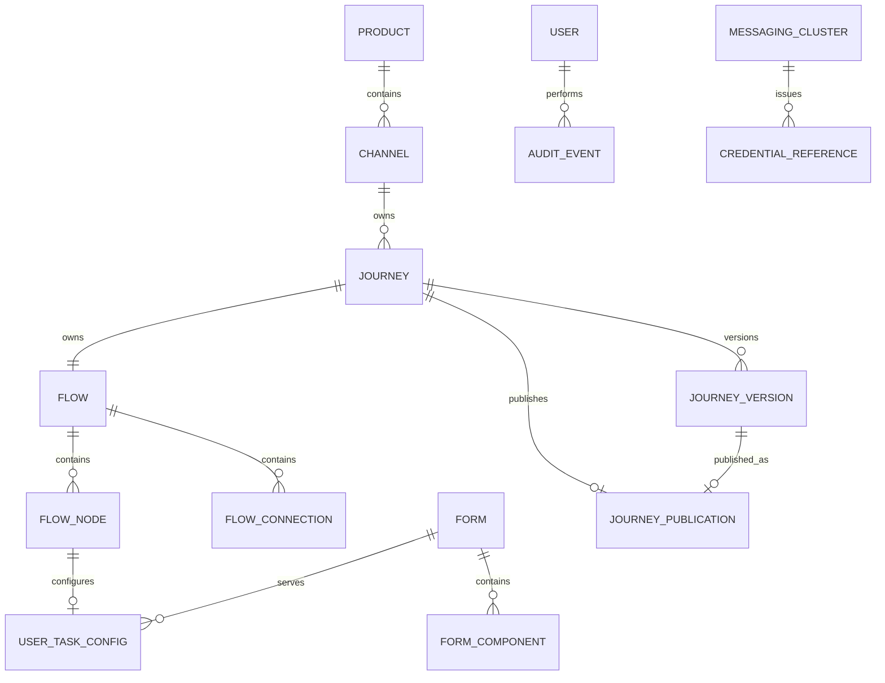

# Elastic Journey Admin Portal
## Modelo de Dados Físico

### Versão
1.0.0

---

# 1. Objetivo

Este documento descreve o modelo físico de dados do Elastic Journey Admin Portal para produtos, canais, jornadas, fluxos, formulários e publicação.

---

# 2. Premissas Técnicas

## Banco de Dados

```text
PostgreSQL
```

## Identificadores

Todas as entidades utilizam `UUID` como chave primária.

## Datas

Datas operacionais utilizam `TIMESTAMPTZ` em UTC.

## Estruturas Dinâmicas

Configurações visuais, dados de execução e snapshots publicados utilizam `JSONB`.

---

# 3. Estratégia de Persistência

`product` agrupa canais. Cada `channel` pertence a um produto, e cada `journey` pertence a exatamente um canal. O produto de uma jornada é obtido através do canal.

Formulários são ativos reutilizáveis associados às User Tasks por `user_task_config`. A publicação armazena o snapshot da versão imutável enviada para a API de publicação do runtime e preserva versões anteriores.

Os logs técnicos de observabilidade (FT-10) não são persistidos no PostgreSQL — trafegam por `logback` (console na versão 1.0.0, com ponto de extensão preparado e desativado para ELK) e, por isso, não possuem tabela neste modelo.

A execução de uma jornada publicada roda inteiramente contra o motor de runtime, acompanhada em tempo real pelo frontend — não existe `execution_run`/`execution_step`/`execution_result` neste schema. O único registro que sobrevive no PostgreSQL do Admin Portal é um `audit_event` genérico (`EXECUTION_START`) marcando que uma execução foi iniciada.

`messaging_cluster` e `credential_reference` (FT-14) formam o catálogo de integrações: cada credencial referencia um cluster, e um conector de mensageria de `flow_node` referencia uma credencial por `reference_name` (persistido dentro do documento `jsonb` do fluxo, não por chave estrangeira de banco — mesma limitação já descrita para `flow_node`/`flow_connection` no §9). Nunca armazenam o valor de um segredo — só a referência ao Azure Key Vault.

`ai_provider_credential` (FT-14 US-14.06) é uma tabela isolada, sem relacionamento com as demais: guarda a credencial de API de um provedor de IA (Gemini) usada pela geração de fluxo assistida (FT-03 US-03.17). Diferente de `credential_reference`, armazena o segredo em texto plano — desvio deliberado e temporário do princípio de nunca persistir segredo, documentado como TODO no código.

---

# 4. Modelo Relacional — Tabelas

```text
product
channel
journey
flow
flow_node
flow_connection
flow_annotation
form
form_field
user_task_config
journey_publication
journey_version
audit_event
messaging_cluster
credential_reference
ai_provider_credential
```

---

# 5. Tabela Product

```sql
CREATE TABLE product (
    product_id UUID PRIMARY KEY,
    name VARCHAR(150) NOT NULL,
    description TEXT,
    status VARCHAR(20) NOT NULL CHECK (status IN ('ACTIVE', 'INACTIVE')),
    created_at TIMESTAMPTZ NOT NULL DEFAULT CURRENT_TIMESTAMP,
    updated_at TIMESTAMPTZ NOT NULL DEFAULT CURRENT_TIMESTAMP
);
```

---

# 6. Tabela Channel

```sql
CREATE TABLE channel (
    channel_id UUID PRIMARY KEY,
    product_id UUID NOT NULL,
    name VARCHAR(100) NOT NULL,
    type VARCHAR(30) NOT NULL CHECK (
        type IN ('WEB', 'MOBILE', 'WHATSAPP', 'URA', 'CONTACT_CENTER', 'OTHER')
    ),
    status VARCHAR(20) NOT NULL CHECK (status IN ('ACTIVE', 'INACTIVE')),
    description TEXT,
    created_at TIMESTAMPTZ NOT NULL DEFAULT CURRENT_TIMESTAMP,
    updated_at TIMESTAMPTZ NOT NULL DEFAULT CURRENT_TIMESTAMP,
    CONSTRAINT fk_channel_product
        FOREIGN KEY (product_id) REFERENCES product(product_id)
);
```

---

# 7. Tabela Journey

```sql
CREATE TABLE journey (
    journey_id UUID PRIMARY KEY,
    channel_id UUID NOT NULL,
    name VARCHAR(200) NOT NULL,
    description TEXT,
    status VARCHAR(20) NOT NULL CHECK (
        status IN ('DRAFT', 'PUBLISHED', 'UNPUBLISHED', 'INACTIVE')
    ),
    created_at TIMESTAMPTZ NOT NULL DEFAULT CURRENT_TIMESTAMP,
    updated_at TIMESTAMPTZ NOT NULL DEFAULT CURRENT_TIMESTAMP,
    CONSTRAINT fk_journey_to_channel
        FOREIGN KEY (channel_id) REFERENCES channel(channel_id)
);
```

---

# 8. Tabela Flow

```sql
CREATE TABLE flow (
    flow_id VARCHAR(80) PRIMARY KEY,
    journey_id UUID NOT NULL UNIQUE,
    name VARCHAR(200) NOT NULL,
    nodes JSONB NOT NULL,
    connections JSONB NOT NULL,
    annotations JSONB NOT NULL DEFAULT '[]',
    created_at TIMESTAMPTZ NOT NULL DEFAULT CURRENT_TIMESTAMP,
    updated_at TIMESTAMPTZ NOT NULL DEFAULT CURRENT_TIMESTAMP,
    FOREIGN KEY (journey_id) REFERENCES journey(journey_id)
);
```

`flow_id` é gerado como `Process_<uuid>` — não é um UUID puro, então a coluna é `VARCHAR`, não `UUID` (ver dicionário de dados). `nodes`, `connections` e `annotations` são a persistência real de `FlowNode`, `FlowConnection` e `FlowAnnotation` (§9-10) — arrays JSONB, não tabelas próprias. As seções seguintes descrevem cada item desses arrays no formato de referência relacional (colunas, FK) só para documentar sua forma; nenhuma delas existe como tabela de fato.

---

# 9. Tabela FlowNode

```sql
CREATE TABLE flow_node (
    node_id UUID PRIMARY KEY,
    flow_id UUID NOT NULL,
    node_type VARCHAR(30) NOT NULL CHECK (
        node_type IN ('START', 'END', 'USER_TASK', 'SERVICE_TASK', 'RECEIVE_TASK', 'MESSAGE_START_EVENT', 'GATEWAY')
    ),
    name VARCHAR(200) NOT NULL,
    description TEXT,
    position_x INTEGER,
    position_y INTEGER,
    created_at TIMESTAMPTZ NOT NULL DEFAULT CURRENT_TIMESTAMP,
    updated_at TIMESTAMPTZ NOT NULL DEFAULT CURRENT_TIMESTAMP,
    FOREIGN KEY (flow_id) REFERENCES flow(flow_id),
    UNIQUE (flow_id, node_id)
);
```

O desenho acima é a referência relacional de cada elemento do array — a persistência real é um item do array `flow.nodes` (JSONB, ver §8), sem tabela própria: `node_id` é a chave dentro do array, não uma PK de banco, e a FK para `flow_id` é implícita (o nó só existe dentro do documento do próprio `Flow`).

As configurações de integração dos nós `SERVICE_TASK`, `RECEIVE_TASK` e `MESSAGE_START_EVENT` permanecem no documento JSONB do fluxo. A estrutura deve separar propriedades comuns (`connector_type`, `credential_ref`, `input_mapping`, `output_mapping`) das propriedades específicas de `REST` e `KAFKA`, permitindo a inclusão futura de novos conectores sem alteração da tabela `flow_node`. `output_mapping` segue formato estruturado — lista de regras `name`/`jsonPath` — em vez de objeto livre (REQ-03.09.010); campos de texto de `connectorConfig` (`url`, `headers`, `body`) podem referenciar variáveis de passos anteriores via `{{nome}}` (REQ-03.09.012).

```json
{
  "nodeType": "SERVICE_TASK",
  "connectorType": "REST",
  "connectorConfig": {
    "method": "POST",
    "url": "https://brasilapi.com.br/api/cnpj/v1/{{cnpjInformado}}",
    "headers": {},
    "query": {},
    "body": {}
  },
  "credentialRef": "runtime-secret-ref",
  "inputMapping": {},
  "outputMapping": [
    { "name": "cnpjRazaoSocial", "jsonPath": "$.razao_social" }
  ]
}
```

Outros atributos do documento `flow_node`, fora do bloco de conector acima: `startVariables` (REQ-03.12.001) — lista `{ name, type }`, só preenchida no nó `START`, declarando as variáveis que o canal digital/BFF deve fornecer ao iniciar uma instância; `messageText` (REQ-04.01.005) — texto livre, só relevante numa `USER_TASK` sem tela desenhada (`embeddedScreen` vazio), podendo referenciar `{{nome}}` do mesmo jeito que `connectorConfig`; `embeddedScreen` — array de `FormField` (§12) desenhado diretamente no nó, só relevante numa `USER_TASK`; e `embeddedScreenSdui` — árvore SDUI compilada de `embeddedScreen`, só presente numa snapshot de publicação/versão, nunca no fluxo ao vivo do editor. Toda referência `{{nome}}`, seja em `messageText` ou em qualquer prop de texto de um campo de `embeddedScreen`, é resolvida pelo simulador de execução em tempo real (não na publicação).

> **Nota de revisão (2026-08-24):** `embeddedScreen`/`embeddedScreenSdui` adicionados e `messageText` reescrito nesta revisão — a Runtime Engine só suporta um conjunto básico de tipos de campo nativos (~5-6), inviabilizando manter a User Task associada a um formulário do catálogo por `formId`; a tela passou a ser desenhada diretamente no nó.

---

# 10. Tabela FlowConnection

```sql
CREATE TABLE flow_connection (
    connection_id UUID PRIMARY KEY,
    flow_id UUID NOT NULL,
    source_node_id UUID NOT NULL,
    target_node_id UUID NOT NULL,
    created_at TIMESTAMPTZ NOT NULL DEFAULT CURRENT_TIMESTAMP,
    FOREIGN KEY (flow_id) REFERENCES flow(flow_id),
    FOREIGN KEY (flow_id, source_node_id) REFERENCES flow_node(flow_id, node_id),
    FOREIGN KEY (flow_id, target_node_id) REFERENCES flow_node(flow_id, node_id),
    UNIQUE (flow_id, source_node_id)
);
```

A restrição `UNIQUE (flow_id, source_node_id)` acima descreve o desenho relacional de referência, mas não reflete a persistência real: o `Flow` (nós e conexões, ver §8) é gravado como um único documento `jsonb`, então a cardinalidade de saída por tipo de nó — inclusive a exceção do `GATEWAY`, que tem exatamente duas (US-03.11) — é garantida pelo backend (`FlowValidator`), não por uma constraint de banco. Antes de persistir o fluxo completo, o backend deve garantir exatamente um elemento inicial (`START` ou `MESSAGE_START_EVENT`), ao menos um `END`, as cardinalidades de entrada e saída de cada tipo e a existência de um caminho contínuo entre o elemento inicial e algum `END`.

O `FlowValidator` também rejeita (422) um `END` alcançável apenas por `SERVICE_TASK`s com conector REST — sem nenhum checkpoint (`USER_TASK`, `RECEIVE_TASK` ou `SERVICE_TASK` Kafka) entre o elemento inicial e esse `END`. O conector HTTP nativo usado pelo motor de runtime para REST executa de forma síncrona, dentro da mesma transação de quem disparou a execução; várias dessas execuções concluindo a instância na mesma transação (sem nenhum ponto de parada) rompem o motor com um erro interno (`NullValueException: execution ... doesn't exist`, reproduzido em ambiente real). O `ms-espec-registry` replica essa mesma checagem antes de chamar o motor, cobrindo jornadas publicadas antes dessa regra existir.

## Tabela FlowAnnotation

```sql
CREATE TABLE flow_annotation (
    annotation_id UUID PRIMARY KEY,
    flow_id UUID NOT NULL,
    text TEXT,
    position_x INTEGER,
    position_y INTEGER,
    linked_node_ids UUID[],
    FOREIGN KEY (flow_id) REFERENCES flow(flow_id)
);
```

Mesmo caso de `flow_node`/`flow_connection`: o desenho acima é a referência relacional, mas a persistência real é mais um documento dentro do mesmo `jsonb` do `Flow` (ver §8), sem tabela própria. Uma `FlowAnnotation` nunca é lida pelo `FlowValidator` nem enviada ao `ms-transform-publication` — não participa da validação estrutural do fluxo nem da tradução para BPMN. `linked_node_ids` é só informativo (desenha uma linha pontilhada no editor); não há integridade referencial exigida contra `flow_node` — se um nó vinculado for excluído, o próprio editor remove o vínculo da anotação.

---

# 11. Tabela Form

```sql
CREATE TABLE form (
    form_id UUID PRIMARY KEY,
    name VARCHAR(150) NOT NULL,
    description VARCHAR(500),
    fields JSONB NOT NULL,
    created_at TIMESTAMPTZ NOT NULL DEFAULT CURRENT_TIMESTAMP,
    updated_at TIMESTAMPTZ NOT NULL DEFAULT CURRENT_TIMESTAMP
);
```

`fields` é a persistência real de `FormField` (§12) — array JSONB, não tabela própria. Não há `code` nem `status`: um `Form` não tem código técnico próprio nem ciclo de ativo/inativo — é identificado só pelo `form_id`. Um `Form` nunca é referenciado por uma User Task; serve só como modelo de partida (cópia dos campos) ao desenhar a tela de um nó (`flow_node.embeddedScreen`, §9/§13) — nada liga o nó ao `form_id` de origem depois da cópia.

> **Nota de revisão (2026-08-24):** parágrafo reescrito — a Runtime Engine só suporta um conjunto básico de tipos de campo nativos (~5-6), inviabilizando manter a User Task associada a um formulário do catálogo por `form_id`; a tela passou a ser desenhada diretamente no nó (`embeddedScreen`), com o formulário do catálogo servindo apenas como modelo de cópia opcional.

---

# 12. Tabela FormField

```sql
CREATE TABLE form_field (
    name VARCHAR(80) NOT NULL,
    form_id UUID NOT NULL,
    field_type VARCHAR(50) NOT NULL CHECK (
        field_type IN (
            'SECTION', 'TEXT', 'INPUT', 'SINGLE_SELECT', 'MULTI_SELECT', 'FILE_UPLOAD',
            'RADIO', 'SWITCH', 'SLIDER', 'RATING', 'STEPPER', 'AUTOCOMPLETE',
            'TITLE', 'IMAGE', 'DIVIDER', 'CARD', 'CALLOUT'
        )
    ),
    input_subtype VARCHAR(20) CHECK (
        input_subtype IN ('TEXT', 'NUMBER', 'EMAIL', 'DATE')
    ),
    label VARCHAR(200),
    help_text TEXT,
    required BOOLEAN NOT NULL DEFAULT FALSE,
    default_value TEXT,
    columns INTEGER,
    visible_if TEXT,
    data_source JSONB,
    configuration JSONB,
    PRIMARY KEY (form_id, name),
    FOREIGN KEY (form_id) REFERENCES form(form_id)
);
```

`name` é a chave técnica do campo (substitui o antigo `component_id` gerado pelo sistema): definida pelo usuário. Neste catálogo (`form_field`), única dentro do formulário e imutável após a criação; quando o mesmo modelo de campo é usado na tela embutida de uma User Task (`flow_node.embeddedScreen`, §9), o `name` passa a ser editável, com unicidade verificada na jornada inteira (REQ-03.09.011). `input_subtype` só se aplica a `field_type = 'INPUT'`. `columns` só se aplica a `field_type = 'SECTION'` (número de colunas da grade que agrupa os campos seguintes). `visible_if` é modelado mas ainda não avaliado em tempo de execução (fora do escopo da v1.0.0). `data_source` só se aplica a `field_type = 'AUTOCOMPLETE'` — mesma forma de `connector_config` (§9) para busca remota, ainda não resolvida em tempo de execução (opções estáticas por enquanto, fora do escopo da v1.0.0). `configuration` (JSONB) guarda, conforme o tipo/subtipo: opções como pares `{label, value}` (`SINGLE_SELECT`/`MULTI_SELECT`/`RADIO`/`AUTOCOMPLETE`), validação de formato — faixa mínima/máxima para `NUMBER`, regex/máscara para `TEXT` —, regras de arquivo aceito — extensões e tamanho máximo — para `FILE_UPLOAD`, e configuração livre dos componentes novos (`min`/`max`/`step` de `SLIDER`/`STEPPER`, contagem de `RATING`, `url`/`alt` de `IMAGE`, `variant`/`description` de `CALLOUT` etc.).

O desenho acima é a referência relacional de cada elemento do array — a persistência real é um item do array `form.fields` (JSONB, ver §11) ou de `flow_node.embeddedScreen` (JSONB, ver §9), sem tabela própria. Não existe `display_order`: a ordem de exibição é a própria ordem do campo dentro do array, não uma coluna armazenada.

> **Nota de revisão (2026-08-24):** `field_type` ampliado de 5 para 17 valores, e as colunas `columns`/`visible_if`/`data_source` adicionadas nesta revisão — mesma mudança que substituiu a associação por `form_id` pelo desenho direto da tela no nó: como a Runtime Engine só suporta um conjunto básico de tipos de campo nativos (~5-6), o catálogo próprio do Admin Portal foi ampliado para cobrir a necessidade real de telas ricas, resolvida inteiramente pelo Admin Portal (SDUI) em vez de depender do motor.

---

# 13. Tabela UserTaskConfig

```sql
CREATE TABLE user_task_config (
    node_id UUID PRIMARY KEY,
    embedded_screen JSONB,
    embedded_screen_sdui JSONB,
    message_text TEXT,
    FOREIGN KEY (node_id) REFERENCES flow_node(node_id)
);
```

`user_task_config` só pode referenciar nós cujo `node_type` seja `USER_TASK`. Essa restrição deve ser garantida por regra de domínio ou trigger. `embedded_screen` é opcional (REQ-04.01.005: uma User Task pode não ter tela desenhada); quando vazio, `message_text` guarda a mensagem exibida ao usuário nessa etapa em vez de uma tela — os dois nunca coexistem com sentido (se `embedded_screen` não estiver vazio, `message_text` é ignorado). `embedded_screen_sdui` só é preenchido numa snapshot de publicação/versão (árvore SDUI compilada de `embedded_screen` no momento da publicação) — nunca no fluxo ao vivo do editor. Um `form` do catálogo (§11) pode servir de modelo de partida ao montar `embedded_screen`, mas nenhuma referência é persistida ligando o nó ao `form_id` de origem — por isso não há FK para `form` nesta tabela. Na persistência real, `embedded_screen`/`embedded_screen_sdui`/`message_text` são atributos do próprio item de `flow.nodes` (JSONB, ver §8-9) — não existe `user_task_config` como tabela própria, nem como sub-documento separado dentro do nó.

> **Nota de revisão (2026-08-24):** tabela reescrita — a Runtime Engine só suporta um conjunto básico de tipos de campo nativos (~5-6), inviabilizando manter a User Task associada a um formulário do catálogo por `form_id`; a tela passou a ser desenhada diretamente no nó (`embedded_screen`), com o formulário do catálogo servindo apenas como modelo de cópia opcional.

---

# 14. Tabela JourneyPublication

Atualização do escopo: `journey_publication` representa a publicação ativa e deve possuir `version_id` apontando para a `journey_version` publicada. Versões anteriores não são sobrescritas.

A publicação armazena o snapshot da versão contendo produto, canal, jornada, fluxo (com a tela já compilada — `embeddedScreenSdui` — de cada User Task) e o número da versão publicada (`versionNumber`, também gravado como tag de versão do processo implantado no runtime — distinta do contador de implantação que o próprio runtime mantém internamente). Existe no máximo uma publicação ativa por jornada; versões anteriores são preservadas.

> **Nota de revisão (2026-08-24):** parágrafo reescrito — a Runtime Engine só suporta um conjunto básico de tipos de campo nativos (~5-6), inviabilizando manter a User Task associada a um formulário do catálogo por `form_id`; a tela passou a ser desenhada diretamente no nó, e o snapshot não carrega mais uma lista de formulários — só a tela já compilada de cada nó.

```sql
CREATE TABLE journey_publication (
    publication_id UUID PRIMARY KEY,
    journey_id UUID NOT NULL UNIQUE,
    version_id UUID NOT NULL,
    publication_status VARCHAR(30) NOT NULL CHECK (
        publication_status IN ('PUBLISHED', 'UNPUBLISHED')
    ),
    publication_date TIMESTAMPTZ,
    unpublished_date TIMESTAMPTZ,
    journey_snapshot JSONB NOT NULL,
    created_at TIMESTAMPTZ NOT NULL DEFAULT CURRENT_TIMESTAMP,
    updated_at TIMESTAMPTZ NOT NULL DEFAULT CURRENT_TIMESTAMP,
    FOREIGN KEY (journey_id) REFERENCES journey(journey_id),
    FOREIGN KEY (version_id) REFERENCES journey_version(version_id)
);
```

A chave estrangeira sem `ON DELETE CASCADE` impede a exclusão física de uma jornada que possua ou tenha possuído publicação. Essas jornadas devem ser desativadas por meio de `journey.status = 'INACTIVE'`. A exclusão física é permitida somente quando não existe registro em `journey_publication`.

---

# 15. Tabela JourneyVersion

```sql
CREATE TABLE journey_version (
    version_id UUID PRIMARY KEY,
    journey_id UUID NOT NULL,
    version_number INTEGER NOT NULL,
    version_status VARCHAR(20) NOT NULL CHECK (
        version_status IN ('DRAFT', 'PUBLISHED', 'UNPUBLISHED', 'INACTIVE')
    ),
    version_snapshot JSONB NOT NULL,
    description TEXT,
    created_by UUID NOT NULL,
    created_at TIMESTAMPTZ NOT NULL DEFAULT CURRENT_TIMESTAMP,
    published_at TIMESTAMPTZ,
    UNIQUE (journey_id, version_number),
    FOREIGN KEY (journey_id) REFERENCES journey(journey_id)
);
```

Versões publicadas são imutáveis. A versão 1.0.0 não contempla restauração ou rollback. A publicação deve referenciar a versão publicada, preservando versões anteriores.

---

# 16. Tabelas de Identidade e Auditoria

A versão 1.0.0 utiliza provedor externo mockado. O usuário `admin`, com senha `admin` e papel `ADMIN`, pode ser representado por configuração mockada; a senha não deve ser persistida nem auditada.

```sql
CREATE TABLE audit_event (
    audit_event_id UUID PRIMARY KEY,
    user_id UUID,
    action VARCHAR(100) NOT NULL,
    resource_type VARCHAR(80) NOT NULL,
    resource_id UUID,
    result VARCHAR(20) NOT NULL CHECK (result IN ('SUCCESS', 'FAILURE', 'DENIED')),
    correlation_id VARCHAR(100),
    previous_value JSONB,
    new_value JSONB,
    occurred_at TIMESTAMPTZ NOT NULL DEFAULT CURRENT_TIMESTAMP
);
```

Registros de auditoria são protegidos contra edição e remoção por operações normais e não podem conter senhas, tokens, secrets ou credenciais.

---

# 17. Tabela MessagingCluster

```sql
CREATE TABLE messaging_cluster (
    cluster_id UUID PRIMARY KEY,
    name VARCHAR(150) NOT NULL UNIQUE,
    type VARCHAR(30) NOT NULL CHECK (
        type IN ('KAFKA', 'EVENT_HUBS', 'SERVICE_BUS')
    ),
    connection_address VARCHAR(300) NOT NULL,
    status VARCHAR(20) NOT NULL CHECK (status IN ('ACTIVE', 'INACTIVE')),
    created_at TIMESTAMPTZ NOT NULL DEFAULT CURRENT_TIMESTAMP,
    updated_at TIMESTAMPTZ NOT NULL DEFAULT CURRENT_TIMESTAMP
);
```

`connection_address` guarda o `bootstrap.servers` (Kafka) ou o namespace (Event Hubs/Service Bus) — texto puro, sem prefixo de protocolo. A desativação é bloqueada enquanto existir credencial ativa ou conector de jornada publicada referenciando o cluster.

---

# 18. Tabela CredentialReference

```sql
CREATE TABLE credential_reference (
    credential_id UUID PRIMARY KEY,
    reference_name VARCHAR(150) NOT NULL UNIQUE,
    cluster_id UUID NOT NULL,
    key_vault_uri VARCHAR(300) NOT NULL,
    secret_name VARCHAR(150) NOT NULL,
    status VARCHAR(20) NOT NULL CHECK (status IN ('ACTIVE', 'INACTIVE')),
    created_at TIMESTAMPTZ NOT NULL DEFAULT CURRENT_TIMESTAMP,
    updated_at TIMESTAMPTZ NOT NULL DEFAULT CURRENT_TIMESTAMP,
    CONSTRAINT fk_credential_reference_cluster
        FOREIGN KEY (cluster_id) REFERENCES messaging_cluster(cluster_id)
);
```

`reference_name` é o valor usado como `credentialRef` na configuração de um conector de mensageria — nunca há coluna de valor de segredo nesta tabela. `key_vault_uri`/`secret_name` são só metadado apontando pro cofre corporativo; a resolução de verdade acontece fora do Admin Portal, no componente de runtime que abre a conexão. A desativação é bloqueada enquanto existir conector de jornada publicada referenciando a credencial.

---

# 19. Tabela AiProviderCredential

```sql
CREATE TABLE ai_provider_credential (
    credential_id UUID PRIMARY KEY,
    provider VARCHAR(30) NOT NULL UNIQUE CHECK (provider IN ('GEMINI')),
    api_key TEXT NOT NULL,
    created_at TIMESTAMPTZ NOT NULL DEFAULT CURRENT_TIMESTAMP,
    updated_at TIMESTAMPTZ NOT NULL DEFAULT CURRENT_TIMESTAMP
);
```

Tabela isolada, sem chave estrangeira — `provider` é único por natureza (um único registro por provedor suportado). `api_key` guarda o segredo em texto plano, ao contrário de `credential_reference`: exceção deliberada e temporária ao princípio de nunca persistir segredo (REQ-14.02.003/REQ-14.06.003), com pendência de criptografia registrada como TODO no código antes de produção. A API nunca retorna `api_key` numa resposta — apenas se `provider` está configurado e `updated_at`.

---

# 20. Chaves Primárias

| Tabela | PK |
|--------|----|
| product | product_id |
| channel | channel_id |
| journey | journey_id |
| flow | flow_id |
| flow_node | node_id |
| flow_connection | connection_id |
| form | form_id |
| form_field | (form_id, name) |
| user_task_config | node_id |
| journey_publication | publication_id |
| journey_version | version_id |
| audit_event | audit_event_id |
| messaging_cluster | cluster_id |
| credential_reference | credential_id |
| ai_provider_credential | credential_id |

---

# 21. Chaves Estrangeiras Principais

| Origem | Destino |
|--------|---------|
| channel.product_id | product.product_id |
| journey.channel_id | channel.channel_id |
| flow.journey_id | journey.journey_id |
| flow_node.flow_id | flow.flow_id |
| flow_connection.(flow_id, source_node_id) | flow_node.(flow_id, node_id) |
| flow_connection.(flow_id, target_node_id) | flow_node.(flow_id, node_id) |
| form_field.form_id | form.form_id |
| user_task_config.node_id | flow_node.node_id |
| journey_publication.journey_id | journey.journey_id |
| journey_version.journey_id | journey.journey_id |
| journey_publication.version_id | journey_version.version_id |
| credential_reference.cluster_id | messaging_cluster.cluster_id |

> **Nota de revisão (2026-08-24):** FK `user_task_config.form_id → form.form_id` removida nesta revisão — a Runtime Engine só suporta um conjunto básico de tipos de campo nativos (~5-6), inviabilizando manter a User Task associada a um formulário do catálogo por `form_id`; a tela passou a ser desenhada diretamente no nó (`embedded_screen`), sem vínculo persistido ao formulário de origem.

---

# 22. Estratégia de Índices

```sql
CREATE INDEX idx_product_status ON product(status);

CREATE INDEX idx_channel_product ON channel(product_id);
CREATE INDEX idx_channel_type ON channel(type);
CREATE INDEX idx_channel_status ON channel(status);

CREATE INDEX idx_journey_by_channel ON journey(channel_id);
CREATE INDEX idx_journey_name ON journey(name);
CREATE INDEX idx_journey_status ON journey(status);
CREATE INDEX idx_journey_updated_at ON journey(updated_at);

CREATE INDEX idx_flow_node_flow ON flow_node(flow_id);
CREATE INDEX idx_flow_node_type ON flow_node(node_type);

CREATE INDEX idx_flow_connection_flow ON flow_connection(flow_id);

CREATE INDEX idx_form_status ON form(status);
CREATE INDEX idx_form_field_form ON form_field(form_id);

CREATE INDEX idx_publication_status ON journey_publication(publication_status);
CREATE INDEX idx_publication_snapshot ON journey_publication USING GIN (journey_snapshot);
CREATE INDEX idx_journey_version_journey ON journey_version(journey_id, version_number);
CREATE INDEX idx_journey_version_status ON journey_version(version_status);
CREATE INDEX idx_audit_event_user ON audit_event(user_id);
CREATE INDEX idx_audit_event_resource ON audit_event(resource_type, resource_id);
CREATE INDEX idx_audit_event_occurred_at ON audit_event(occurred_at);

CREATE INDEX idx_messaging_cluster_type ON messaging_cluster(type);
CREATE INDEX idx_messaging_cluster_status ON messaging_cluster(status);
CREATE INDEX idx_credential_reference_cluster ON credential_reference(cluster_id);
CREATE INDEX idx_credential_reference_status ON credential_reference(status);
```

---

# 23. Estratégia de Consulta

```text
Pesquisar produtos e listar seus canais

Pesquisar jornadas por produto e canal

Carregar fluxo e formulários completos

Executar jornadas

Consultar publicações por produto e canal no Admin Portal

Consultar versões por jornada

Consultar eventos de auditoria por usuário, recurso, resultado e período

Consultar clusters e credenciais do catálogo de integrações por tipo, cluster associado e status
```

---

# 24. Estratégia de Publicação

`journey_publication` mantém o snapshot da versão publicada separado da jornada em edição. A restrição `UNIQUE (journey_id)` garante no máximo uma publicação ativa por jornada. Uma nova publicação deve apontar para uma nova `journey_version` e preservar os snapshots anteriores.

## Conteúdo do Snapshot

```text
Product

Channel

Journey

Flow (com a tela já compilada — embeddedScreenSdui — de cada User Task)

VersionNumber
```

> **Nota de revisão (2026-08-24):** "Forms" removido e "VersionNumber" adicionado nesta revisão — a Runtime Engine só suporta um conjunto básico de tipos de campo nativos (~5-6), inviabilizando manter a User Task associada a um formulário do catálogo por `form_id`; a tela passou a ser desenhada diretamente no nó, e o snapshot não carrega mais uma lista de formulários — só a tela já compilada de cada nó.

## Status de Publicação

```text
PUBLISHED, UNPUBLISHED
```

O Admin Portal realiza uma chamada de saída real (HTTP) para a API de publicação do runtime. Após o retorno de sucesso, o snapshot é persistido e `journey.status` passa a `PUBLISHED`.

A despublicação também chama essa API real. Após o sucesso, `journey.status` e `journey_publication.publication_status` passam para `UNPUBLISHED`, e `unpublished_date` recebe a data da operação. Em caso de falha, o backend preserva os estados e o snapshot atuais.

Antes de desativar uma jornada, um canal ou um produto, o backend deve consultar `journey_publication` e bloquear a operação quando encontrar uma publicação `PUBLISHED` no escopo afetado. Registros `UNPUBLISHED` são preservados e não impedem a desativação.

---

# 25. Diagrama ER Físico



---

# 26. Considerações de Evolução

```text
Templates e clonagem entre canais

Workflow de Aprovação

Rollback

Promotion Between Environments

Resolução real de credencial via Azure Key Vault (Workload Identity/AKS) — hoje só a referência é persistida, sem integração de fato
```

---

# 27. Resumo Técnico

O modelo físico estabelece Product → Channel → Journey como hierarquia principal. Cada jornada possui um fluxo, cujas User Tasks têm tela própria desenhada diretamente no nó (formulários do catálogo servem só como modelo de cópia opcional), possui múltiplas versões e no máximo uma publicação ativa associada à versão imutável publicada. O modelo também contempla o usuário mockado, eventos de auditoria sem dados sensíveis e o catálogo de integrações (clusters de mensageria e referências de credencial) usado pelos conectores do fluxo.
