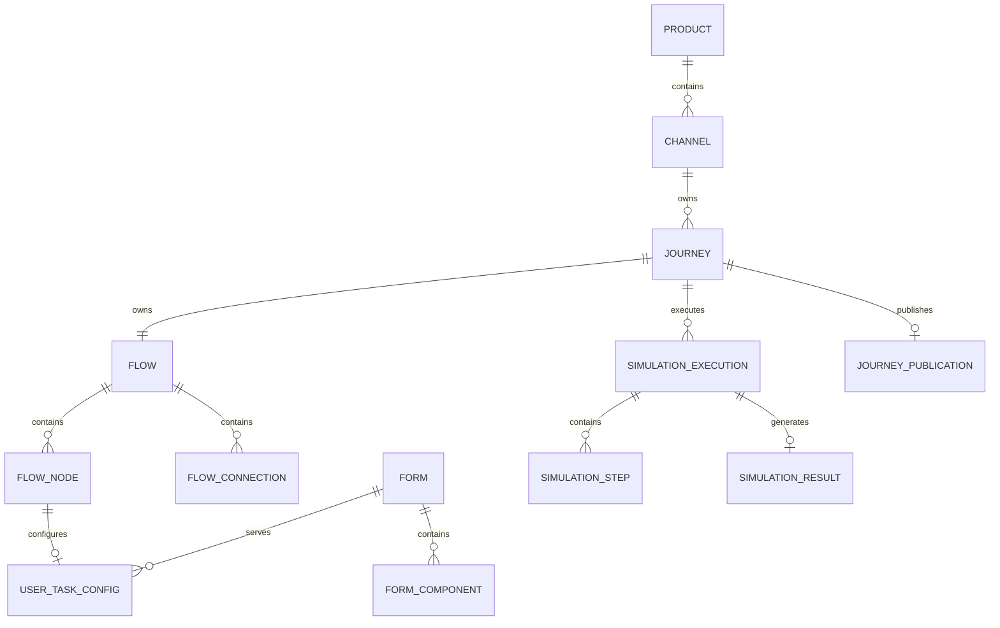

# Elastic Journey Admin Portal
## Modelo de Dados Físico

### Versão
1.0 (MVP)

---

# 1. Objetivo

Este documento descreve o modelo físico de dados do Elastic Journey Admin Portal para produtos, canais, jornadas, fluxos, formulários, simulação e publicação.

---

# 2. Premissas Técnicas

## Banco de Dados

```text
PostgreSQL
```

## Identificadores

Todas as entidades utilizam `UUID` como chave primária.

## Datas

Datas operacionais utilizam `TIMESTAMPTZ` em UTC.

## Estruturas Dinâmicas

Configurações visuais, dados de simulação e snapshots publicados utilizam `JSONB`.

---

# 3. Estratégia de Persistência

`product` agrupa canais. Cada `channel` pertence a um produto, e cada `journey` pertence a exatamente um canal. O produto de uma jornada é obtido através do canal.

Formulários são ativos reutilizáveis associados às User Tasks por `user_task_config`. A publicação armazena o snapshot atual enviado para a API de publicação do runtime e o substitui integralmente em uma nova publicação.

---

# 4. Modelo Relacional — Tabelas

```text
product
channel
journey
flow
flow_node
flow_connection
form
form_component
user_task_config
simulation_execution
simulation_step
simulation_result
journey_publication
```

---

# 5. Tabela Product

```sql
CREATE TABLE product (
    product_id UUID PRIMARY KEY,
    name VARCHAR(150) NOT NULL,
    description TEXT,
    status VARCHAR(20) NOT NULL CHECK (status IN ('ACTIVE', 'INACTIVE')),
    created_at TIMESTAMPTZ NOT NULL DEFAULT CURRENT_TIMESTAMP,
    updated_at TIMESTAMPTZ NOT NULL DEFAULT CURRENT_TIMESTAMP
);
```

---

# 6. Tabela Channel

```sql
CREATE TABLE channel (
    channel_id UUID PRIMARY KEY,
    product_id UUID NOT NULL,
    name VARCHAR(100) NOT NULL,
    type VARCHAR(30) NOT NULL CHECK (
        type IN ('WEB', 'MOBILE', 'WHATSAPP', 'URA', 'CONTACT_CENTER', 'OTHER')
    ),
    status VARCHAR(20) NOT NULL CHECK (status IN ('ACTIVE', 'INACTIVE')),
    description TEXT,
    created_at TIMESTAMPTZ NOT NULL DEFAULT CURRENT_TIMESTAMP,
    updated_at TIMESTAMPTZ NOT NULL DEFAULT CURRENT_TIMESTAMP,
    CONSTRAINT fk_channel_product
        FOREIGN KEY (product_id) REFERENCES product(product_id)
);
```

---

# 7. Tabela Journey

```sql
CREATE TABLE journey (
    journey_id UUID PRIMARY KEY,
    channel_id UUID NOT NULL,
    name VARCHAR(200) NOT NULL,
    description TEXT,
    status VARCHAR(20) NOT NULL CHECK (
        status IN ('DRAFT', 'PUBLISHED', 'UNPUBLISHED', 'INACTIVE')
    ),
    created_at TIMESTAMPTZ NOT NULL DEFAULT CURRENT_TIMESTAMP,
    updated_at TIMESTAMPTZ NOT NULL DEFAULT CURRENT_TIMESTAMP,
    CONSTRAINT fk_journey_to_channel
        FOREIGN KEY (channel_id) REFERENCES channel(channel_id)
);
```

---

# 8. Tabela Flow

```sql
CREATE TABLE flow (
    flow_id UUID PRIMARY KEY,
    journey_id UUID NOT NULL UNIQUE,
    name VARCHAR(200) NOT NULL,
    created_at TIMESTAMPTZ NOT NULL DEFAULT CURRENT_TIMESTAMP,
    updated_at TIMESTAMPTZ NOT NULL DEFAULT CURRENT_TIMESTAMP,
    FOREIGN KEY (journey_id) REFERENCES journey(journey_id)
);
```

---

# 9. Tabela FlowNode

```sql
CREATE TABLE flow_node (
    node_id UUID PRIMARY KEY,
    flow_id UUID NOT NULL,
    node_type VARCHAR(30) NOT NULL CHECK (
        node_type IN ('START', 'END', 'USER_TASK')
    ),
    name VARCHAR(200) NOT NULL,
    description TEXT,
    position_x INTEGER,
    position_y INTEGER,
    created_at TIMESTAMPTZ NOT NULL DEFAULT CURRENT_TIMESTAMP,
    updated_at TIMESTAMPTZ NOT NULL DEFAULT CURRENT_TIMESTAMP,
    FOREIGN KEY (flow_id) REFERENCES flow(flow_id),
    UNIQUE (flow_id, node_id)
);
```

---

# 10. Tabela FlowConnection

```sql
CREATE TABLE flow_connection (
    connection_id UUID PRIMARY KEY,
    flow_id UUID NOT NULL,
    source_node_id UUID NOT NULL,
    target_node_id UUID NOT NULL,
    created_at TIMESTAMPTZ NOT NULL DEFAULT CURRENT_TIMESTAMP,
    FOREIGN KEY (flow_id) REFERENCES flow(flow_id),
    FOREIGN KEY (flow_id, source_node_id) REFERENCES flow_node(flow_id, node_id),
    FOREIGN KEY (flow_id, target_node_id) REFERENCES flow_node(flow_id, node_id),
    UNIQUE (flow_id, source_node_id)
);
```

A restrição `UNIQUE (flow_id, source_node_id)` limita cada origem a uma saída. Antes de persistir o fluxo completo, o backend deve garantir exatamente um `START`, exatamente um `END`, as cardinalidades de entrada e saída de cada tipo e a existência de um caminho contínuo entre `START` e `END`.

---

# 11. Tabela Form

```sql
CREATE TABLE form (
    form_id UUID PRIMARY KEY,
    code VARCHAR(80) NOT NULL UNIQUE,
    name VARCHAR(200) NOT NULL,
    description TEXT,
    status VARCHAR(20) NOT NULL CHECK (status IN ('ACTIVE', 'INACTIVE')),
    created_at TIMESTAMPTZ NOT NULL DEFAULT CURRENT_TIMESTAMP,
    updated_at TIMESTAMPTZ NOT NULL DEFAULT CURRENT_TIMESTAMP
);
```

---

# 12. Tabela FormComponent

```sql
CREATE TABLE form_component (
    component_id UUID PRIMARY KEY,
    form_id UUID NOT NULL,
    component_type VARCHAR(50) NOT NULL CHECK (
        component_type IN ('TEXT', 'INPUT', 'SELECT', 'MULTISELECT', 'UPLOAD', 'CONTENT')
    ),
    label VARCHAR(200),
    help_text TEXT,
    required BOOLEAN NOT NULL DEFAULT FALSE,
    default_value TEXT,
    display_order INTEGER NOT NULL,
    configuration JSONB,
    FOREIGN KEY (form_id) REFERENCES form(form_id),
    UNIQUE (form_id, display_order)
);
```

---

# 13. Tabela UserTaskConfig

```sql
CREATE TABLE user_task_config (
    node_id UUID PRIMARY KEY,
    form_id UUID NOT NULL,
    FOREIGN KEY (node_id) REFERENCES flow_node(node_id),
    FOREIGN KEY (form_id) REFERENCES form(form_id)
);
```

`user_task_config` só pode referenciar nós cujo `node_type` seja `USER_TASK`. Essa restrição deve ser garantida por regra de domínio ou trigger.

---

# 14. Tabela SimulationExecution

```sql
CREATE TABLE simulation_execution (
    simulation_id UUID PRIMARY KEY,
    journey_id UUID NOT NULL,
    input_data JSONB,
    executed_at TIMESTAMPTZ NOT NULL DEFAULT CURRENT_TIMESTAMP,
    status VARCHAR(20) NOT NULL CHECK (
        status IN ('RUNNING', 'COMPLETED', 'FAILED', 'CANCELLED')
    ),
    FOREIGN KEY (journey_id) REFERENCES journey(journey_id)
);
```

---

# 15. Tabela SimulationStep

```sql
CREATE TABLE simulation_step (
    step_id UUID PRIMARY KEY,
    simulation_id UUID NOT NULL,
    node_id UUID NOT NULL,
    step_order INTEGER NOT NULL,
    started_at TIMESTAMPTZ,
    finished_at TIMESTAMPTZ,
    result VARCHAR(20) CHECK (result IN ('SUCCESS', 'FAILED', 'SKIPPED')),
    form_data JSONB,
    FOREIGN KEY (simulation_id) REFERENCES simulation_execution(simulation_id),
    FOREIGN KEY (node_id) REFERENCES flow_node(node_id),
    UNIQUE (simulation_id, step_order)
);
```

As chaves estrangeiras garantem a existência da execução e do nó, mas não comparam suas jornadas. Antes da persistência, o serviço de simulação deve confirmar que `flow_node.flow_id → flow.journey_id` corresponde a `simulation_execution.journey_id`.

---

# 16. Tabela SimulationResult

```sql
CREATE TABLE simulation_result (
    result_id UUID PRIMARY KEY,
    simulation_id UUID NOT NULL UNIQUE,
    executed_path JSONB,
    execution_summary JSONB,
    FOREIGN KEY (simulation_id) REFERENCES simulation_execution(simulation_id)
);
```

---

# 17. Tabela JourneyPublication

A publicação armazena o snapshot atual contendo produto, canal, jornada, fluxo e formulários. Existe no máximo uma linha por jornada.

```sql
CREATE TABLE journey_publication (
    publication_id UUID PRIMARY KEY,
    journey_id UUID NOT NULL UNIQUE,
    publication_status VARCHAR(30) NOT NULL CHECK (
        publication_status IN ('PUBLISHED', 'UNPUBLISHED')
    ),
    publication_date TIMESTAMPTZ,
    unpublished_date TIMESTAMPTZ,
    journey_snapshot JSONB NOT NULL,
    created_at TIMESTAMPTZ NOT NULL DEFAULT CURRENT_TIMESTAMP,
    updated_at TIMESTAMPTZ NOT NULL DEFAULT CURRENT_TIMESTAMP,
    FOREIGN KEY (journey_id) REFERENCES journey(journey_id)
);
```

A chave estrangeira sem `ON DELETE CASCADE` impede a exclusão física de uma jornada que possua ou tenha possuído publicação. Essas jornadas devem ser desativadas por meio de `journey.status = 'INACTIVE'`. A exclusão física é permitida somente quando não existe registro em `journey_publication`.

---

# 18. Chaves Primárias

| Tabela | PK |
|--------|----|
| product | product_id |
| channel | channel_id |
| journey | journey_id |
| flow | flow_id |
| flow_node | node_id |
| flow_connection | connection_id |
| form | form_id |
| form_component | component_id |
| user_task_config | node_id |
| simulation_execution | simulation_id |
| simulation_step | step_id |
| simulation_result | result_id |
| journey_publication | publication_id |

---

# 19. Chaves Estrangeiras Principais

| Origem | Destino |
|--------|---------|
| channel.product_id | product.product_id |
| journey.channel_id | channel.channel_id |
| flow.journey_id | journey.journey_id |
| flow_node.flow_id | flow.flow_id |
| flow_connection.(flow_id, source_node_id) | flow_node.(flow_id, node_id) |
| flow_connection.(flow_id, target_node_id) | flow_node.(flow_id, node_id) |
| form_component.form_id | form.form_id |
| user_task_config.node_id | flow_node.node_id |
| user_task_config.form_id | form.form_id |
| simulation_execution.journey_id | journey.journey_id |
| simulation_step.simulation_id | simulation_execution.simulation_id |
| simulation_step.node_id | flow_node.node_id |
| simulation_result.simulation_id | simulation_execution.simulation_id |
| journey_publication.journey_id | journey.journey_id |

---

# 20. Estratégia de Índices

```sql
CREATE INDEX idx_product_status ON product(status);

CREATE INDEX idx_channel_product ON channel(product_id);
CREATE INDEX idx_channel_type ON channel(type);
CREATE INDEX idx_channel_status ON channel(status);

CREATE INDEX idx_journey_by_channel ON journey(channel_id);
CREATE INDEX idx_journey_name ON journey(name);
CREATE INDEX idx_journey_status ON journey(status);
CREATE INDEX idx_journey_updated_at ON journey(updated_at);

CREATE INDEX idx_flow_node_flow ON flow_node(flow_id);
CREATE INDEX idx_flow_node_type ON flow_node(node_type);

CREATE INDEX idx_flow_connection_flow ON flow_connection(flow_id);

CREATE INDEX idx_form_status ON form(status);
CREATE INDEX idx_form_component_form ON form_component(form_id);
CREATE INDEX idx_user_task_form ON user_task_config(form_id);

CREATE INDEX idx_simulation_journey ON simulation_execution(journey_id);
CREATE INDEX idx_simulation_step_execution ON simulation_step(simulation_id);

CREATE INDEX idx_publication_status ON journey_publication(publication_status);
CREATE INDEX idx_publication_snapshot ON journey_publication USING GIN (journey_snapshot);
```

---

# 21. Estratégia de Consulta

```text
Pesquisar produtos e listar seus canais

Pesquisar jornadas por produto e canal

Carregar fluxo e formulários completos

Executar simulações

Consultar publicações por produto e canal no Admin Portal
```

---

# 22. Estratégia de Publicação

`journey_publication` mantém um snapshot separado da jornada em edição. A restrição `UNIQUE (journey_id)` garante no máximo uma publicação por jornada. Uma nova publicação atualiza a mesma linha e substitui integralmente `journey_snapshot`.

## Conteúdo do Snapshot

```text
Product

Channel

Journey

Flow

Forms
```

## Status de Publicação

```text
PUBLISHED, UNPUBLISHED
```

No MVP, a publicação chama uma API mockada do runtime. Após o retorno de sucesso, o snapshot é persistido e `journey.status` passa a `PUBLISHED`. O contrato definitivo da API externa será definido posteriormente.

A despublicação também chama a API mockada. Após o sucesso, `journey.status` e `journey_publication.publication_status` passam para `UNPUBLISHED`, e `unpublished_date` recebe a data da operação. Em caso de falha, o backend preserva os estados e o snapshot atuais.

Antes de desativar uma jornada, um canal ou um produto, o backend deve consultar `journey_publication` e bloquear a operação quando encontrar uma publicação `PUBLISHED` no escopo afetado. Registros `UNPUBLISHED` são preservados e não impedem a desativação.

---

# 23. Diagrama ER Físico



---

# 24. Considerações de Evolução

```text
Versionamento de jornadas e publicações

Templates e clonagem entre canais

Workflow de Aprovação

Rollback

Promotion Between Environments

Auditoria

Autenticação

RBAC
```

---

# 25. Resumo Técnico

O modelo físico estabelece Product → Channel → Journey como hierarquia principal. Cada jornada possui um fluxo, utiliza formulários por meio de User Tasks, registra simulações e possui no máximo uma publicação, substituída quando um novo snapshot é publicado.
